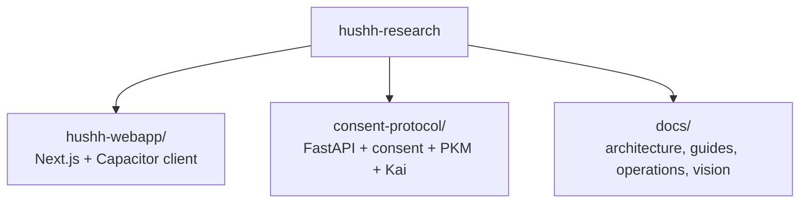

<h1 align="center">Hussh Research</h1>

<p align="center">
  <strong>Consent-first personal data agents</strong><br/>
  <em>Your data. Your vault. Your agents.</em>
</p>

<p align="center">
  
  
  
  
  <br/>
  
  
  
  <a href="https://discord.gg/fd38enfsH5"></a>
</p>

## 30-Second View

**Hussh** is a consent-first platform for personal data agents.

The repo stays intentionally small for contributors:

- `hushh-webapp/`: Next.js + Capacitor app
- `consent-protocol/`: FastAPI backend, consent protocol, PKM, Kai
- `docs/`: architecture, operations, and product references

The trust contract is fixed:

1. the user holds the key boundary
2. the backend stores ciphertext and metadata, not plaintext
3. scopes decide what agents may touch
4. apps and agents execute only inside granted consent

## Visual Map



## Core Guarantees

- **Consent + scoped access**: sensitive operations are explicitly authorized and auditable.
- **BYOK**: the user-controlled key boundary stays on the user side.
- **Zero-knowledge**: the backend persists ciphertext and metadata, not plaintext user memory.
- **Tri-flow parity**: web, iOS, and Android stay aligned on visible contracts.

## Quick Start

```bash
git clone https://github.com/hushh-labs/hushh-research.git
cd hushh-research
./bin/hushh bootstrap
./bin/hushh terminal backend --mode local --reload
./bin/hushh web
```

That is the local-first default contributor path:

- local frontend
- local backend
- default repo/runtime contract with fewer hidden differences

Command default note:

- `./bin/hushh web` now defaults to `local`
- use `./bin/hushh web --mode uat` only when you intentionally want the deployed UAT backend

Fastest frontend-only hosted shortcut:

```bash
./bin/hushh terminal backend --mode local --reload
./bin/hushh web
```

Production-like local frontend:

```bash
./bin/hushh env use --mode local
cd hushh-webapp
npm run build
npm run start
```

Use `./bin/hushh env use --mode uat` or `./bin/hushh env use --mode prod` before `npm run build` only when you intentionally want the optimized local frontend to call the deployed UAT or production backend.

## Choose Your Lane

- Monorepo app contributor:
  `./bin/hushh bootstrap` then `./bin/hushh terminal backend --mode local --reload` and `./bin/hushh web`
- Backend/protocol contributor inside the monorepo:
  `./bin/hushh bootstrap` then `./bin/hushh terminal backend --mode local --reload`
- Standalone `consent-protocol` contributor:
  use [consent-protocol/README.md](./consent-protocol/README.md)
- Operator or maintainer:
  start at [docs/reference/operations/README.md](./docs/reference/operations/README.md)

The `consent-protocol` subtree relationship still exists, but it is maintainer-only complexity and not part of the normal first-run path.

## Canonical Contributor Commands

```bash
./bin/hushh bootstrap
./bin/hushh doctor --mode local
./bin/hushh codex onboard
./bin/hushh codex ci-status --watch
./bin/hushh codex route-task repo-orientation
./bin/hushh web
./bin/hushh web --mode uat
./bin/hushh native ios --mode uat
./bin/hushh native android --mode uat
```

The only supported repo-level command surface is `./bin/hushh`.

## What Bootstrap Seeds

`./bin/hushh bootstrap` is the only supported repo bootstrap path. It seeds:

- `consent-protocol/.env`
- generated frontend profile files beside the tracked examples in `hushh-webapp/`
- active frontend profile into `hushh-webapp/.env.local`

When `gcloud` access is available, hydration uses live cloud-backed values. Without it, bootstrap falls back to the cached/template-safe path and `./bin/hushh doctor --mode <mode>` tells you exactly what is still missing.

## Contributor Contract

- License: Apache-2.0 for first-party repo code.
- Signoff: all pull-request commits must include `Signed-off-by` (`git commit -s`).
- Backend toolchain: `uv` is the canonical Python install and CI path.
- Runtime artifacts: `consent-protocol/requirements*.txt` are generated for packaging compatibility and are not the contributor install surface.

Prefer the devcontainer if you want a reproducible setup with Node 20, Python 3.13, and `uv` preinstalled:

```bash
Dev Containers: Reopen in Container
```

If you specifically need a Docker-backed local backend helper, keep it inside the
root CLI:

```bash
./bin/hushh compose up dev
```

This starts the backend support stack only. The frontend still uses the
canonical `./bin/hushh web` path.

## Documentation

- [Getting Started](./docs/guides/getting-started.md)
- [Environment Model](./docs/guides/environment-model.md)
- [Contributing](./contributing.md)
- [Migration Governance](./docs/reference/operations/migration-governance.md)
- [Docs Index](./docs/README.md)
- [CLI Reference](./docs/reference/operations/cli.md)
- [Architecture](./docs/reference/architecture/architecture.md)
- [Brand And Compatibility Contract](./docs/reference/operations/brand-and-compatibility-contract.md)
- [Branch Governance](./docs/reference/operations/branch-governance.md)
- [Vision](./docs/vision/README.md)

## Compatibility Boundaries

Public markdown and contributor-facing copy use **Hussh**.

Some internal identifiers still use legacy compatibility names:

- repo slug
- package and bundle identifiers
- cloud service names
- env keys
- internal plugin and class names

Those are infrastructure details, not the public docs contract. The canonical rule lives in [docs/reference/operations/brand-and-compatibility-contract.md](./docs/reference/operations/brand-and-compatibility-contract.md).

## Principles

**Keep the integrated backbone where the platform needs it, and keep the contributor surface small, modular, and understandable.**

In practice:

- small public command surface
- modular docs
- self-contained scripts
- minimal contributor cognitive load

Hussh exists to make consented, scoped, zero-knowledge AI straightforward to build and straightforward to reason about.
