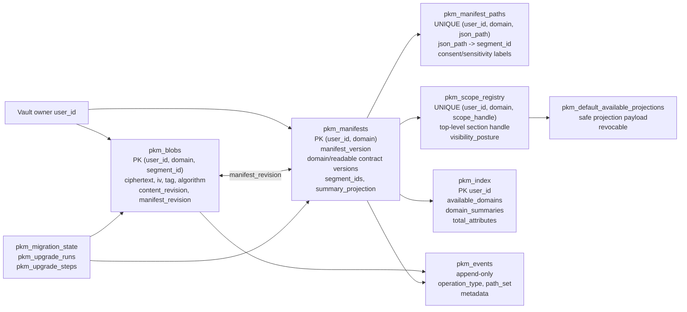
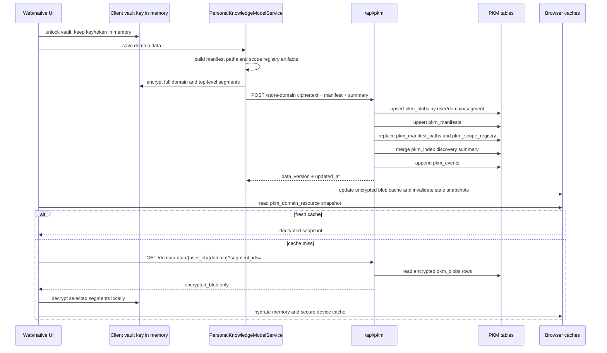
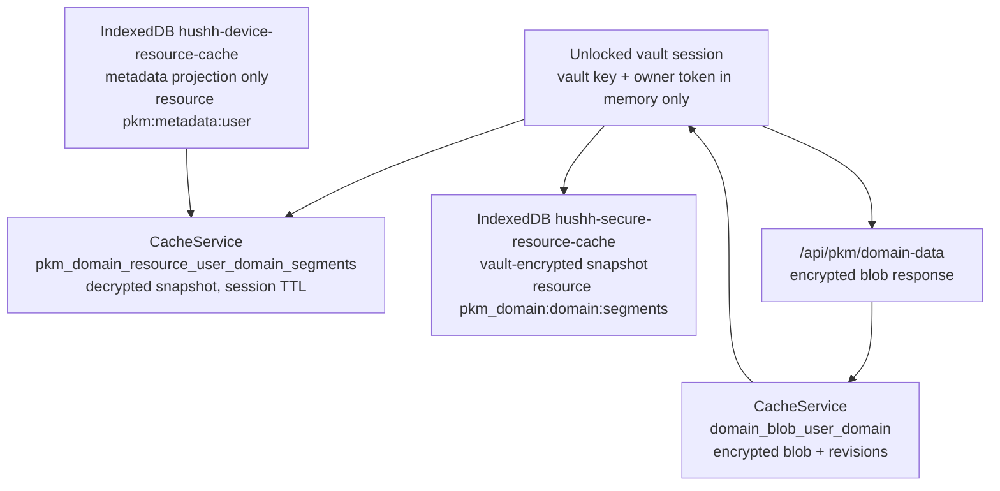
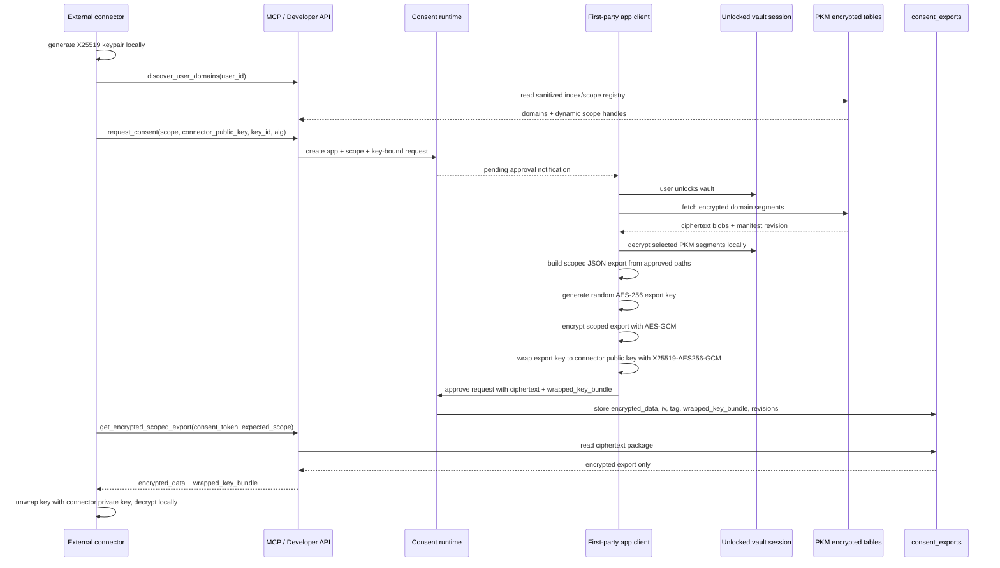

# Personal Knowledge Model


## Visual Map

Canonical visual owner: [consent-protocol](../README.md). Use that map for the top-down system view; this page is the narrower detail beneath it.

The Personal Knowledge Model (PKM) is the current checked-in encrypted user-memory architecture. One is the product ownership target for relationship memory; the current implementation evidence still comes through the Kai-first runtime because Kai is the shipped finance specialist and voice/action surface.

The approved product direction is One-owned relationship memory with specialist slices beneath it:

- One owns cross-domain relationship memory such as context, preferences, trusted people, decisions, and previously answered questions.
- Kai owns finance memory and finance reasoning over the protected finance lane.
- Nav owns privacy, consent, vault, deletion, and scope-review memory once Nav runtime surfaces are implemented.

Until that migration lands, do not describe One-owned PKM as current-state runtime behavior. Use the One/Nav roadmap for future-state claims about portable One memory, user-private action receipts, BYO model execution, or no platform-controlled recovery.

### PKM table map



### PKM read/write and cache map





## Canonical tables

- `pkm_index`
  Sanitized discovery/readable-summary projection. It can carry coarse summaries,
  counters, freshness, and capability flags, but it is not raw PKM and is not the
  user-memory authority.
- `pkm_blobs`
  Encrypted PKM payload segments keyed by `user_id + domain + segment_id`.
- `pkm_manifests`
  Private encrypted-first structure metadata per user/domain.
- `pkm_manifest_paths`
  Private queryable manifest paths for first-party runtime and consent expansion.
- `pkm_scope_registry`
  Public queryable scope handles and coarse exposure metadata. Registry rows carry
  a protocol-owned `visibility_posture`: `private`, `consent_required`, or
  `default_available`. No raw internal PKM paths should be exposed outside
  first-party authenticated tooling.
- `pkm_default_available_projections`
  Standing safe projections for user-selected `default_available` sections. These
  rows are generated client-side after vault unlock, contain only consumer-visible
  projection payloads, and are revocable. They never contain raw encrypted PKM
  blobs, `pkm.read`, hashes/provenance as shareable values, workflow artifacts,
  or unrestricted domain payloads.
- `pkm_events`
  Append-only PKM mutation and replay ledger.
- `pkm_migration_state`
  Cutover state for legacy encrypted users awaiting repartition on vault unlock.
- `pkm_upgrade_runs`
  Generic client-side PKM upgrade runs for post-cutover schema and readability evolution.
- `pkm_upgrade_steps`
  Per-domain resumable checkpoints for generic PKM upgrades. No plaintext or key material is stored here.

## Authority and sync model

PKM is local-first and encrypted-first. The user-memory authority is:

1. encrypted domain payloads in `pkm_blobs`
2. per-domain structure and version truth in `pkm_manifests`
3. append-only mutation history in `pkm_events`
4. client-side cache write-through after vault unlock

`pkm_index` is a cloud discovery projection. It can summarize available domains,
safe counters, freshness, and coarse capability flags, but it is not the source
of user memory truth. If local-only, offline, or on-device runtime paths are
active, the app may read from local encrypted cache and reconcile cloud
projection later.

Cloud writes to `pkm_index.domain_summaries` must therefore be treated as sync
projection updates. They should be atomic and repairable, but they must not make
local saves fail solely because the cloud projection is temporarily unavailable.

## Storage rules

- New writes are PKM-only.
- Encrypted payloads are segmented by top-level domain and segment id.
- Payload ciphertext remains opaque:
  - `ciphertext`
  - `iv`
  - `tag`
  - `algorithm`
  - `content_revision`
  - `manifest_revision`
  - `size_bytes`
- Exact raw JSON paths remain private to first-party authenticated tooling after vault unlock.
- Public/runtime discovery must use scope handles and coarse metadata, not raw internal PKM paths.
- Sharing posture is a three-state protocol contract:
  - `private`: not discoverable or exportable to external connectors.
  - `consent_required`: discoverable safe label only; data still requires consent and a strict-ZK encrypted export.
  - `default_available`: discoverable and readable as a user-published safe projection without creating a consent request.
- `default_available` is projection-only. It does not downgrade vault encryption, does not expose `pkm.read`, and does not grant access to non-consumer-visible data.

## Partner and CRM boundary

PKM is not a partner CRM mirror.

Enterprise systems such as Salesforce may store CRM-native contact or workflow metadata, consent receipt ids, scope labels, audit references, and narrowly approved fields when a workflow has a clear business or legal purpose. They should not receive raw PKM, KYC documents, full email bodies, vault data, user keys, or broad personal profiles by default.

If plaintext PII is handed to a partner system, that copy is outside the Hussh zero-knowledge boundary. The handoff must be explicit, scoped, auditable, minimized, and covered by retention, encryption or masking, access control, and deletion policy. The canonical personal memory remains encrypted PKM unless a consented encrypted PKM write records a derived fact back into Hussh.

## Why JSONB is not the encrypted payload layer

We explicitly reject `jsonb { plaintext_key: ciphertext_value }` as the primary PKM storage model.

Why:

- it leaks semantic PKM structure
- it weakens the zero-knowledge posture
- it increases write amplification
- it complicates nested object and array storage
- it does not make encrypted value queries meaningfully better

JSONB is still useful for:

- `pkm_index.summary_projection`
- manifest metadata
- scope registry metadata
- sanctioned counters and capability flags

## Retrieval path

1. Read `pkm_index` for discovery and freshness.
2. Resolve allowed scope handles through `pkm_scope_registry`.
3. Fetch only the required `pkm_blobs` segments.
4. Decrypt only those segments in the authenticated trusted boundary.
5. Cache decrypted segments by `user + domain + segment + content_revision`.

The server does not inspect plaintext PKM payloads.

## PKM to MCP encrypted export flow

This is the current strict zero-knowledge export path used by the Developer API
and hosted MCP tool `get_encrypted_scoped_export`. In this context, "zero-knowledge"
means Hussh server-side surfaces store and return ciphertext plus wrapped-key
metadata only for the scoped export payload. It is not a mathematical ZK-proof
protocol.



### Layer examples

All examples below are synthetic and use placeholder identifiers.

| Layer | Example data shape | What can be plaintext there | What must not be plaintext there |
| --- | --- | --- | --- |
| Unlocked first-party client | `buildConsentExportForScope({ userId, scope, vaultKey, vaultOwnerToken })` | Scoped PKM data in memory while the vault is unlocked | Persisted vault key, connector private key, broad partner profile |
| PKM encrypted storage | `pkm_blobs(user-123, financial, portfolio)` | Non-secret row keys, revisions, ciphertext metadata | Decrypted portfolio, holdings, KYC documents, user keys |
| PKM discovery | `pkm_index.available_domains`, `pkm_scope_registry.scope_handle` | Sanitized domains, handles, labels, posture | Raw PKM values or unrestricted internal JSON path exposure |
| Consent request | `scope=attr.financial.profile.*`, `connector_public_key=<base64-x25519-public-key>` | App identity, reason, scope, connector public key | Connector private key, decrypted user payload |
| Consent export storage | `consent_exports.encrypted_data`, `iv`, `tag`, `wrapped_key_bundle` | Ciphertext package, key id, revisions, refresh status | Plaintext export key or plaintext scoped export |
| MCP response | `get_encrypted_scoped_export(...)` | Same ciphertext package plus grant metadata | Decrypted PKM or plaintext export key |
| External connector | Connector-held private key unwraps the export key locally | Plaintext only after local connector decryption | Any claim that Hussh server retained plaintext after export |
| Partner CRM or workflow app | Consent receipt id, expiry, narrow approved workflow fields | Only explicitly approved, purpose-bound fields | Raw PKM mirror, vault data, KYC documents, full broad profile |

Connector request example:

```json
{
  "user_id": "user_123",
  "scope": "attr.financial.profile.*",
  "reason": "Build an approved risk-profile summary for this user",
  "connector_public_key": "base64-x25519-public-key",
  "connector_key_id": "connector-key-2026-05",
  "connector_wrapping_alg": "X25519-AES256-GCM"
}
```

First-party client scoped export payload before export encryption:

```json
{
  "profile": {
    "risk_profile": "balanced",
    "risk_score": 72
  },
  "__export_metadata": {
    "scope": "attr.financial.profile.*",
    "source_domain": "financial",
    "manifest_version": 4,
    "approved_paths": ["profile.risk_profile", "profile.risk_score"],
    "approved_segment_ids": ["profile"],
    "export_timestamp": "2026-05-28T18:30:00Z"
  }
}
```

Returned encrypted export shape:

```json
{
  "status": "success",
  "user_id": "user_123",
  "granted_scope": "attr.financial.profile.*",
  "expected_scope": "attr.financial.profile.*",
  "coverage_kind": "exact",
  "encrypted_data": "base64-ciphertext",
  "iv": "base64-iv",
  "tag": "base64-tag",
  "wrapped_key_bundle": {
    "wrapped_export_key": "base64-wrapped-export-key-ciphertext",
    "wrapped_key_iv": "base64-wrapping-iv",
    "wrapped_key_tag": "base64-wrapping-tag",
    "sender_public_key": "base64-ephemeral-hussh-public-key",
    "wrapping_alg": "X25519-AES256-GCM",
    "connector_key_id": "connector-key-2026-05"
  },
  "export_revision": 3,
  "export_refresh_status": "current"
}
```

The storage row may also retain non-secret source revision metadata such as
`source_content_revision` and `source_manifest_revision` for refresh and
staleness tracking. The Developer API and MCP response surfaces stay focused on
the ciphertext package, grant metadata, and refresh status.

When `granted_scope` is broader than `expected_scope`, Hussh still returns the
canonical broader encrypted export package. The connector must narrow the
decrypted JSON locally to the requested subtree before partner use.

## Generic PKM upgrades

After legacy cutover, PKM still evolves. Those upgrades are a separate system from `pkm_migration_state`.

- `pkm_migration_state` remains only for legacy-to-PKM repartition.
- Generic PKM upgrades are driven by:
  - global `pkm_index.model_version`
  - semantic `pkm_contract_version` and `readable_projection_version`
  - per-domain `pkm_manifests.domain_contract_version`
  - per-domain `pkm_manifests.readable_summary_version`
- Domain contract targets are dynamic-domain defaults. Domain-specific adapters are optional compatibility overrides, not the primary upgrade policy.
- The generic upgrade pipeline rebuilds manifest normalization, readable summaries, scope registry shape, consumer visibility, semantic counts, and externalizable path metadata from the current manifest/data shape.
- The client plans upgrades after vault unlock, decrypts locally, rewrites one domain at a time, re-encrypts, and stores new PKM rows with optimistic concurrency.
- Upgrade run state and checkpoints are stored server-side as non-secret metadata only.
- If the app loses the unlocked session mid-upgrade, the next resume must reacquire access locally through the user’s normal vault unlock method.

### Reviewer-backed upgrade evidence

PKM protocol-version bumps require evidence against the current reviewer fixture from runtime env.

- Use `REVIEWER_UID` as the vault-owner user under test; do not substitute copied recipients, counterparties, or older fixture ids.
- Use `../../scripts/audit_active_pkm_shape_readonly.py` to decrypt active reviewer `pkm_blobs` locally in memory and emit only redacted structural shape, counts, and presentation painpoints.
- If the local maintainer env lacks reviewer secrets, run the audit with `--gcp-secret-project hushh-pda-uat` so Secret Manager values are loaded into process memory only.
- Use `../../scripts/eval_pkm_structure_agent.py --phase fresh_chain_60` or deeper phases to run natural prompt chains against the reviewer-shaped manifest/scope surface.
- Treat duplicate branches, `changes` noise, oversized arrays, deep key-value nesting, and developer metadata paths as upgrade/presentation inputs for the dynamic capability pipeline.
- Never print plaintext PKM values or send decrypted reviewer payloads to backend ADK/model calls as part of upgrade evidence.

## Financial protected lane

Kai Finance remains a protected mature PKM domain during cutover.

Protected behaviors:

- onboarding
- Plaid
- portfolio import
- dashboard
- debate
- optimize
- analysis history

Freeform chat must not invent arbitrary new canonical financial structures that conflict with the governed financial contract.

## Migration truth

Legacy encrypted storage can only be fully repartitioned after a user unlocks their vault at least once.

Cutover sequence:

1. Fresh users write PKM only.
2. Legacy metadata is backfilled into `pkm_index`.
3. Legacy users are marked `awaiting_unlock_repartition`.
4. On next authenticated vault unlock, the client decrypts the legacy blob, repartitions it into PKM segments, re-encrypts, writes PKM rows, and marks migration complete.
5. After the bounded migration window, legacy tables and adapters are deleted.

Legacy names survive only inside migration internals and must not be used for new product work.
