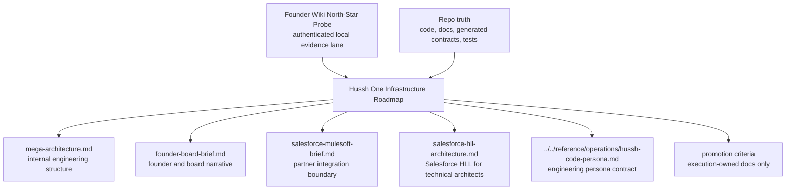

# Hussh One Infrastructure Roadmap

Status: planning-only future architecture package. Do not treat this directory as implementation proof.

## Visual Map

## Purpose

This package promotes the temporary One personal-agent infrastructure notes into a durable future-state home. It is intentionally docs-first:

- no runtime code changes
- no agent or skill changes
- no claim that One, OpenClaw, BYOA, on-device inference, Salesforce, or MuleSoft work is shipped unless current repo evidence proves it
- no private wiki body text, credentials, or local machine paths in shareable outputs

## Current Truth Summary

| Surface | Current Classification | Boundary |
| --- | --- | --- |
| Hussh platform | `already_exists` as the trust, consent, API, MCP, PKM, and governance platform | Durable current-state docs and code define shipped behavior. |
| One personal agent | `partially_exists` / `future_state_only` | One is the approved top-level direction, while many shipped runtime surfaces remain Kai-first today. |
| Kai | `already_exists` as the current finance and investor specialist surface | Kai must not be described as the whole One agent. |
| Nav | `partially_exists` as privacy, consent, and access guidance | Nav is not ordinary page navigation. UI routes remain route/page concerns. |
| KYC and PCHP | `partially_exists` / active execution surfaces | Identity and consent boundaries must stay explicit and auditable. |
| Salesforce, MuleSoft, Agentforce, Flex Gateway | `missing` in repo implementation | Partner architecture only until a scoped integration PR lands. |
| Mac Mini, OpenClaw, local MCP, MLX, App Intents | `partially_exists` / `future_state_only` | Planning path only unless checked code and tests show a shipped path. |
| BYOA and local world model | `future_state_only` | Must not become a second canonical memory store or second trust plane. |

## Required Founder Wiki Lane

Founder Wiki validation is required before this package or any derived PDF is treated as final. The validation must be authenticated and machine-local.

Safe setup rules:

1. Use the configured Founder Wiki MCP server URL: `https://mcp.hushh.ai`, which Codex records as the streamable HTTP mount `https://mcp.hushh.ai/mcp`.
2. Store the bearer token only in a local environment variable such as `HUSHH_FOUNDER_WIKI_MCP_TOKEN`.
3. Do not write credentials into repo files, generated docs, shell history, or `tmp/`.
4. Rotate any pasted secret before relying on the local MCP setup.
5. Write only safe audit output: page names checked, alignment classifications, current-state-vs-north-star drift, and repo docs that need updates.

Required probe target set:

| Probe Family | Target Concepts |
| --- | --- |
| Product canon | non-negotiables, wiki index, One, Kai, Nav, PCHP |
| Personal operating layer | Personal Operating Layer, BYOA, World Model, Aha Moment |
| Local and device intelligence | MLX/on-device, App Intents, LLM Wiki pattern, OpenClaw |
| Trust and identity | Hu-SSH, Signature Vault, north-star user persona, One Lens |
| Brand and enterprise endpoints | PCHP brand-side endpoint, iBrokerage, One Email KYC |
| Partner validation | Salesforce, MuleSoft, Agentforce, Flex Gateway, CRM, PII |
| Mac validation | Mac Mini, OpenClaw, local MCP, MLX |
| Operating model | code persona, engineering persona, product non-deviation |

Current Founder Wiki validation status: `authenticated_salesforce_streamlining_complete` as of 2026-05-19. The safe MCP audit covered the 203 visible-page inventory before the new private audit artifact was created; the wiki now lists 204 pages including that audit page. The latest pass patched the Salesforce/MuleSoft spine and supporting product, trust, and governance pages without copying private wiki bodies.

## Audience Documents

- [mega-architecture.md](./mega-architecture.md): internal engineering architecture and dependency map.
- [founder-board-brief.md](./founder-board-brief.md): concise board-level direction and decisions.
- [salesforce-mulesoft-brief.md](./salesforce-mulesoft-brief.md): partner-facing boundary for Salesforce, MuleSoft, Agentforce, Flex Gateway, CRM, and PII.
- [salesforce-hll-architecture.md](./salesforce-hll-architecture.md): Salesforce-facing High-Level Logical Architecture for technical architects, with GitHub-native system context, consent/export, and data-boundary diagrams.

## Promotion Rule

This package may move out of `docs/future/` only when:

1. Founder Wiki validation has run in authenticated mode.
2. Current-state claims are backed by repo code, generated contracts, tests, schemas, or checked docs.
3. The execution owner and implementation surfaces are known.
4. Partner integrations have scoped read/write contracts and consent boundaries.
5. Execution docs are split into the correct homes, such as `docs/reference/`, `consent-protocol/docs/`, or `hushh-webapp/docs/`.

## Do Not Build

- A Salesforce-specific auth plane that bypasses PCHP, API, or MCP consent.
- A broad plaintext PKM mirror inside Salesforce, MuleSoft, CRM, logs, analytics, or partner stores.
- A second canonical memory store for One.
- Local models that read locked, unscoped, or undecrypted PKM.
- Salesforce writeback before explicit write scopes, replay protection, and audit trails.
- Production claims for OpenClaw, BYOA, local world model, or on-device inference before code and tests prove them.

## References

- [../../vision/agent-ontology.md](../../vision/agent-ontology.md): canonical One, Kai, Nav, KYC, and Hussh ontology.
- [../../reference/architecture/founder-language-matrix.md](../../reference/architecture/founder-language-matrix.md): approved founder language and retired phrases.
- [../../reference/operations/hussh-code-persona.md](../../reference/operations/hussh-code-persona.md): Hussh engineering and Codex non-deviation contract.
- [../../reference/operations/coding-agent-mcp.md](../../reference/operations/coding-agent-mcp.md): local MCP host and Founder Wiki setup rules.
