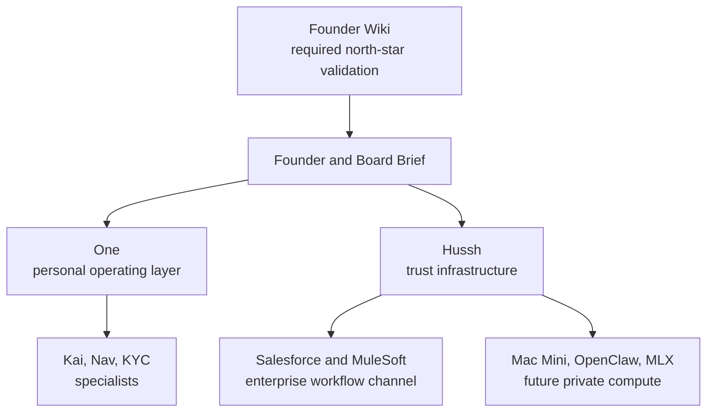

# Hussh One Infrastructure Founder And Board Brief

Status: planning-only brief. It is directionally aligned to the One infrastructure strategy and has completed authenticated Founder Wiki validation for north-star direction. It remains planning-only until repo implementation proof exists for the future-state surfaces.

## Visual Map

## Core Message

Hussh is the trust infrastructure for personal AI. One is the user's personal operating layer. Kai, Nav, and KYC are specialists that One can summon when the task requires finance reasoning, privacy and consent guidance, or identity verification.

The architecture should scale into enterprise and private compute without losing the trust boundary. Salesforce, MuleSoft, Agentforce, Mac Mini, OpenClaw, MLX, App Intents, and BYOA are useful channels only if they stay subordinate to Hussh consent, PKM, vault, and audit authority.

## What Exists Today

| Area | Current Truth |
| --- | --- |
| Platform | Hussh already has trust, consent, API, MCP, frontend, PKM, and governance surfaces. |
| Agent experience | Runtime is still partially Kai-first. One is the approved top-level direction, not uniformly shipped everywhere. |
| Trust boundary | PCHP, consent, scoped export, audit, and vault/PKM rules remain the durable authority. |
| Partner integrations | Salesforce, MuleSoft, Agentforce, and Flex Gateway are planning lanes, not implemented repo surfaces. |
| Private compute | Mac Mini, OpenClaw, local MCP, MLX, and App Intents are future lanes unless checked runtime proof exists. |

## Strategic Shape

| Strategic Move | Why It Matters | Guardrail |
| --- | --- | --- |
| Make One the top relationship layer | Gives users one durable personal operating layer instead of fragmented assistants. | Do not erase Kai, Nav, or KYC specialist boundaries. |
| Keep Hussh as trust infrastructure | Lets external tools request scoped outcomes without owning user trust. | Do not build another auth or consent plane. |
| Use Salesforce as workflow endpoint | Opens an enterprise distribution channel for user-approved CRM workflows. | Do not mirror broad PKM or vault data into CRM. |
| Use MuleSoft/Flex Gateway as enterprise routing | Fits enterprise integration expectations without weakening Hussh policy. | Gateway policy must not replace Hussh consent. |
| Build local compute carefully | Gives privacy-sensitive users a path to private edge intelligence. | Local models cannot read locked or unscoped memory. |

## Founder Wiki Validation Requirement

Before this brief is final, run the Founder Wiki North-Star Probe in authenticated mode against:

- non-negotiables and wiki index
- One, Kai, Nav, PCHP
- Personal Operating Layer, BYOA, World Model, Aha Moment
- MLX/on-device, App Intents, LLM Wiki pattern, OpenClaw
- Hu-SSH, Signature Vault, north-star user persona, One Lens
- PCHP brand-side endpoint, iBrokerage, One Email KYC
- Salesforce, MuleSoft, Agentforce, Flex Gateway, CRM, PII
- code persona, engineering persona, product non-deviation

Safe output only: page names checked, alignment classifications, current-state-vs-north-star drift, and repo docs that need updates.

Current status: `authenticated_salesforce_streamlining_complete` as of 2026-05-19.

## Board-Level Decisions

| Decision | Recommended Default |
| --- | --- |
| Should Salesforce become a memory store? | No. Treat it as a workflow endpoint with narrow approved fields. |
| Should MuleSoft own consent enforcement? | No. It may mediate enterprise routing, but Hussh remains trust authority. |
| Should BYOA become the canonical memory store? | No. It can become a user-owned compute or agent execution lane, but PKM/vault remain canonical. |
| Should OpenClaw and MLX be claimed as shipped? | No. Keep them future-state until runtime, tests, and docs prove the path. |
| Should code persona become agent policy now? | Not yet. First document it durably, validate it, then update skills or agents separately. |

## What This Enables

- One can become the durable personal operating layer.
- Kai, Nav, and KYC can stay sharper instead of becoming overloaded brands.
- Enterprise partners can integrate through scoped consent rather than broad data copies.
- Local compute can become privacy-preserving rather than a shadow memory plane.
- Founder language, product architecture, and engineering behavior can stay aligned.

## Do Not Overclaim

- Do not say One is fully shipped across all runtime surfaces.
- Do not say Salesforce/MuleSoft integration exists in repo code.
- Do not say Mac Mini/OpenClaw/MLX/BYOA is production-ready.
- Do not quote private wiki body text in shareable artifacts.
- Do not imply partner systems can bypass PCHP, consent, vault, PKM, or audit.
