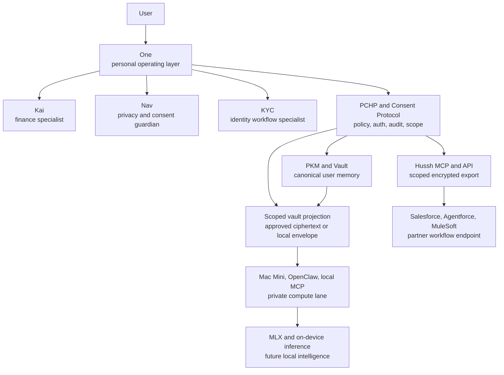

# Hussh One Infrastructure Mega Architecture

Status: planning-only architecture. Current-state claims below must be verified against repo code, generated contracts, tests, schemas, and checked docs before execution or public use.

## Visual Map

## Architecture Thesis

Hussh is the platform and trust infrastructure. One is the user's top-level personal agent. Kai, Nav, and KYC are specialists below One. Salesforce, MuleSoft, Agentforce, Mac Mini, OpenClaw, MLX, App Intents, and BYOA are integration or compute lanes that must consume Hussh trust contracts instead of creating parallel authority.

The practical design goal is to let One coordinate user-approved outcomes while keeping consent, identity, PKM, audit, and vault boundaries explicit.

## Current Truth

| Claim | Classification | Evidence Boundary |
| --- | --- | --- |
| Hussh has active consent, API, MCP, PKM, KYC, and frontend surfaces. | `already_exists` | Existing backend, frontend, docs, and generated contracts. |
| One is the long-term personal-agent product frame. | `partially_exists` / `future_state_only` | Approved docs direction, but runtime is not fully migrated. |
| Kai is the current shipped finance-oriented agent surface. | `already_exists` | Runtime and docs are Kai-first in several flows. |
| Nav is a privacy and consent guardian. | `partially_exists` | Must not be confused with route/page navigation. |
| Salesforce, MuleSoft, Agentforce, and Flex Gateway are implemented integrations. | `missing` | Planning and partner-brief only until scoped code lands. |
| Mac Mini, local MCP, OpenClaw, MLX, and App Intents are production-ready. | `future_state_only` unless a checked path proves otherwise | Treat as future private-compute lane. |
| BYOA is a canonical deployed memory or trust store. | `future_state_only` | Must remain subordinate to Hussh trust and PKM authority. |

## Layer Model

| Layer | Responsibility | Current/Future Boundary |
| --- | --- | --- |
| Experience | One relationship, Kai finance workflows, Nav consent guidance, KYC identity tasks | Current runtime remains partially Kai-first. |
| Trust and policy | PCHP, auth, consent scopes, audit logs, data access policy | Current authority; do not bypass. |
| Memory | PKM, vault, scoped personal data, derived user context | Current canonical memory boundary. |
| Access | Hussh API, MCP, generated contracts, encrypted scoped export | Current developer access pattern. |
| Enterprise workflow | Salesforce, Agentforce, MuleSoft, Flex Gateway, CRM | Future partner endpoint, not trust authority. |
| Private compute | Mac Mini, OpenClaw, local MCP, App Intents | Future private edge and local tool plane. |
| Local intelligence | MLX, on-device inference, BYOA world model | Future local reasoning lane, not canonical memory. |

## End-To-End Flow

| Step | Flow | Boundary |
| --- | --- | --- |
| 1 | User asks One for a high-trust task. | One owns relationship framing. |
| 2 | One routes to Kai, Nav, KYC, or another specialist. | Specialists stay scoped to their domains. |
| 3 | PCHP evaluates identity, consent, policy, and scope. | Trust decision remains inside Hussh. |
| 4 | PKM or vault data is unlocked only through scoped consent. | No broad plaintext mirrors. |
| 5 | MCP/API returns a narrow encrypted or scoped response. | Partner systems receive the minimum required payload. |
| 6 | Salesforce or MuleSoft may orchestrate approved workflow fields. | CRM stores workflow metadata, not durable user memory. |
| 7 | Local MCP/OpenClaw may execute private edge tasks in the future. | Local compute receives only scoped vault projections or local envelopes after consent, not raw unlocked PKM. |
| 8 | Audit events and consent records remain attributable and replay-safe. | GitHub, CRM, and analytics credit do not redefine Hussh trust state. |

## Salesforce And MuleSoft Lane

The recommended enterprise lane is read-only first:

1. Salesforce or Agentforce asks for a specific user-approved workflow outcome.
2. MuleSoft or Flex Gateway mediates enterprise routing, throttling, and policy integration.
3. Hussh API/MCP validates identity, tenant, app, consent, and requested scope.
4. Hussh returns a narrow workflow payload or consent decision, not a broad PKM dump.
5. Writeback is disabled until explicit write scopes, audit, replay protection, and user-visible revocation exist.

Allowed partner-side storage:

- consent status pointers
- workflow request IDs
- audit references
- narrow approved CRM fields
- non-sensitive operational metadata

Disallowed partner-side storage:

- broad PKM
- vault keys or vault contents
- full KYC packages unless explicitly scoped
- full email archives
- durable One memory
- reusable user secrets
- unbounded PII exports

## Private Compute Lane

Mac Mini, OpenClaw, local MCP, App Intents, and MLX should become a private compute lane only after the trust contract is proven:

| Component | Future Role | Required Gate |
| --- | --- | --- |
| Mac Mini | local private compute node | owner, device, network, and update model |
| OpenClaw | local connector and tool execution contract | scoped data binding and conformance tests |
| local MCP | machine-local agent/tool bridge | no secret leakage; explicit capability list |
| App Intents | Apple-native action surface | user-visible permission and action mapping |
| MLX/on-device | local model inference | no access to locked/unscoped PKM |

Private-compute diagrams must route through PCHP and scoped vault projection. Do not draw PKM as a direct raw input to Mac Mini, OpenClaw, local MCP, App Intents, MLX, or BYOA lanes.

## Founder Wiki North-Star Probe

Founder Wiki validation is required before this architecture is final. The probe must run in authenticated mode and write only safe audit fields:

- `founder_wiki_pages_checked`
- `alignment_classification`
- `current_state_vs_north_star_drift`
- `repo_docs_that_need_updates`

Current status: `authenticated_salesforce_streamlining_complete` as of 2026-05-19. The safe MCP audit covered the 203 visible-page inventory before the new private audit artifact was created; the wiki now lists 204 pages including that audit page. No private wiki body text was copied into this document.

## What Not To Build

- Do not build a Salesforce-specific auth plane.
- Do not create a second trust plane beside PCHP, consent, API, and MCP.
- Do not create a second canonical memory store beside PKM and vault.
- Do not mirror broad PKM, KYC, vault, or email data into Salesforce, MuleSoft, analytics, logs, or partner tools.
- Do not let local models read locked, unscoped, or undecrypted user memory.
- Do not describe One, OpenClaw, BYOA, on-device inference, Salesforce, or MuleSoft as shipped without current repo proof.
- Do not use Nav as a synonym for UI navigation.

## Promotion Criteria

This plan can move into execution only when:

1. Founder Wiki validation completes in authenticated mode.
2. The first execution PR has a named owner and code surfaces.
3. Consent scopes and data classes are explicit.
4. Read and write boundaries are separated.
5. Tests cover consent denial, revocation, replay protection, and narrow export behavior.
6. Docs move from planning home to execution-owned homes.
