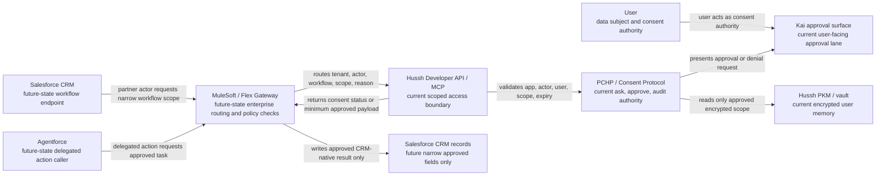
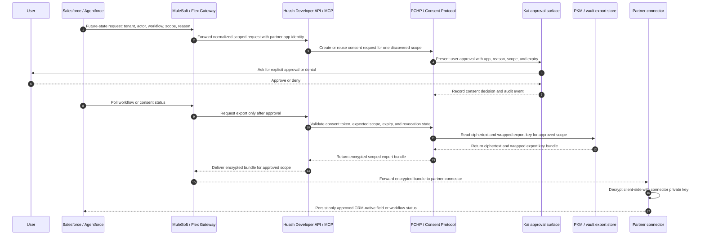
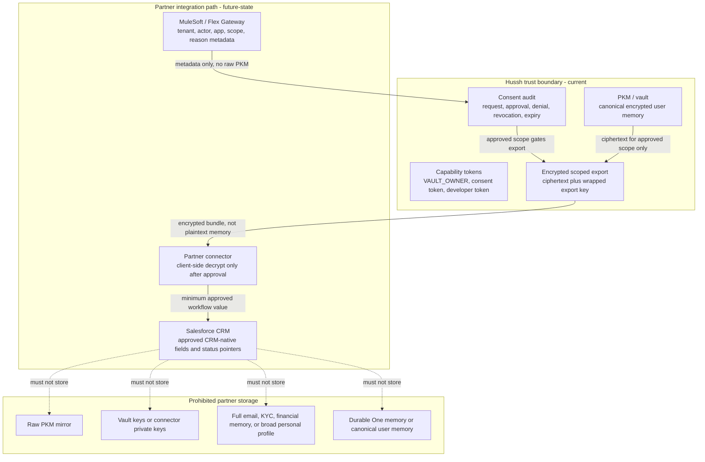

# Salesforce High-Level Logical Architecture

Status: planning-only Salesforce HLL. This document does not claim that Salesforce, MuleSoft, Agentforce, or Flex Gateway are implemented in the repo.

## Purpose

This High-Level Logical Architecture explains how a Salesforce-side workflow should integrate with Hussh without weakening Hussh's consent, vault, Personal Knowledge Model (PKM), or audit boundaries.

The intended reader is a Salesforce technical architect who needs to understand:

- which system owns consent and trust decisions
- what Salesforce, Agentforce, MuleSoft, or Flex Gateway may request
- what data can return to Salesforce after explicit approval
- what must stay inside Hussh
- which integration gaps require partner confirmation before implementation

The canonical engineering source remains [../../reference/architecture/architecture-view-catalog.md](../../reference/architecture/architecture-view-catalog.md). This HLL is the Salesforce-specific derivative.

## Current Truth

| Area | Classification | Meaning for Salesforce HLL |
| --- | --- | --- |
| Hussh Developer API / MCP | current | Existing developer-access lane for scope discovery, consent request/status, and encrypted scoped export. |
| PCHP | current implementation through Consent Protocol, Developer API, and MCP | Hussh asks, the user approves or denies, and Hussh audits the scoped access decision. |
| PKM / vault | current | Canonical encrypted user memory and vault boundary stay inside Hussh. |
| Kai approval surface | current | Mature current product surface for user-facing approval and finance workflows. |
| Cloud Run lanes | current | Current hosted deployment lane for web/backend services. |
| Salesforce, MuleSoft, Agentforce, Flex Gateway | future-state / partner-confirmation-needed | Planning-lane enterprise channels only until scoped code, tests, and deploy evidence exist. |
| Partner writeback | future-state / partner-confirmation-needed | Requires explicit write scopes, replay protection, revocation behavior, audit, and recovery policy. |
| OAuth tenant mapping and revocation callbacks | future-state / partner-confirmation-needed | Required before production partner integration. |

## Visual Context

Canonical visual owner: [Hussh Documentation](../../README.md). Use that map for the top-down documentation surface; [Hussh Architecture View Catalog](../../reference/architecture/architecture-view-catalog.md) is the narrower engineering architecture source beneath it.

Reading rule: Salesforce and Agentforce are workflow channels. MuleSoft or Flex Gateway can mediate enterprise routing. Hussh remains the trust authority.

## HLL Consent And Export Sequence

Important boundary: Hussh returns an encrypted scoped export bundle. Any connector-side plaintext handling is outside the Hussh zero-knowledge boundary and must be explicitly scoped, minimized, retained, encrypted or masked, access-controlled, auditable, and deletable.

## HLL Data Boundary View

## Salesforce Boundary Rules

Salesforce may store after explicit approval:

- consent status pointer
- consent receipt or audit reference
- workflow status
- scope label
- expiry or revocation status needed for the workflow
- narrow CRM-native field explicitly approved for the workflow
- non-sensitive operational metadata such as request ID, app identity, and response class

Salesforce must not become:

- a PKM mirror
- a vault or key store
- the consent engine
- a durable One memory store
- a broad plaintext PII lake
- a bypass around PCHP, Consent Protocol, Developer API, MCP, or user approval

MuleSoft or Flex Gateway may help with routing, normalization, rate limits, enterprise policy checks, and non-sensitive operational observability. They must not replace Hussh consent, scope validation, audit, PKM authority, or vault boundaries.

## Glossary Gap Coverage

| Term | Plain meaning for Salesforce architects |
| --- | --- |
| HLL | High-Level Logical Architecture: the system-level view of actors, boundaries, data classes, and responsibilities. |
| Agentforce | Future-state Salesforce delegated action caller. It may request a scoped Hussh workflow, not direct memory access. |
| MuleSoft Anypoint | Future-state Salesforce integration layer for API orchestration, routing, and enterprise controls. It does not own consent. |
| Flex Gateway | Future-state gateway option for traffic policy and partner-side operational controls. It does not replace PCHP. |
| Connected App / OAuth | Partner-confirmation-needed app identity model for authenticating Salesforce to Hussh before any user consent request. |
| Org / user / app / actor claims | Identity claims that must distinguish the Salesforce org, human user, connected app, and delegated agentic actor. |
| Data Cloud / Hyperforce | Out of scope until partner design requires them; neither is a PKM, vault, key, consent, or durable memory store. |
| MCP | Model Context Protocol. In Hussh, the hosted MCP exposes consent tools for external apps and agents. |
| Developer API | Hussh `/api/v1` public developer lane for scope discovery, consent, status, and encrypted scoped export. |
| PCHP | Hussh's ask, approve, audit handshake, implemented today through Consent Protocol, Developer API, and MCP consent/export flow. |
| PKM | Personal Knowledge Model: Hussh's canonical encrypted user memory and structured personal context. |
| Vault | User-private trust boundary for encrypted data, local unlock, and key-boundary behavior. |
| Scope | The exact data or operation class a user is asked to approve. |
| Scoped export | A bounded export for one approved scope, not a broad dump of user memory. |
| Consent token | Capability token proving a specific approval, scope, expiry, and user/app relationship. |
| Developer token | Token that authenticates the external app or developer lane. It is not user consent by itself. |
| VAULT_OWNER | Current owner capability token used after local vault unlock; it does not bypass consent rules. |
| Wrapped export key | The export key encrypted to the connector public key so Hussh does not manage the connector private key. |
| Ciphertext | Encrypted data. Hussh can return ciphertext without exposing plaintext to the server or partner by default. |
| Connector | Partner-side integration component that receives approved encrypted exports and handles client-side decryption. |
| Partner connector | Same as connector in this HLL: the Salesforce-side component responsible for approved client-side decryption and minimized writeback. |
| System of record | Salesforce may be system-of-record for CRM workflow metadata only; Hussh remains system-of-record for consent, audit, PKM, and vault boundaries. |
| Plaintext boundary | If connector-side plaintext enters Salesforce, that copy is outside Hussh zero-knowledge protection and needs explicit retention, encryption or masking, access control, audit, and deletion ownership. |
| CRM-native metadata | Salesforce fields such as workflow status, consent receipt ID, scope label, request ID, and explicitly approved business fields. |
| Audit reference | A durable identifier or record pointer proving what was requested, approved, denied, exported, revoked, or expired. |
| Revocation | User or system action that invalidates future access under a prior approval. |
| Future-state | Approved planning direction that is not shipped until repo code, tests, and deploy evidence prove it. |

## Salesforce Review Questions

These questions should be resolved before turning the HLL into implementation work:

| Topic | Question for Salesforce / MuleSoft design review |
| --- | --- |
| Tenant and actor identity | Which Salesforce org, user, app, and Agentforce actor claims can be sent on every request? |
| App authentication | Which OAuth or connected-app model identifies Salesforce to Hussh before any user consent is requested? |
| Consent UX | Should the user approve inside Hussh only, or should Salesforce surface a Hussh-hosted approval handoff? |
| Data residency | Which approved CRM-native fields may Salesforce store, in which region, and for how long? |
| Plaintext handling | If a connector decrypts data for Salesforce, which component owns encryption or masking, retention, access control, and deletion? |
| Audit handoff | Which Hussh audit reference must Salesforce store so both sides can explain the decision later? |
| Revocation and expiry | How will Salesforce receive and enforce revocation or expiration changes? |
| Writeback | Which future write scopes are required, and which Salesforce writebacks are explicitly prohibited? |

## Conceptual Audit Checklist

Before this HLL is shared externally or converted into slides/PDF:

1. Every diagram arrow must identify the actor, data class, or trust boundary being crossed.
2. Salesforce, MuleSoft, Agentforce, and Flex Gateway must remain labeled as future-state or partner-confirmation-needed.
3. No diagram may imply that raw PKM, vault contents, vault keys, connector private keys, or durable One memory are stored in Salesforce.
4. Partner CRM storage must be limited to CRM-native metadata and narrow approved workflow outputs.
5. PCHP must map back to the current Consent Protocol, Developer API, and MCP consent/export flow.
6. Any plaintext PII leaving Hussh must be described as outside the Hussh zero-knowledge boundary and subject to explicit purpose, retention, encryption or masking, access control, deletion, and audit ownership.
7. Shareable copies must contain no secrets, HCT values, developer tokens, local filesystem paths, private wiki body text, or internal prompt/provenance notes.
8. Mermaid diagrams must remain GitHub-native `flowchart` or `sequenceDiagram` syntax.

## References

- [README.md](./README.md): One infrastructure roadmap package.
- [salesforce-mulesoft-brief.md](./salesforce-mulesoft-brief.md): partner boundary brief.
- [mega-architecture.md](./mega-architecture.md): internal future-state architecture structure.
- [../../reference/architecture/architecture-view-catalog.md](../../reference/architecture/architecture-view-catalog.md): canonical C4 + ISO 42010 engineering view catalog.
- [../../reference/architecture/architecture.md](../../reference/architecture/architecture.md): canonical seven-layer Hussh platform architecture.
- [../../reference/architecture/founder-language-matrix.md](../../reference/architecture/founder-language-matrix.md): terminology and founder-language mapping.
- [../../../consent-protocol/docs/reference/developer-api.md](../../../consent-protocol/docs/reference/developer-api.md): current Developer API and MCP-facing contract.
- [../../../packages/hushh-mcp/README.md](../../../packages/hushh-mcp/README.md): hosted MCP and `@hushh/mcp` setup surface.
