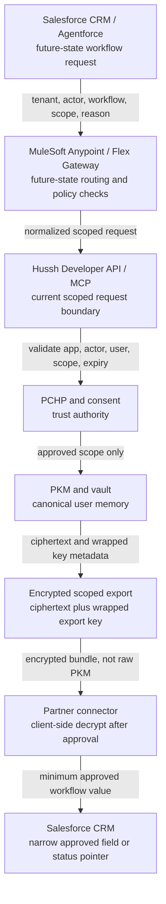

# Salesforce And MuleSoft Partner Brief For Hussh One Infrastructure

Status: planning-only partner brief. No Salesforce, MuleSoft, Agentforce, or Flex Gateway implementation is claimed by this document.

## Visual Map

## Partner Premise

Salesforce and MuleSoft can become enterprise workflow channels for Hussh One, not replacements for Hussh trust infrastructure. The correct integration pattern is:

1. CRM or Agentforce requests a narrow user-approved task.
2. MuleSoft or Flex Gateway routes and governs the enterprise request.
3. Hussh validates app, actor, user, consent scope, and data class.
4. Hussh returns an encrypted scoped export or consent-status response through the approved connector lane.
5. Hussh keeps the canonical trust, audit, PKM, and vault boundaries.

## Recommended First Integration

Start read-only:

| Step | Contract |
| --- | --- |
| Request | Partner sends tenant, actor, app, user reference, requested workflow, and requested scope. |
| Consent check | Hussh verifies user consent, data class, purpose, expiration, and revocation state. |
| Encrypted export | Hussh returns ciphertext and wrapped export-key metadata for the approved scope, not raw PKM. |
| Connector handling | The partner connector decrypts client-side only after approval and materializes the minimum workflow value. |
| Narrow response | Salesforce stores only the approved workflow field, consent status pointer, or audit reference. |
| Audit | Hussh records request, actor, scope, decision, and response class. |
| Partner storage | Partner stores request ID, consent status pointer, and narrow CRM field if approved. |

Writeback should wait until explicit write scopes, replay protection, revocation UX, audit trails, and user-visible recovery behavior exist.

## PII And CRM Boundary

Allowed in Salesforce or CRM after approval:

- consent status pointer
- workflow status
- audit reference
- narrow field explicitly approved for the workflow
- non-sensitive operational metadata

Not allowed as broad mirrors:

- PKM
- vault contents
- vault keys
- durable One memory
- full email archives
- broad KYC packages
- reusable secrets
- unbounded PII exports

## MuleSoft And Flex Gateway Role

MuleSoft Anypoint and Flex Gateway are future-state partner-confirmation-needed lanes. They may help with:

- enterprise routing
- traffic shaping
- request normalization
- app-level policy checks
- logging of non-sensitive request metadata
- partner-side operational observability

They must not become:

- the canonical consent engine
- the canonical memory store
- the vault boundary
- the PCHP replacement
- a broad plaintext data lake for user memory

## Managed Omni Gateway Private Space Handoff

For the current MuleSoft setup discussion, use Managed Omni Gateway in CloudHub 2.0 Private Spaces rather than a self-managed gateway inside Hussh GCP.

Partner intake values live in [MuleSoft Managed Omni Gateway Private Space Handoff](../../reference/operations/mulesoft-managed-omni-private-space.md). The approved starting posture is:

- Private Space region: `US East (Ohio)` for Non-Prod and Prod private connectivity paths, aligned to GCP `us-east5`.
- Non-Prod Private Space CIDR: `10.81.0.0/22`.
- Prod Private Space CIDR: `10.91.0.0/22`.
- Internal DNS server IPs: pending until Hussh provisions Cloud DNS inbound forwarding.
- VPN: separate Non-Prod and Prod HA VPN connections with Cloud Router/BGP.

This handoff is network readiness, not consent authority. MuleSoft may route approved partner requests to Hussh; Hussh still validates app, actor, user, scope, expiry, revocation, and audit state before returning a consent status or encrypted scoped export.

## Enterprise Glossary

| Term | Meaning in this planning lane |
| --- | --- |
| Agentforce | Future-state Salesforce delegated action caller. It may request a Hussh-scoped workflow, not direct memory access. |
| MuleSoft Anypoint | Future-state enterprise integration layer for routing, policy mediation, and API orchestration. It does not own consent. |
| Flex Gateway | Future-state gateway option for traffic policy and partner-side operational controls. It does not replace PCHP. |
| Connected App / OAuth | Partner-confirmation-needed app identity model for Salesforce-to-Hussh authentication before user consent. |
| Org / user / app / actor claims | Partner-confirmation-needed identity claims that identify the Salesforce tenant, human user, connected app, and agentic actor. |
| Data Cloud / Hyperforce | Out of scope until Salesforce confirms whether either surface is required; neither is a PKM, vault, key, or consent store. |
| Partner connector | Partner-side component that receives encrypted scoped exports and handles client-side decryption after approval. |
| System of record | Salesforce may be system-of-record for CRM workflow metadata only; Hussh remains system-of-record for consent, audit, PKM, and vault boundaries. |
| Plaintext boundary | If connector-side plaintext enters CRM, that copy is outside Hussh zero-knowledge protection and needs retention, encryption or masking, access control, audit, and deletion ownership. |

## Agentforce Role

Agentforce can call a Hussh-scoped workflow tool when a user-approved enterprise workflow needs One, Kai, Nav, or KYC context. The Agentforce action must be described as a delegated workflow request, not as direct access to user memory.

## Founder Wiki Validation

Before this brief is used externally, run authenticated Founder Wiki validation for:

- Salesforce
- MuleSoft
- Agentforce
- Flex Gateway
- CRM
- PII
- PCHP brand-side endpoint
- iBrokerage
- One Email KYC
- Hu-SSH and Signature Vault

Safe output only: page names checked, alignment classifications, current-state-vs-north-star drift, and repo docs that need updates.

Current status: `authenticated_salesforce_streamlining_complete` as of 2026-05-19. This remains a planning-only partner brief, not proof of a Salesforce, MuleSoft, Agentforce, or Flex Gateway implementation.

## Partner Confirmations Needed

| Topic | Confirmation Needed |
| --- | --- |
| OAuth and app identity | Which app identity, tenant model, and actor claims the partner can send. |
| Consent UX | Whether Hussh or the partner presents the user-facing consent screen for each workflow. |
| Data residency | Where approved workflow fields may be stored and for how long. |
| Audit handoff | Which audit IDs partner systems must store and display. |
| Revocation | How partner systems receive revocation or expiration signals. |
| Writeback | Which future write scopes are required, and which are prohibited. |

## Out Of Scope

- Broad PKM sync.
- Full KYC sync.
- Vault key custody.
- CRM-owned durable memory.
- Direct partner access to locked local compute.
- Production claims before repo implementation and tests exist.
