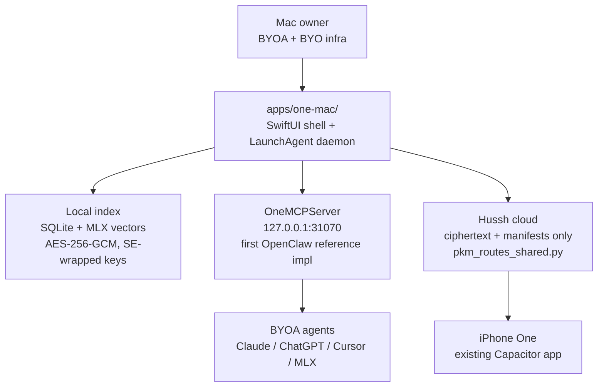

# One for macOS — Knowledge-Base App Plan

Status: **planning-only roadmap.** This is not a current-state implementation contract. Code lives at [`apps/one-mac/`](../../apps/one-mac/); it currently contains only a Phase 0 skeleton.

## Framing

> **Hussh = `[hu]man [s]ecure [s]ocket [h]ost`.**
>
> One for macOS is the **host** in that mnemonic: the user's latest Apple-silicon Mac runs the daemon, the encrypted on-device index, and the **secure socket** (local MCP HTTP/SSE server) that exposes user-owned knowledge — under PCHP consent — to BYOA agents (Claude / ChatGPT / Cursor / local MLX) and to trusted people.

## Visual Map

## Current Overlap

The repo already ships pieces the One-mac plan reuses:

- the PKM data shapes at [`consent-protocol/api/routes/pkm_routes_shared.py`](../../consent-protocol/api/routes/pkm_routes_shared.py) (`DomainSummary`, `PersonalKnowledgeModelIndex`) — Mac index will mirror them so the cloud is a ciphertext-redundant mirror
- the HMAC-signed bearer token primitives at [`consent-protocol/hushh_mcp/consent/token.py`](../../consent-protocol/hushh_mcp/consent/token.py) (`HCT:` payload format with `user_id|agent_id|scope|issued_at|expires_at[|commercial]`) — One-mac CRTs will use the same format, ported into Swift under `apps/one-mac/Sources/OneConsent/`
- the existing hosted Consent MCP (`discover_user_domains`, `request_consent`, `check_consent_status`, `get_encrypted_scoped_export`, `validate_token`, `list_scopes`) — One-mac MCP tools will have analogous shapes so the iPhone's existing `PersonalKnowledgeModelPlugin` in [`hushh-webapp/ios/App/CapApp-SPM/Package.swift`](../../hushh-webapp/ios/App/CapApp-SPM/Package.swift) needs zero changes to read Mac-written ciphertext
- the Nav 5-tab prototype + 4-phase handshake animation — Mac UI is a port, not a fork, of the existing surface

## Missing Primitives

Before One-mac becomes current-state runtime, the repo needs these primitives:

1. Swift port of `hushh_mcp/consent/token.py` (HMAC-SHA256 over the canonical `HCT:` payload).
2. A new `local_mcp_session` consent scope with short TTL + device-binding field in `consent-protocol/hushh_mcp/constants.py`.
3. A new desktop pairing route under `consent-protocol/api/routes/one/` (planned filename `desktop.py`, sibling of `email.py`) for device registration, pair manifest sync, and revocation propagation.
4. New PKM domain keys: `macos_index`, `macos_local_fs`, `macos_apple_notes`, `macos_apple_mail`, `macos_calendar`, `macos_obsidian`, `macos_notion`, `macos_gdrive`, `macos_slack`.
5. A `DataSourceBinding` Swift protocol in `apps/one-mac/Sources/OneMCPServer/` designed to be the first concrete reference implementation of the planned **OpenClaw** open-source consent-MCP host.
6. An OpenClaw conformance test harness under `apps/one-mac/Tests/OneMCPServerTests/openclaw-conformance/`.
7. A device-pairing CRT ceremony (QR + biometric) that issues a per-device key envelope, recorded in both local `device_pairings` and the cloud `desktop` registry.
8. App Intents conformance for the 10 v1 verbs (`SearchMyKnowledge`, `OpenSource`, `ShowConsentLog`, `ListAgentsConnected`, `RevokeAgent`, `GrantToPerson`, `RevokeFromPerson`, `RebuildIndex`, `PauseIngest`, `ResumeIngest`) plus entity types.
9. A Mac-side Nav UI that mirrors — does not parallel — the existing 5-tab prototype (Home / Private Vault / Agent Requests / Nav Rules Engine / Audit Log) and the 4-phase handshake animation.
10. A signed Developer ID build pipeline with notarization for v1; a separate sandbox-compatible MAS build for v2.

## ZK Posture

One-mac matches Hussh's **shipped** zero-knowledge definition: client-side AES-256-GCM with Secure-Enclave-wrapped keys + HMAC-signed bearer tokens. Plaintext exists only in the daemon's process memory during a consented read. Cloud holds ciphertext + manifests; the server cannot decrypt vault contents. Cryptographic ZK proofs (Merkle-sealed transparency log, Pedersen commitments, Sigstore-style cosignatures) are deferred to Phase 6+.

## OpenClaw Alignment

`apps/one-mac/Sources/OneMCPServer/` is the first concrete reference implementation of the planned open-source OpenClaw consent-MCP host. Promotion criteria for the planned `wiki/concepts/openclaw.md` page from private to public are:

1. `apps/one-mac/Sources/OneMCPServer/` is open-sourceable in isolation: Apache-2.0, no Hussh-only dependencies, and a stable `DataSourceBinding` protocol.
2. `apps/one-mac/Tests/OneMCPServerTests/openclaw-conformance/` passes against both a stub `DataSourceBinding` and the real One-mac binding with identical assertions.
3. Founder authorizes promotion.

**NemoClaw** is Nvidia's planned extension of OpenClaw — it is outside the Hussh repository scope and is referenced here only for awareness.

## Mobile Bridge

The iPhone and the Mac do **not** sync over LAN in v1. The Mac is the **canonical writer** of PKM ciphertext; the iPhone reads via the existing hosted Consent MCP at `https://api.uat.hushh.ai/mcp/` using the already-shipped `PersonalKnowledgeModelPlugin`. The bridge path is:

1. **Pair** — Mac mints a `device_pairing` CRT, surfaces a QR; iPhone scans, Face-ID-confirms; pairing rows land in both local `device_pairings` and cloud `desktop` registry.
2. **Write** — Mac daemon POSTs `{ciphertext, iv, tag, manifest_entry}` to `/pkm/blobs` + `/pkm/manifests`.
3. **Read from iPhone** — existing `PersonalKnowledgeModelPlugin` calls `get_encrypted_scoped_export` → device-bound DAT → ciphertext fetched → decrypted on-device using the iPhone's SE-wrapped key (delivered during the pair ceremony).

**Plaintext never traverses cloud.** Per-device SE keys never leave their device; only ciphertext + the pair envelope move. Multi-device sync remains the responsibility of the existing PKM ciphertext relay, not the disabled `/api/sync/*` surface.

## Distribution

- **v1 — Developer ID + Notarization.** Full entitlements: `SMAppService` (LaunchAgent), AppleEvents (AppleScript Notes bridge), MailKit, EventKit, full filesystem read/write, network client. Distributed direct via signed `.dmg`.
- **v2 — Mac App Store.** Sandbox-compatible connector subset only (Files / EventKit / Reminders). AppleScript + MailKit private surfaces drop behind `#if MAS` compile guards. A separate `OneMacMAS` scheme builds the MAS variant.

## Promotion Criteria

Move this plan into execution docs only when:

- Phase 1 has landed (`OneIndexer` + LocalFS + Spotlight connectors + a working `one_search` MCP tool) on `main`
- the OpenClaw conformance test suite is green in CI
- the Swift port of `hushh_mcp/consent/token.py` has byte-for-byte round-trip parity with the Python source
- the planned desktop pairing route exists at `api/routes/one/desktop.py` inside `consent-protocol/` and is covered by tests
- Nav 5-tab UI is implemented and matches the existing prototype
- a signed Developer ID build can be notarized and launched on a clean macOS 15 VM
- the iPhone read path (via the hosted Consent MCP) decrypts Mac-written ciphertext end-to-end without changes to `hushh-webapp/`
- founder authorizes promotion of [`apps/one-mac/`](../../apps/one-mac/) from "Phase 0 skeleton" to current-state contract docs in `docs/reference/architecture/`

Promotion targets:

- Mac-specific execution docs → `apps/one-mac/docs/...` (created on promotion)
- Cross-cutting consent-protocol changes → `consent-protocol/docs/reference/...`
- Three-layer architecture docs → a new `one-mac-architecture.md` under `docs/reference/architecture/`

## Founder Claims Held Here Until Shipped

| Founder-language claim | Required proof before current-state docs may claim it |
| --- | --- |
| Your agents are yours to own | Working BYOA pane on a Developer-ID-signed build, with Claude Desktop, Cursor, and ChatGPT MCP each reading the local MCP server under per-agent CRTs |
| Mac is the host, cloud is a ciphertext mirror | `pkm_blobs` rows in the cloud carry only `{ciphertext, iv, tag}`; no plaintext writeback path exists; verified by route-level golden tests |
| One MCP server = first OpenClaw reference impl | `apps/one-mac/Sources/OneMCPServer/` is Apache-2.0 and the OpenClaw conformance test harness is green |
| Hussh = `[hu]man [s]ecure [s]ocket [h]ost` | The mnemonic appears in product copy only after the local MCP server is shipping and the host model is verifiable end-to-end |

## References

- [`docs/future/README.md`](./README.md) — future-roadmap home and promotion rule
- [`docs/future/one-nav-runtime-plan.md`](./one-nav-runtime-plan.md) — One/Kai/Nav/KYC migration plan that this app conforms to
- [`apps/one-mac/README.md`](../../apps/one-mac/README.md) — Phase 0 skeleton entry point
- [`.codex/skills/desktop-mac/SKILL.md`](../../.codex/skills/desktop-mac/SKILL.md) — owner skill for this surface
