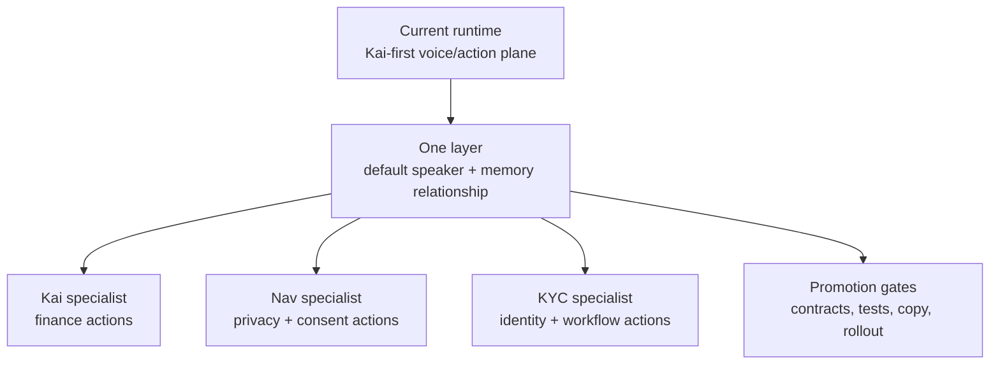

# One/Kai/Nav/KYC Runtime Plan

Status: planning-only roadmap. This is not a current-state implementation contract.

## Visual Map



## Current Overlap

The current app already has pieces the One/Kai/Nav/KYC model can reuse:

- a generated voice/action gateway from local `.voice-action-contract.json` files
- route, persona, vault, auth, consent, and onboarding guards
- encrypted, vault-gated durable voice memory
- consent center, profile security, deletion, and scoped-access surfaces
- Kai finance routes, analysis actions, search grounding, and command execution
- PKM writeback patterns that can become the structured memory layer for KYC outcomes
- the current `one@hushh.ai` KYC mailbox contract described in [One Email KYC](../reference/architecture/one-email-kyc.md)

The gap is not capability existence. The gap is ownership clarity: the live runtime still defaults to Kai as the assistant identity in many places, while the product direction makes One the top relationship layer and Nav the privacy guardian.

KYC is the first planned specialist added to this roadmap after Kai and Nav. KYC is not a second top-level application identity. One owns the user relationship, Nav owns consent and trust review, and KYC owns bounded identity/KYC workflows.

## Missing Primitives

Before One/Kai/Nav/KYC becomes current-state runtime, the repo needs these primitives:

1. `speaker_persona` carried from local action contracts through the generated gateway, manifest, frontend registry, backend prompt selection, and composer path.
2. `delegate_agent_id` carried where a user-facing action is executed by a specialist instead of the top One layer.
3. Prompt identity templates for `one`, `kai`, `nav`, and `kyc`.
4. TTS instruction selection for the active speaker persona.
5. Shell copy ownership rules for greetings, notifications, memory, consent, and specialist handoffs.
6. Nav-owned action inventory for consent, vault, deletion, revocation, and scope review.
7. KYC-owned action inventory for identity/KYC requests, missing-document review, approval-gated drafts, and structured PKM writeback.
8. Analytics/event fields that distinguish workspace persona, speaking persona, and delegated specialist.
9. Verification that `nav.*` means Nav guardian capability, while `route.*` means navigation.
10. One-owned memory portability, export, and retention contracts that separate relationship memory from Kai finance memory and Nav trust memory.
11. KYC memory/writeback rules that allow structured facts and workflow artifacts without raw email-thread persistence.
12. BYO AI / BYO model policy that distinguishes user-held keys from provider routing, model availability, and local-device capability.
13. Action-receipt privacy rules that define which receipts are encrypted for the user, which audit rows are visible to platform services, and which metadata remains operationally necessary.

## Promotion Criteria

Move this plan into execution docs only when:

- every generated action has a valid `speaker_persona`
- delegated specialist actions have a valid `delegate_agent_id`
- `rg "nav\\." contracts/kai hushh-webapp consent-protocol docs .codex` finds only true Nav guardian actions or roadmap prose
- voice planner/composer prompts can select One, Kai, Nav, or KYC without weakening existing English-only, vault, consent, or rollout controls
- shell and design-system docs define which copy surfaces belong to One, Kai, Nav, and KYC
- tests cover route actions, finance actions, privacy/consent actions, and KYC workflow actions with the correct speaker persona and delegated specialist
- UAT can prove that finance workflows still execute through Kai while consent/privacy workflows are framed by Nav
- UAT can prove that KYC workflows are framed by One, scope-reviewed by Nav when needed, and executed by KYC only inside a bounded consent grant
- PKM docs can truthfully describe One-owned relationship memory, Kai finance memory, Nav privacy memory, and KYC workflow artifacts without contradicting the checked-in storage and unlock path
- claims such as on-device memory, no platform-controlled backdoor recovery, portable One memory export, BYO model execution, and user-private action receipts are backed by implementation references and tests

## Founder Claims Held Here Until Shipped

The founder drafts are directionally important, but the following claims remain planning-only until implementation proof exists:

| Founder-language claim | Required proof before current-state docs may claim it |
| --- | --- |
| One memory lives on device and is portable | PKM/storage docs, client unlock path, export format, and tests prove relationship-memory portability |
| There is no platform-controlled recovery path | Vault/key-management docs and recovery UX prove the exact no-backdoor model |
| Users can bring any model or key | Provider routing, key storage, local execution, and failure-mode docs prove BYO AI behavior |
| Every action leaves a receipt only the user can read | Receipt schema, encryption boundary, audit visibility, and support/debug metadata rules are documented and tested |
| One can act across messages, calendar, accounts, finance, KYC, and consent | Route/action contracts, delegated specialists, and consent scopes exist for those domains |

## Phases

### Phase 1: Contract Hygiene

- Rename navigation action ids from `nav.*` to `route.*`.
- Add `speaker_persona` and `delegate_agent_id` to local contracts and generated outputs.
- Reserve `nav.*` for true Nav guardian actions.
- Reserve KYC execution for `kyc.*` workflow actions or explicit `delegate_agent_id: "kyc"`.
- Update docs, skills, tests, and audits in the same change.

### Phase 2: Prompt And Speech Selection

- Add One/Kai/Nav/KYC prompt identity templates.
- Route planner/composer speech through `speaker_persona`.
- Keep English-only STT/planner/composer/TTS constraints unchanged.
- Do not change trust or execution authority based on speaker persona; authority comes from consent, vault, persona, workspace, and delegated-agent policy.

### Phase 3: Shell And Copy Migration

- Move greetings, notifications, memory recall, and generic help toward One.
- Move consent review, scope review, deletion, revocation, vault, and suspicious-access copy toward Nav.
- Keep finance analysis, market, portfolio, and RIA finance decisions with Kai.
- Move KYC status, missing-document review, and approval-gated draft language toward KYC only on explicit KYC workflow surfaces; One frames and closes the handoff.

### Phase 4: Nav Capability Inventory

- Add explicit Nav actions for consent and privacy work.
- Keep route actions as `route.*`.
- Add tests proving Nav actions are not just renamed navigation actions.

### Phase 5: KYC Capability Inventory

- Add KYC actions for identity/KYC request intake, missing-document status, draft generation, and structured PKM writeback.
- Use the current `one@hushh.ai` KYC mailbox contract in [One Email KYC](../reference/architecture/one-email-kyc.md) for active implementation truth.
- Default outbound KYC messages to user approval before send.
- Add tests proving KYC cannot read or write outside its workflow consent.

### Phase 6: UAT Promotion

- Run focused voice, docs, typecheck, and backend voice suites.
- Run UAT smoke for finance, consent, vault, deletion, notification, and KYC workflow flows.
- Promote only after current-state docs can describe One/Kai/Nav/KYC without future-state caveats.

## Risks

| Risk | Mitigation |
| --- | --- |
| Kai identity bleeds into generic assistant copy | Design-system copy ownership rules and voice prompt speaker selection |
| Nav becomes a branding label for navigation | Reserve `nav.*` for privacy/consent guardian actions; use `route.*` for navigation |
| KYC becomes an uncontrolled email agent | Keep One as relationship owner, Nav as consent reviewer, KYC as bounded workflow specialist, and outbound send approval-gated |
| One/Kai/Nav/KYC copy overclaims shipped runtime | Docs governance requires current-state versus future-state wording |
| Personality work weakens trust controls | Speaker persona never changes guards, tokens, vault policy, or consent enforcement |
| Duplicate action paths appear during migration | Straight rename only; no legacy alias, no dual-write, no compatibility acceptance path |
| BYO AI language implies unsupported providers or local inference | Provider/model claims stay future-state until backed by runtime config, docs, and tests |
| Private receipt language hides necessary audit metadata | Receipt privacy rules must distinguish user-private contents from operational audit metadata |

## Verification Gates

Contract hygiene:

```bash
cd hushh-webapp && npm run build:voice-gateway
cd hushh-webapp && npm run verify:voice-gateway
rg "nav\\." contracts/kai hushh-webapp consent-protocol docs .codex
rg "delegate_agent_id" contracts/kai hushh-webapp consent-protocol docs .codex
```

Runtime proof:

```bash
cd hushh-webapp && npm run typecheck
cd hushh-webapp && npm run test -- __tests__/voice/kai-action-gateway.test.ts __tests__/voice/voice-action-manifest.test.ts __tests__/voice/investor-kai-action-registry.test.ts __tests__/voice/voice-grounding.test.ts __tests__/voice/voice-turn-orchestrator.test.ts
cd consent-protocol && python3 -m pytest tests/test_kai_voice_contract.py tests/test_kai_voice_rollout_guardrails.py -q
```

Docs and skills:

```bash
./bin/hushh docs verify
python3 .codex/skills/docs-governance/scripts/doc_inventory.py tier-a
python3 .codex/skills/codex-skill-authoring/scripts/skill_lint.py
./bin/hushh codex audit
```

## Out Of Scope

- No production claim that One/Kai/Nav/KYC is fully shipped before the runtime proves it.
- No callable alias path for previous route-navigation `nav.*` action ids.
- No celebrity voice references in canonical docs.
- No personal numeric preference in canonical docs.
- No production/public `one@hushh.ai` inbound KYC workflow until the [One Email KYC](../reference/architecture/one-email-kyc.md) production gates pass. UAT mailbox validation is allowed only under controlled smoke tests.
