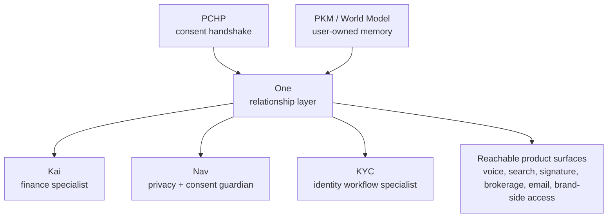

# One Product Surface Evolution Plan

Status: planning-only roadmap. This is not a current-state implementation contract.

## Visual Map

## Purpose

This plan defines how the current Kai-first app should evolve into a coherent One product surface without creating parallel product roots.

The goal is not to rename everything to One. The goal is to make One the relationship layer while preserving specialist ownership, trust boundaries, and current runtime truth.

## Current Truth

The repo already has the pieces needed for this transition:

- Kai-first finance routes, voice, search, action gateway, market intelligence, portfolio, and RIA workflows
- generated action contracts with `speaker_persona` and delegated-specialist fields
- route, persona, vault, auth, consent, onboarding, and workspace guards
- encrypted PKM architecture, provenance docs, runtime DB boundaries, and cache-coherence rules
- One Email KYC as a bounded identity workflow, not a broad autonomous email agent
- PCHP implemented today through the Consent Protocol Developer API and MCP consent/export flow

The gap is product-surface composition. Current implementation docs are strong by subsystem, but the product needs one evolution path that tells contributors how new surfaces become part of One instead of becoming standalone roots.

## Direction

One should become the product surface that:

- listens through scoped connected surfaces
- remembers through encrypted PKM and governed projections
- decides by selecting the right specialist
- acts only through bounded route, vault, consent, persona, workspace, and audit controls

Kai, Nav, KYC, and future specialists remain below One:

- Kai owns finance judgment, portfolio context, market intelligence, brokerage, RIA, and finance decision receipts.
- Nav owns consent, vault, deletion, revocation, suspicious access, and scope-review friction.
- KYC owns explicit identity workflow state, missing-document review, approval-gated drafts, and structured PKM writeback.
- Future specialists must name their One handoff, specialist owner, consent scope, vault boundary, and action route before they become product-aligned.

## Surface Lanes

| Surface lane | Product owner | Current-state boundary | Promotion condition |
| --- | --- | --- | --- |
| One shell and relationship layer | One | Approved direction; current runtime remains Kai-first in many places | Shell, prompts, analytics, copy, and action contracts prove One owns generic framing |
| Finance, market, brokerage, RIA | Kai | Current shipped finance specialist | Keep Kai as craft owner while One frames cross-domain handoff |
| Consent, privacy, vault, deletion | Nav | Approved direction; not yet separate runtime | Add true Nav actions and copy surfaces without using `nav.*` for route navigation |
| Identity and KYC workflows | KYC under One | One Email KYC has execution-owned references | Keep mailbox/KYC bounded, approval-gated, and scope-limited |
| Signature and document trust | Nav/KYC under One | North-star surface only unless backed by checked routes/contracts | Preserve vault, consent, audit, approval, and document provenance boundaries |
| iBrokerage | Kai under One | Future-facing brokerage direction | Use current brokerage contracts as implementation truth before expanding claims |
| PCHP brand-side access | PCHP / Developer API / MCP | Future-facing ecosystem framing; current PCHP maps to consent/export APIs | No separate trust plane; every brand/app path uses scoped consent and audit |
| OpenClaw / LLM Wiki projections | PKM / World Model under One | Interoperability pattern, not canonical memory | Projections must derive from encrypted consented PKM and stay revocable/exportable |
| BYOA and on-device execution | Platform constraint | Future-state unless a current AI runtime proves support | Provider/model/key/local execution docs and tests prove each claim |

## Cleanup Needed

### 1. Keep Kai current-state docs narrow

`docs/reference/kai/` should remain the current-state finance specialist home. It should not become the One product-surface home.

Required posture:

- Kai docs may mention One only as the relationship-layer direction.
- Kai current-state docs must keep runtime claims tied to checked routes, generated contracts, tests, and provider behavior.
- Finance safety, degraded state, realtime quote provenance, and decision receipts stay Kai-owned.

### 2. Treat `docs/vision/kai/README.md` as a finance thesis, not the product hub

The long Kai vision page is useful as finance-specialist narrative, but it should not carry the whole One story.

Cleanup target:

- keep the opening One/Kai boundary
- avoid adding more runtime detail there
- move new implementation claims into `docs/reference/kai/`
- move new future-state surface ideas into `docs/future/`
- avoid entity/legal/fund-specific expansion unless legal review explicitly asks for it

### 3. Use One as the product-surface organizer

New product ideas should be reviewed by asking:

1. What user pain does this solve tomorrow?
2. Which One motion does it improve: listen, remember, decide, or act?
3. Which specialist owns the craft?
4. Which consent scope, vault boundary, route/action id, and audit path make it safe?
5. Is it reachable from the app/backend today, or is it a future projection?

If those answers are missing, the work is not ready for merge even if it is logical standalone code.

### 4. Keep infrastructure and product surface tied together

The seven-layer architecture remains the infrastructure map. One is the product surface that rides that infrastructure.

Do not create a separate One architecture that bypasses:

- PCHP / Consent Protocol
- generated action contracts
- encrypted PKM
- runtime DB data-plane rules
- web/native parity
- route and workspace guards
- docs/current-state proof requirements

## Promotion Gates

A future One product-surface claim can move into current-state docs only when:

- a reachable route, component, backend route, generated action, or native path exists
- the owner is clear: One, Kai, Nav, KYC, or a future specialist
- vault, consent, auth, workspace, and audit boundaries are documented
- tests or smoke checks prove the behavior
- docs avoid overclaiming on-device, BYOA, private receipts, or full One memory until implementation proves them

## What Not To Build

- standalone agents with no One handoff
- root-level subsystems not reachable from canonical app/backend/package paths
- duplicate memory stores that bypass encrypted PKM
- brand-side or developer access that bypasses PCHP consent/export flow
- voice/search/action paths that do not use generated action contracts
- Kai docs that make Kai sound like the whole platform
- KYC/email features that become broad mailbox automation

## Related References

- [../vision/README.md](../vision/README.md)
- [../vision/agent-ontology.md](../vision/agent-ontology.md)
- [./one-nav-runtime-plan.md](./one-nav-runtime-plan.md)
- [../reference/architecture/architecture.md](../reference/architecture/architecture.md)
- [../reference/architecture/founder-language-matrix.md](../reference/architecture/founder-language-matrix.md)
- [../reference/architecture/one-email-kyc.md](../reference/architecture/one-email-kyc.md)
- [../reference/kai/README.md](../reference/kai/README.md)
- [../reference/kai/kai-action-gateway-vnext.md](../reference/kai/kai-action-gateway-vnext.md)
