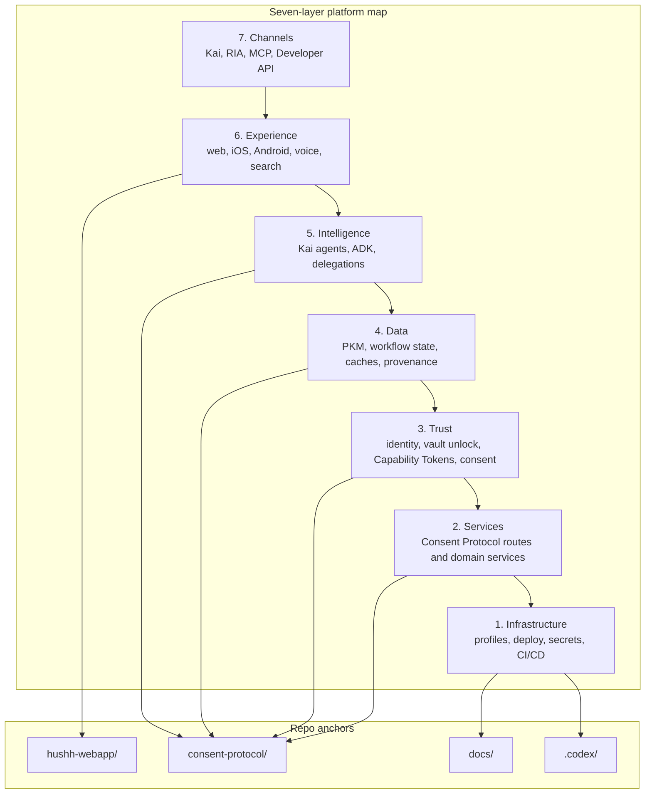

# Hussh Project Context Map

> Orientation for contributors and coding agents. Read this before making changes.

## Visual Map

## North Stars

- Hussh Principle: "An agent should work for the person whose life it touches."
- Kai North Star: "Your data, your business. Your committee, on-demand."

## Read The Repo As One Platform

This repo is the platform.

The current checked-in user-facing intelligence runtime is Kai-first, while the product direction is One as the personal agent with Kai as its finance specialist. The architecture also includes the trust plane, the data plane, the developer lane, the agent plane, the mobile lane, and the operational governance surface that keep the platform coherent at scale.

Start with:

1. [docs/reference/architecture/architecture.md](./reference/architecture/architecture.md)
2. [docs/reference/operations/brand-and-compatibility-contract.md](./reference/operations/brand-and-compatibility-contract.md)
3. [docs/reference/architecture/founder-language-matrix.md](./reference/architecture/founder-language-matrix.md)

## CRITICAL RULES (Non-Negotiables)

These are invariants. If a change violates one, it is the wrong change.

1. **Cryptographic Primitives**
   - Vault keys are derived or unlocked client-side.
   - The backend stores ciphertext only.
2. **Capability Tokens + PCHP**
   - "Signed in" is not consent.
   - Every vault, PKM, export, or agent operation requires valid scoped authority.
   - There are no dev or test bypasses for consent-critical paths.
3. **Separation of Duties**
   - Web, iOS, and Android stay contract-aligned or are explicitly marked otherwise.
   - Components do not call `fetch()` directly; they use the service layer.
   - Frontend, backend, and trust-boundary docs must stay in sync.
4. **Minimal Browser Storage**
   - Sensitive credentials and vault keys stay memory-only.
   - Decrypted PKM stays memory-only.
   - Only explicitly approved encrypted snapshots or non-sensitive cache/settings values may use device storage.

## Layer-To-Repo Map

### 1. Infrastructure

- repo command surface: `./bin/hushh`
- runtime and deploy governance: `docs/reference/operations/`
- contributor and automation surfaces: `.codex/`, `scripts/`, `deploy/`

### 2. Core Platform Services

- backend routes and domain services: `consent-protocol/api/`, `consent-protocol/hushh_mcp/services/`
- provider orchestration and protocol contracts: `consent-protocol/docs/reference/`

### 3. Trust, Identity, And Governance

- IAM, consent, and runtime-boundary docs: `docs/reference/iam/`
- consent lifecycle and token model: `consent-protocol/docs/reference/consent-protocol.md`

### 4. Data And Knowledge

- storage facts, provenance, and PKM boundaries: `docs/reference/architecture/runtime-db-fact-sheet.md`, `docs/reference/architecture/data-provenance-ledger.md`
- PKM model: `consent-protocol/docs/reference/personal-knowledge-model.md`

### 5. Intelligence And Agent

- Kai and agent runtime docs: `docs/reference/kai/`, `consent-protocol/docs/reference/agent-development.md`
- operons and ADK surfaces: `consent-protocol/hushh_mcp/agents/`, `consent-protocol/hushh_mcp/operons/`, `consent-protocol/hushh_mcp/hushh_adk/`

### 6. Experience And Interaction

- frontend shell and services: `hushh-webapp/app/`, `hushh-webapp/components/`, `hushh-webapp/lib/services/`
- mobile and plugin contracts: `hushh-webapp/docs/`, `docs/reference/mobile/`, `docs/guides/mobile.md`

### 7. Channels, Ecosystem, And Distribution

- Developer API and MCP: `consent-protocol/docs/reference/developer-api.md`, `packages/hushh-mcp/README.md`
- channel-facing product docs: `docs/reference/kai/`, `docs/reference/iam/`, `docs/vision/`

## Repo Map

- `hushh-webapp/`: Next.js + React + Capacitor experience runtime
- `consent-protocol/`: FastAPI backend, consent protocol, PKM, agents, export and developer surfaces
- `docs/`: cross-cutting Hussh architecture, operations, vision, and guide references
- `.codex/`: reusable skills, workflows, and routing contracts for recurring repo work

## How Data Access Works

- Web: React component -> service layer -> Next.js proxy -> Consent Protocol
- Native: React component -> service layer -> Capacitor plugin -> Consent Protocol
- Backend: route -> policy validation -> domain service -> storage/provider plane

System overview: [docs/reference/architecture/architecture.md](./reference/architecture/architecture.md)  
Kai interconnection map: [docs/reference/kai/kai-interconnection-map.md](./reference/kai/kai-interconnection-map.md)

## Dynamic Domains And Scopes

PKM storage is encrypted and domain-driven.

- encrypted blobs: `pkm_blobs`
- non-encrypted index/metadata: `pkm_index`
- scope pattern: `attr.{domain}.{attribute_key}` with wildcard support

Primary references:

- `consent-protocol/docs/reference/personal-knowledge-model.md`
- `consent-protocol/docs/reference/consent-protocol.md`
- `docs/reference/architecture/api-contracts.md`

## When Adding A Feature

Use `docs/guides/new-feature.md` and treat it as a required checklist.

Minimum definition of done:

1. tri-flow impact is implemented or explicitly marked N/A
2. consent and scope are validated at entry points
3. BYOK and ciphertext-at-rest are preserved
4. API or contract docs are updated in the same change
5. route or surface governance is updated when user-visible contracts move
6. PR impact and tests are updated

## Trust And Compliance Reality Check

If you are shipping anything investor-facing, read:

- `docs/reference/kai/kai-runtime-smoke-checklist.md`
- `docs/reference/architecture/data-provenance-ledger.md`
- `docs/reference/iam/validation-checklist.md`
