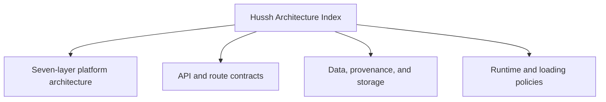

# Hussh Architecture Index

## Visual Map

Use this as the north-star entrypoint for the Hussh platform stack, its integration contracts, and the supporting runtime/data references.

The architecture docs use the founder-language dual-label contract defined in [founder-language-matrix.md](./founder-language-matrix.md): founder terms lead when describing system meaning, and implementation labels remain explicit when a reader needs route, token, package, or runtime precision.

Brand and compatibility rules live in [../operations/brand-and-compatibility-contract.md](../operations/brand-and-compatibility-contract.md).

## References

- [architecture.md](./architecture.md): canonical seven-layer Hussh platform architecture, plus integration, deployment, and runtime sequence model.
- [founder-language-matrix.md](./founder-language-matrix.md): canonical founder-term to implementation-term mapping and audit checklist.
- [api-contracts.md](./api-contracts.md): API surface and proxy/backend contracts.
- [route-contracts.md](./route-contracts.md): app route inventory and parity governance.
- [one-email-kyc.md](./one-email-kyc.md): current One-led KYC mailbox, consent, draft, send, and PKM writeback contract.
- [frontend-native-surface-map.md](./frontend-native-surface-map.md): generated route/API/native/plugin/voice mapper scaffold.
- [loading-policy.md](./loading-policy.md): canonical loading and empty-state policy.
- [cache-coherence.md](./cache-coherence.md): cache invalidation and freshness model.
- [data-model-governance.md](./data-model-governance.md): maintainer SOP for schema, data classes, retention, deletion, and table-family changes.
- [runtime-db-fact-sheet.md](./runtime-db-fact-sheet.md): runtime storage facts and boundaries.
- [runtime-db-data-plane-contract.json](./runtime-db-data-plane-contract.json): machine-readable table-family ownership, retention, deletion, and trust-boundary contract used by the data-model audit.
- [data-provenance-ledger.md](./data-provenance-ledger.md): provenance and audit data model.
- [pkm-cutover-runbook.md](./pkm-cutover-runbook.md): PKM cutover and compatibility rules.
