# Hussh Architecture View Catalog

Status: canonical engineering architecture view catalog. This document organizes Hussh architecture views using C4 as the primary diagram frame and ISO/IEC/IEEE 42010 as the view-governance frame.

## Visual Map

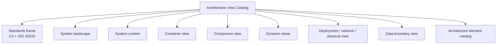

## Purpose

This catalog gives engineers, operators, and reviewers one standard vocabulary for Hussh architecture diagrams. It complements the seven-layer platform architecture in [architecture.md](./architecture.md) by defining the actual views we maintain, the stakeholder concern each view answers, and the source documents that must be checked before changing a diagram.

All diagrams in this document use GitHub-native Mermaid only: `flowchart` and `sequenceDiagram`. Do not use Mermaid C4 extension syntax here; keep C4 as the architecture framing, not the renderer syntax.

The primary method is:

- C4 model for software architecture structure: system landscape, system context, container, component, dynamic, and deployment views.
- ISO/IEC/IEEE 42010 for architecture-description discipline: each view names stakeholders, concerns, notation/model kind, source anchors, and current-versus-future-state status.

TOGAF and ArchiMate terms are supporting enterprise vocabulary only. In this repo, `catalog` means an inventory/list of architecture elements; `technology/deployment view` means runtime infrastructure and communication topology; `physical view` means deployed nodes, environments, data locations, and physical/logical runtime boundaries.

## Standards References

- C4 model: https://c4model.com/
- ISO/IEC/IEEE 42010: https://www.iso.org/standard/74393.html
- TOGAF Standard, 10th Edition: https://www.opengroup.org/togaf-standard-10th-edition-downloads
- UML deployment diagrams: https://support.microsoft.com/en-us/visio/create-a-uml-deployment-diagram
- OSI basic reference model: https://standards.iteh.ai/catalog/standards/iso/dd6368a0-cd9f-468b-94a3-7418626f4ee0/iso-iec-7498-1-1994

## Current-State Contract

- Current: Kai-first product runtime, Consent Protocol, Developer API, hosted MCP, `@hushh/mcp`, PKM/vault, consent/export, Cloud Run deploy lanes, Firebase identity, Supabase/Postgres data plane, RIA Intelligence provider lane, and governed UAT/production deploy workflows.
- Approved direction with checked-in manifests but not default app runtime everywhere: One, Nav, KYC, delegated specialist handoffs, and memory-agent structure.
- Future-state only: Salesforce, MuleSoft, Agentforce, Flex Gateway, OpenClaw/local MCP, full One/Nav default runtime, and broad BYOA/on-device private-compute lanes.
- Partner systems must not be drawn as canonical PKM, vault, key, or durable-memory stores. They may appear only as workflow endpoints that receive consent/audit metadata and narrow approved fields.

## View Catalog

| View | C4 / standard frame | Primary stakeholders | Concern answered | Current status |
| --- | --- | --- | --- | --- |
| System Landscape | C4 supporting diagram | founders, partners, engineering | Which people, systems, providers, and future-state channels surround Hussh? | current + future-state labels |
| System Context | C4 level 1 | founders, product, security, partners | What is inside the Hussh platform boundary and what is outside? | current + future-state labels |
| Container View | C4 level 2 | engineering, platform, reviewers | What deployable/runtime containers make up Hussh? | current |
| Component View | C4 level 3 | backend, frontend, security, agent engineers | What major components exist inside the Consent Protocol runtime and approved specialist direction? | current + approved-direction labels |
| Dynamic Views | C4 dynamic diagrams / sequence diagrams | engineering, partners, security | How do key flows move through consent, agents, exports, and writeback? | current + flow-specific future-state labels |
| Deployment / Network / Physical View | C4 deployment + UML deployment vocabulary | platform, ops, security | Where do artifacts run and how do environments communicate? | current where repo-backed |
| Data Boundary View | ISO 42010 data/security view | security, partners, platform | Where can plaintext, ciphertext, metadata, keys, and CRM fields live? | current policy |

## System Landscape

View metadata:

| Field | Value |
| --- | --- |
| Stakeholders | founders, partners, engineering, security |
| Concern | External landscape around Hussh, including current channels and future-state partner lanes |
| Model kind | C4 system landscape |
| Source anchors | `docs/project_context_map.md`, `docs/reference/architecture/architecture.md`, `docs/vision/agent-ontology.md`, `packages/hushh-mcp/README.md`, `docs/future/hussh-one-infra/salesforce-mulesoft-brief.md` |

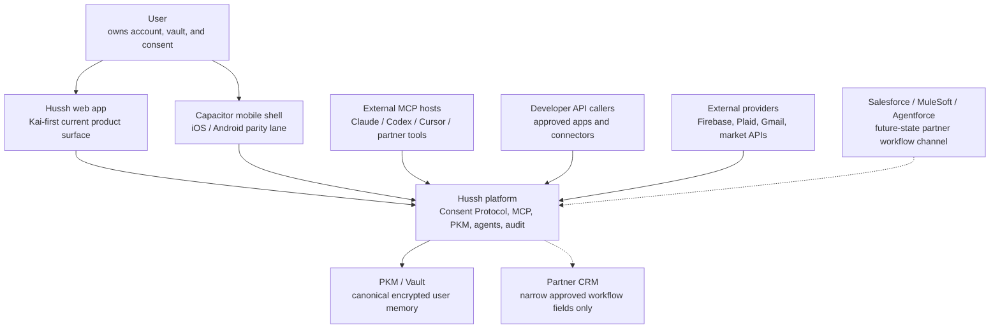

Reading rule: Hussh owns the trust and memory boundary. External systems are channels, providers, or workflow endpoints.

## System Context

View metadata:

| Field | Value |
| --- | --- |
| Stakeholders | product, engineering, security, partners |
| Concern | Hussh boundary, user authority, agent roles, MCP/developer access, and partner limitations |
| Model kind | C4 system context |
| Source anchors | `docs/vision/agent-ontology.md`, `docs/reference/iam/architecture.md`, `consent-protocol/docs/reference/developer-api.md`, `packages/hushh-mcp/README.md` |

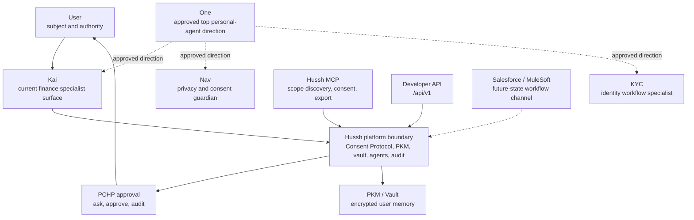

Current-state boundary: One, Nav, and KYC are approved ontology directions with checked-in manifests. Kai remains the most mature current product runtime unless a specific route proves otherwise.

## Container View

View metadata:

| Field | Value |
| --- | --- |
| Stakeholders | frontend, backend, platform, security |
| Concern | Runtime containers, stores, providers, and external transport lanes |
| Model kind | C4 container view |
| Source anchors | `consent-protocol/README.md`, `docs/project_context_map.md`, `docs/reference/architecture/api-contracts.md`, `packages/hushh-mcp/README.md`, `docs/guides/mobile.md` |

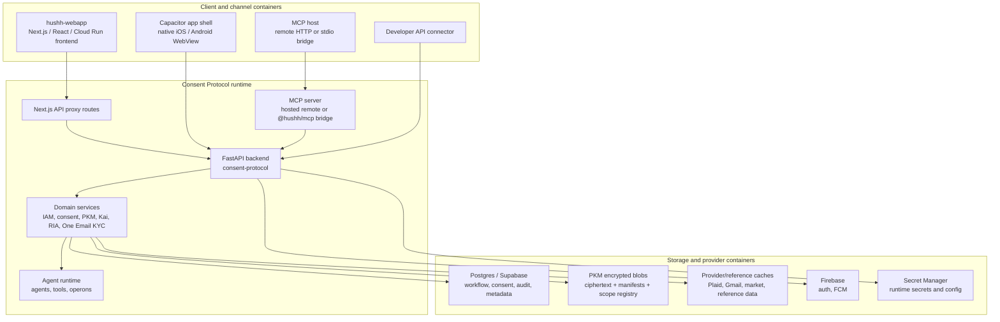

Container rule: clients call service/proxy boundaries; they do not become policy authorities or memory stores.

## Component View

View metadata:

| Field | Value |
| --- | --- |
| Stakeholders | backend, agent, frontend-service, security reviewers |
| Concern | Major components inside the Consent Protocol runtime |
| Model kind | C4 component view |
| Source anchors | `consent-protocol/docs/reference/agent-development.md`, `consent-protocol/docs/reference/kai-agents.md`, `docs/reference/iam/architecture.md`, `docs/reference/architecture/runtime-db-fact-sheet.md` |

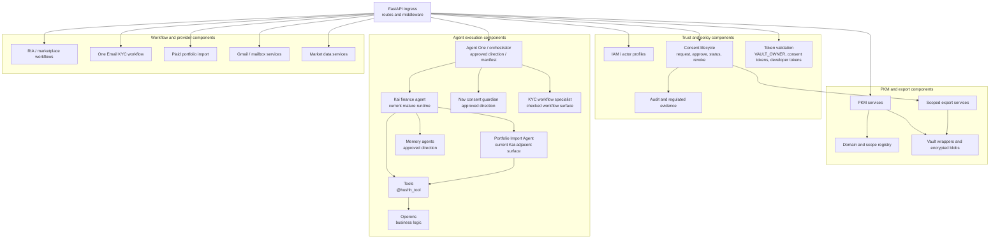

Component rule: agents orchestrate, tools expose callable operations, operons hold business logic, and services own persistence boundaries. Kai is the current mature specialist runtime. One, Nav, KYC, and memory-agent nodes are included only where checked manifests, route surfaces, or approved direction exist; do not read this diagram as proof that full One/Nav default runtime has shipped.

## Dynamic View: Consented Encrypted Export

View metadata:

| Field | Value |
| --- | --- |
| Stakeholders | partners, security, developer-platform engineers |
| Concern | How a connector receives only an approved encrypted export |
| Model kind | C4 dynamic / sequence diagram |
| Source anchors | `consent-protocol/docs/reference/developer-api.md`, `packages/hushh-mcp/README.md`, `docs/reference/iam/architecture.md` |

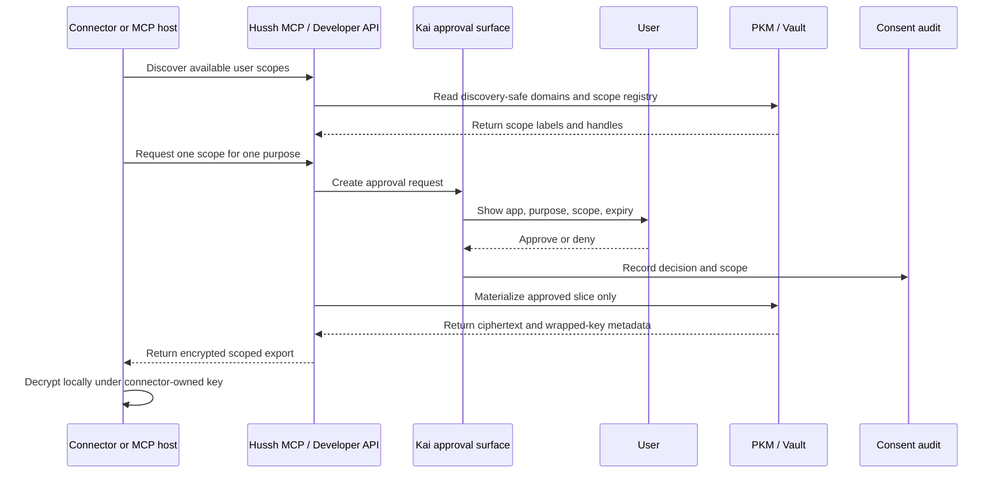

Partner boundary: if a connector decrypts PII and writes plaintext into a CRM, that copy is outside the Hussh zero-knowledge boundary and needs explicit purpose, consent scope, retention, encryption or masking, access control, deletion, and audit ownership.

## Dynamic View: One / Kai Specialist Delegation

View metadata:

| Field | Value |
| --- | --- |
| Stakeholders | product, agent-runtime engineers, security |
| Concern | How specialist handoffs should inherit authority instead of minting broader access |
| Model kind | C4 dynamic / sequence diagram |
| Source anchors | `docs/vision/agent-ontology.md`, `docs/reference/kai/kai-action-gateway-vnext.md`, `docs/reference/kai/kai-architecture-specification-v1.md`, `consent-protocol/hushh_mcp/agents/orchestrator/agent.yaml` |

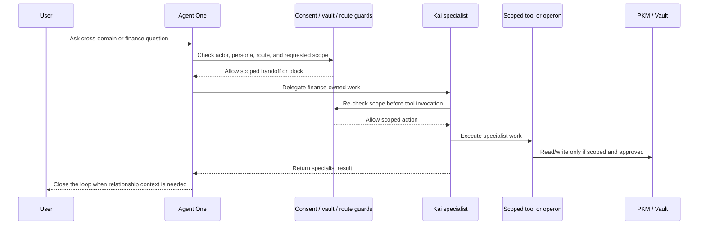

Delegation rule: specialist delegation never bypasses consent, vault, persona, workspace, route, rollout, or kill-switch checks.

## Dynamic View: Portfolio Import

View metadata:

| Field | Value |
| --- | --- |
| Stakeholders | Kai engineers, security, product |
| Concern | How import work stays under portfolio/import and vault/PKM authority |
| Model kind | C4 dynamic / sequence diagram |
| Source anchors | `consent-protocol/hushh_mcp/agents/portfolio_import/agent.yaml`, `docs/reference/kai/kai-architecture-specification-v1.md`, `docs/guides/plaid-activation-and-testing.md` |

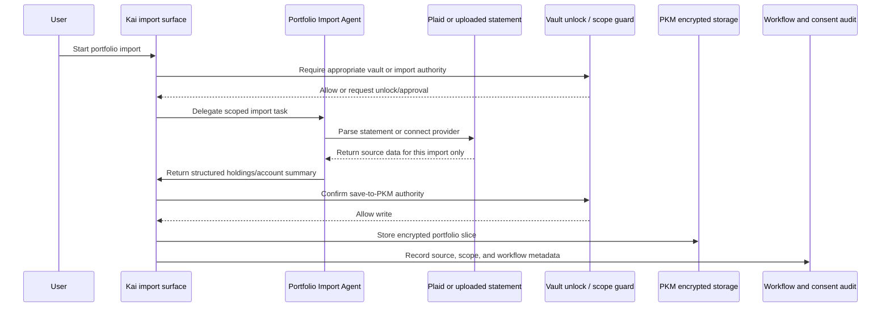

Import rule: import work does not give Kai or the import agent broad access to the user's vault. Save-to-PKM requires explicit scoped authority.

## Dynamic View: One Email KYC

View metadata:

| Field | Value |
| --- | --- |
| Stakeholders | KYC, backend, frontend, security |
| Concern | Mailbox intake, approval-gated draft, scoped export refresh, and structured writeback |
| Model kind | C4 dynamic / sequence diagram |
| Source anchors | `docs/reference/architecture/one-email-kyc.md`, `consent-protocol/hushh_mcp/services/one_email_kyc_service.py`, `hushh-webapp/lib/services/one-kyc-client-zk-service.ts` |

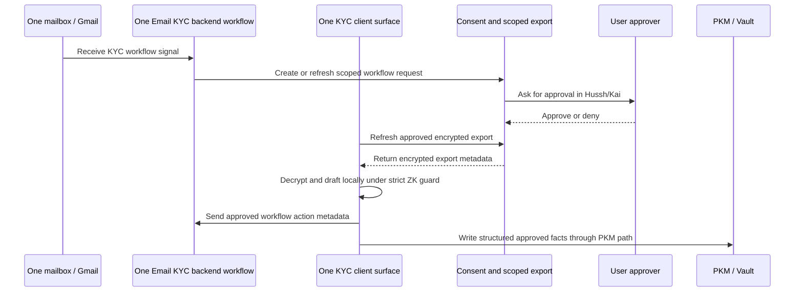

KYC rule: backend orchestrates workflow metadata and mail/send surfaces; strict client-side zero-knowledge behavior must not turn the backend into a plaintext review-draft store.

## Deployment / Network / Physical View

View metadata:

| Field | Value |
| --- | --- |
| Stakeholders | platform, operations, security, release owners |
| Concern | Runtime environments, deploy authority, service topology, and external communication paths |
| Model kind | C4 deployment view with UML deployment vocabulary |
| Source anchors | `deploy/README.md`, `.github/workflows/deploy-uat.yml`, `.github/workflows/deploy-production.yml`, `docs/guides/environment-model.md`, `docs/reference/operations/env-and-secrets.md`, `docs/reference/operations/branch-governance.md`, `docs/reference/architecture/crd-scraping-api.md` |

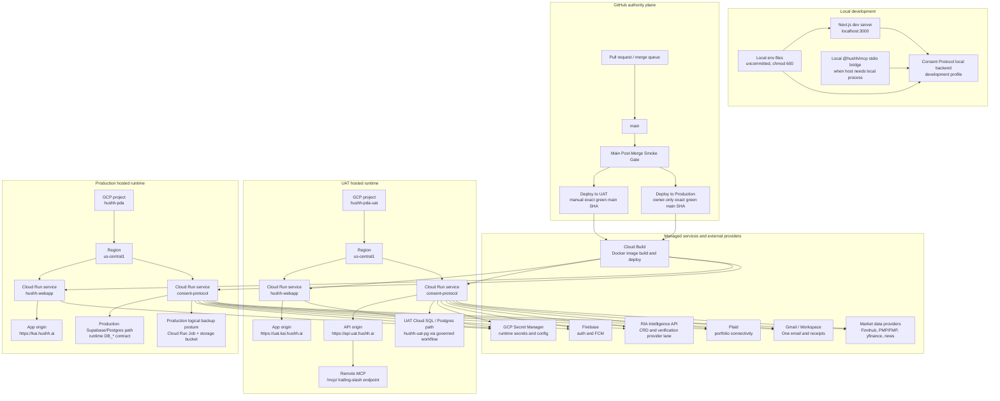

Topology limits:

- This is a service/environment topology, not a packet-level OSI diagram.
- It intentionally does not invent VPC, subnet, firewall, load-balancer, or private service-connect details that are not documented in the repo.
- UAT exposes Developer API and remote MCP; production defaults keep developer API and remote MCP disabled unless a later approved deploy contract changes that.

## Data Boundary View

View metadata:

| Field | Value |
| --- | --- |
| Stakeholders | security, partners, platform, compliance reviewers |
| Concern | Where sensitive data, ciphertext, audit metadata, keys, and partner fields may reside |
| Model kind | ISO 42010 data/security view |
| Source anchors | `docs/reference/architecture/runtime-db-fact-sheet.md`, `docs/reference/architecture/data-model-governance.md`, `docs/reference/architecture/pkm-cutover-runbook.md`, `consent-protocol/docs/reference/developer-api.md`, `packages/hushh-mcp/README.md` |

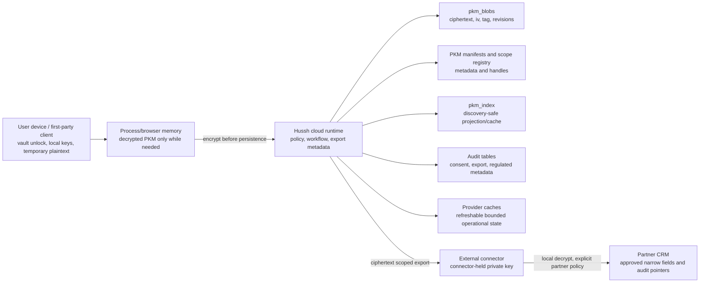

Boundary rules:

- Vault keys and decrypted PKM stay memory-only.
- `pkm_blobs` stores encrypted private content.
- PKM manifests and scope registry are authority for structure and exposure handles.
- `pkm_index` is discovery projection/cache, not canonical private memory.
- Provider caches are not durable user memory unless a consented encrypted PKM write makes them so.
- Partner CRM may store consent receipt ids, scope labels, status, expiry, audit references, and narrow approved workflow fields.
- Partner CRM must not store broad PKM, vault contents, vault keys, full email bodies, broad KYC packages, durable One memory, or reusable secrets by default.

## Architecture Element Catalog

| Element | Classification | Current role | Source anchor |
| --- | --- | --- | --- |
| `hushh-webapp` | container | Next.js, React, Capacitor experience runtime | `hushh-webapp/` |
| Consent Protocol | container | FastAPI backend, consent, PKM, IAM, Kai, RIA, MCP runtime | `consent-protocol/` |
| Developer API | interface | REST lane for scope discovery, consent, status, and scoped export | `consent-protocol/docs/reference/developer-api.md` |
| Hussh MCP | interface/container | Hosted remote MCP and npm bridge for consent tool access | `packages/hushh-mcp/README.md` |
| PKM / Vault | data boundary | Encrypted user memory, manifests, scope registry, discovery-safe index | `consent-protocol/docs/reference/personal-knowledge-model.md` |
| Agent One | agent | Top personal-agent direction and orchestrator manifest | `consent-protocol/hushh_mcp/agents/orchestrator/agent.yaml` |
| Kai | agent | Finance specialist and current mature runtime surface | `consent-protocol/hushh_mcp/agents/kai/agent.yaml` |
| Nav | agent | Privacy and consent guardian manifest | `consent-protocol/hushh_mcp/agents/nav/agent.yaml` |
| KYC | agent | Identity/KYC workflow specialist manifest | `consent-protocol/hushh_mcp/agents/kyc/agent.yaml` |
| Portfolio Import Agent | agent | Statement/CSV/PDF/image import specialist | `consent-protocol/hushh_mcp/agents/portfolio_import/agent.yaml` |
| Memory agents | agents | PKM segmentation, intent, merge, structure, summary reduction | `consent-protocol/hushh_mcp/agents/*/agent.yaml` |
| UAT Cloud Run lane | deployment node | `hushh-pda-uat`, `us-central1`, `consent-protocol`, `hushh-webapp` | `.github/workflows/deploy-uat.yml` |
| Production Cloud Run lane | deployment node | `hushh-pda`, `us-central1`, `consent-protocol`, `hushh-webapp` | `.github/workflows/deploy-production.yml` |
| RIA Intelligence API | provider/runtime dependency | Standalone CRD and advisor verification provider consumed through `RIA_INTELLIGENCE_*` configuration | `docs/reference/architecture/crd-scraping-api.md` |
| Salesforce/MuleSoft | future-state external system | Partner workflow channel only; not shipped implementation | `docs/future/hussh-one-infra/salesforce-mulesoft-brief.md` |

## Standards Glossary

| Term | Use in Hussh docs |
| --- | --- |
| Catalog | Inventory/list of architecture elements, views, components, interfaces, or data boundaries. |
| System Landscape | C4 supporting diagram showing the larger ecosystem around Hussh. |
| System Context | C4 view showing Hussh as the system of interest and its users/external systems. |
| Container | C4 deployable/runtime unit such as web app, backend, MCP server, database, or external service. |
| Component | Internal structural unit inside a container, such as IAM, PKM export service, agent runtime, or workflow service. |
| Dynamic View | Sequence or flow view showing runtime behavior across components or containers. |
| Deployment View | Runtime view showing where artifacts run and how environments/services connect. |
| Network View | Runtime communication path/topology. In this repo it is not OSI packet-level detail unless explicitly stated. |
| Physical View | Deployed nodes, environments, data locations, device/runtime boundaries, and infrastructure placement. |
| Future-state | Future or partner architecture lane without current implementation proof. |
| Current | Repo-backed implementation, deploy workflow, runtime contract, or checked-in manifest with clear boundary. |

## Maintenance Rules

1. Update this catalog when a canonical view, runtime container, major agent, deploy lane, or data boundary changes.
2. Keep current and future-state nodes visually distinct.
3. Do not add partner systems as trust authorities or memory stores.
4. Do not include secrets, local absolute paths, row payloads, HCT values, or inline developer tokens.
5. Do not invent cloud-network internals. Add VPC, subnet, load-balancer, or firewall details only after repo or live read-only evidence exists.
6. Prefer updating source-specific docs first, then this catalog as the cross-cutting view index.
