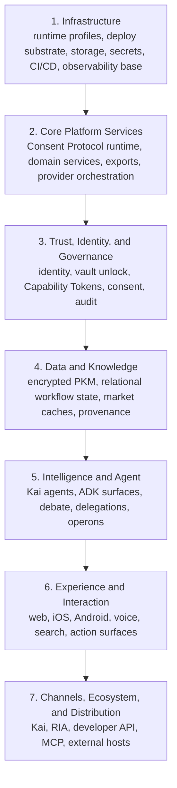
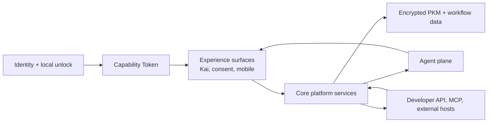
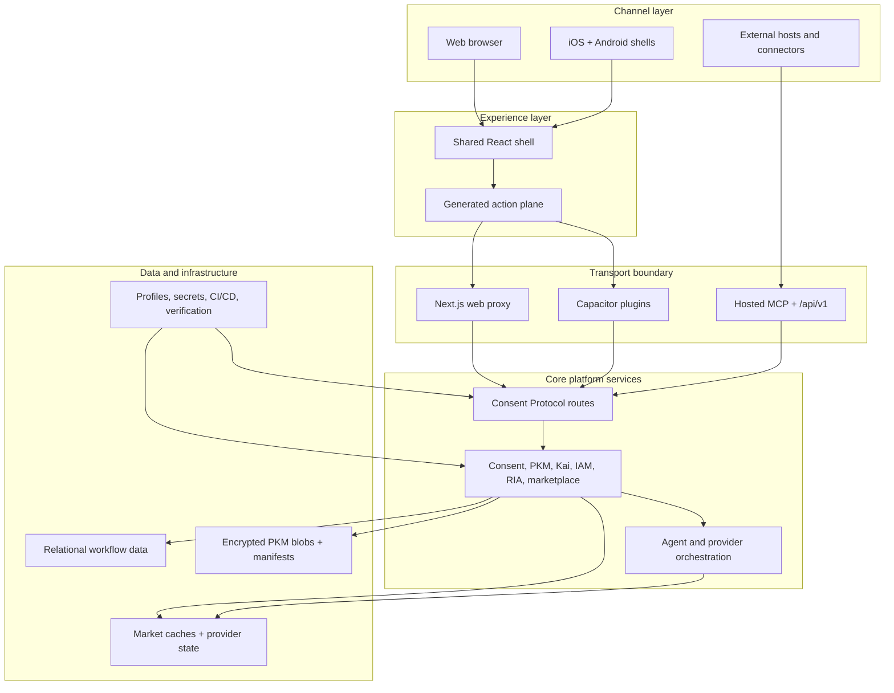
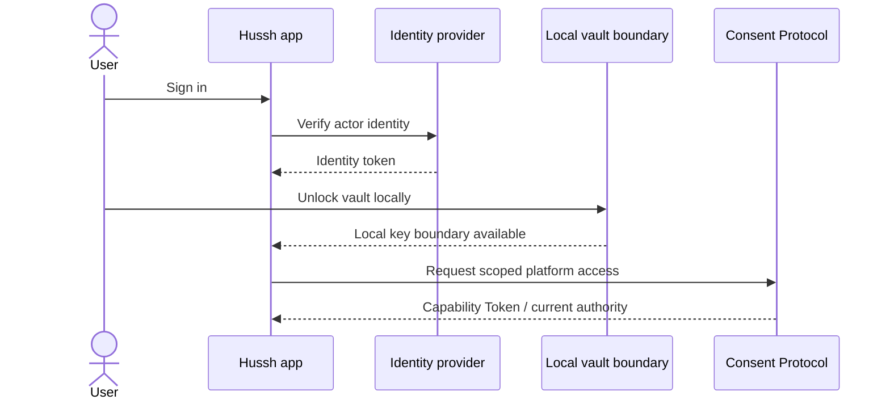
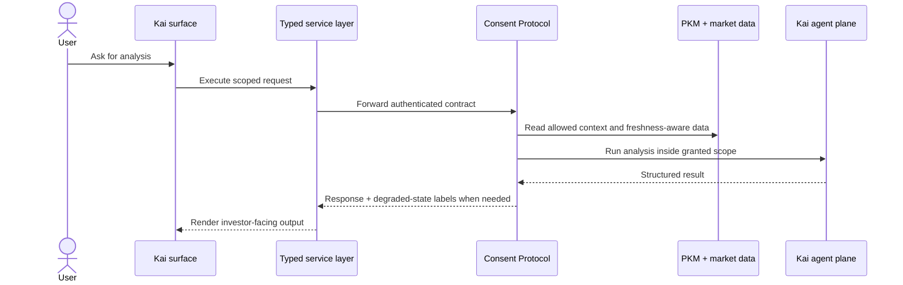
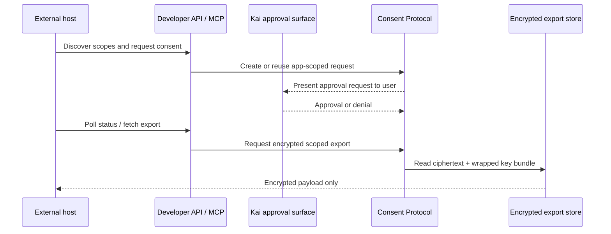
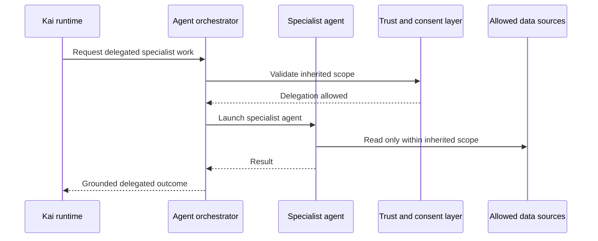
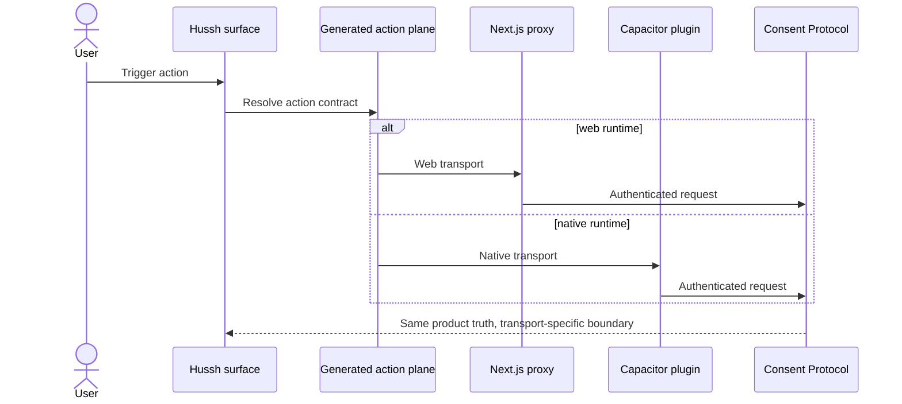

# Hussh Platform Architecture

> Canonical seven-layer architecture for the current Hussh platform and the scale path beyond it.

## Visual Map

## Architecture Thesis

Hussh should be read as a governed personal-intelligence platform, not as a single app and not as a loose collection of packages.

`Hussh` stands for **Human Secure Socket Host**. In architecture terms, the host is the governed infrastructure layer where human authority, private data, AI agents, external apps, and consented access connect without collapsing the trust boundary. The name is therefore an operating model, not just a public label: Hussh hosts personal intelligence through scoped consent, encrypted knowledge, auditable delegation, and deployable product surfaces.

The founder shorthand `hu_ssh` reads this as `SSH for humans`: ask, approve, and audit before private context moves. That shorthand is a metaphor for the same Consent Protocol-backed trust model, not a separate architecture name.

Kai is the primary investor-facing intelligence surface, but the architecture is broader than Kai. The repo already contains the trust boundary, the data boundary, the developer lane, the mobile lane, and the agent lane that make the platform coherent.

The canonical terminology contract for this architecture lives in [founder-language-matrix.md](./founder-language-matrix.md). The canonical public naming and compatibility rule lives in [../operations/brand-and-compatibility-contract.md](../operations/brand-and-compatibility-contract.md).

## Layer Summary

| Layer | Purpose | Current repo anchors |
| --- | --- | --- |
| 7. Channels, Ecosystem, and Distribution | Reach users, developers, and external systems through governed surfaces | Kai app surfaces, `/api/v1`, hosted MCP, `@hushh/mcp`, native delivery |
| 6. Experience and Interaction | Turn trust and intelligence into usable product surfaces | `hushh-webapp/`, shared shell, service layer, generated action plane |
| 5. Intelligence and Agent | Reason, plan, delegate, and execute inside scoped authority | Kai agents, ADK surfaces, operons, A2A-compatible entry points |
| 4. Data and Knowledge | Persist encrypted context, workflow state, and freshness-aware derived data | PKM blobs, metadata index, market caches, export revisions |
| 3. Trust, Identity, and Governance | Decide who is acting, what is allowed, and how it is audited | Firebase auth, local vault unlock, `VAULT_OWNER`, consent, audit rows |
| 2. Core Platform Services | Enforce platform policy and domain behavior | Consent Protocol routes, PKM services, Kai services, RIA and provider orchestration |
| 1. Infrastructure | Keep the runtime deployable, observable, and recoverable | runtime profiles, CI/CD, secrets, storage, deploy scripts, verification tooling |

## 1. Infrastructure Layer

**Purpose:** provide the runtime substrate on which every higher layer depends.

This is the literal platform meaning behind Human Secure Socket Host: infrastructure that lets humans, agents, apps, and consent-gated data meet through governed sockets instead of ad hoc integrations.

- What belongs here:
  - runtime profiles and environment shape
  - deployment scripts and service launch surfaces
  - storage, caches, and secret distribution
  - CI/CD and baseline observability substrate
- What it exposes upward:
  - stable environments
  - storage primitives
  - deploy and verification surfaces
- What it depends on downward:
  - cloud and local execution environments
  - managed storage and networking substrates
- What exists today:
  - `./bin/hushh` as the canonical repo command surface
  - documented runtime profiles, deployment governance, and environment parity checks
  - repo-level CI and local verification scripts
- What is missing for full-scale architecture:
  - a more explicit multi-environment topology and resilience model
  - stronger service-level objectives, failure domains, and recovery targets
  - a clearer control-plane versus data-plane operations split
- Next build path:
  - formalize environment classes, service topology, and reliability objectives

## 2. Core Platform Services Layer

**Purpose:** host the backend systems that enforce platform behavior instead of letting clients improvise it.

- What belongs here:
  - Consent Protocol runtime
  - consent, IAM, PKM, Kai, RIA, and marketplace services
  - export generation and provider orchestration
  - route-level validation and domain service composition
- What it exposes upward:
  - authenticated and scoped APIs
  - workflow services
  - provider-backed data and export surfaces
- What it depends on downward:
  - infrastructure runtime
  - storage and secret surfaces
- What exists today:
  - FastAPI routes in `consent-protocol/`
  - domain services that own consent, PKM, export, and market-facing operations
  - typed boundary contracts consumed by web and native paths
- What is missing for full-scale architecture:
  - clearer service decomposition and async workflow boundaries
  - a more formal event backbone for long-running operations
  - sharper ownership lines across domain services
- Next build path:
  - split the service map into explicit bounded contexts and introduce event-driven workflow orchestration where request/response is no longer sufficient

## 3. Trust, Identity, and Governance Layer

**Purpose:** decide who is acting, what they are allowed to do, and how that decision is reviewed.

- What belongs here:
  - authentication
  - local vault unlock
  - Capability Tokens
  - consent lifecycle
  - delegated authority and audit surfaces
- What it exposes upward:
  - scoped authority
  - verified actor identity
  - reviewable audit history
- What it depends on downward:
  - platform services that validate policy
  - infrastructure-backed secret and storage surfaces
- What exists today:
  - Firebase bootstrap identity plus local vault unlock
  - `VAULT_OWNER`, consent tokens, scoped tokens, and developer tokens
  - consent status, approval, revocation, and audit flows
  - current PCHP implementation through the Developer API and MCP consent/export flow
- What is missing for full-scale architecture:
  - a more explicit policy control plane
  - stronger delegated-authority lifecycle controls and revocation semantics
  - a more formalized governance model for apps, agents, and organizations
- Next build path:
  - separate policy authoring, issuance, revocation, and review into clearer control-plane contracts

## 4. Data and Knowledge Layer

**Purpose:** hold the encrypted and derived memory of the platform without collapsing the trust boundary.

- What belongs here:
  - encrypted Personal Knowledge Model (PKM) blobs
  - sanitized indexes and metadata
  - relational workflow data
  - market caches, brokerage-derived state, and export revisions
  - provenance and freshness rules
- What it exposes upward:
  - ciphertext-backed personal context
  - queryable workflow state
  - freshness-aware market and portfolio data
- What it depends on downward:
  - trust contracts that define allowed access
  - core services that validate reads, writes, and refreshes
- What exists today:
  - encrypted PKM storage and metadata split
  - runtime DB fact sheet, provenance ledger, and degraded-state handling
  - explicit storage boundary between private encrypted context and shared/query-heavy data
- Current and conditional data-plane split:
  - transactional app DB for workflow, actor, consent, and regulated operational state
  - encrypted PKM/vault plane for user-private memory and key-boundary metadata
  - provider/cache plane for refreshable Plaid, Gmail, market, and other integration state
  - conditional future partner CRM plane for CRM-native contact/workflow metadata, consent receipt ids, scope labels, audit references, and narrowly approved fields only when a partner workflow has a clear business or legal purpose and explicit consent
  - analytics/warehouse plane for GA4, BigQuery, and dashboard truth outside the app DB
- Partner PII rule:
  - enterprise systems such as Salesforce must not become mirrors of Hussh PKM, KYC documents, financial memory, Gmail bodies, vault data, user keys, or broad personal profiles
  - if plaintext PII leaves Hussh for a partner workflow, that copy is outside the Hussh zero-knowledge boundary and needs explicit consent, field inventory, retention, encryption/masking, access control, audit, and deletion ownership
- What is missing for full-scale architecture:
  - a more formal separation between transactional, analytical, cache, and export materialization planes
  - clearer retention and replay contracts
  - stronger lineage and data lifecycle documentation
- Next build path:
  - enforce the runtime DB data-plane contract before new tables or long-lived caches ship

## 5. Intelligence and Agent Layer

**Purpose:** transform trusted context into reasoning, recommendations, and bounded execution.

- What belongs here:
  - Kai agents and specialist financial agents
  - ADK-backed agent entry points
  - debate and planner/executor flows
  - operons and backend orchestration helpers
  - TrustLink / A2A delegation surfaces
- What it exposes upward:
  - analysis
  - recommendations
  - tool-driven actions
  - delegated specialist execution
- What it depends on downward:
  - trusted data and scoped authority
  - backend orchestration and provider access
- What exists today:
  - Kai runtime references, agent-development contract, and generated action gateway work
  - ADK-backed surfaces and A2A-compatible delegation entry points
  - debate-oriented financial analysis scaffolding
- What is missing for full-scale architecture:
  - formal agent registry and capability registry
  - execution budget and fallback policy
  - a more explicit memory and delegation contract
- Next build path:
  - define governable agent infrastructure instead of leaving agents as mostly implicit runtime features

## 6. Experience and Interaction Layer

**Purpose:** make the platform legible and usable across human-facing product surfaces.

- What belongs here:
  - Kai product surfaces
  - shared React shell and service layer
  - voice, search, and generated action surfaces
  - consent and approval UX
  - native bridge and parity behavior
- What it exposes upward:
  - investor-facing intelligence
  - approval surfaces
  - web and mobile interaction contracts
- What it depends on downward:
  - agent outputs
  - trusted data and scoped backend services
- What exists today:
  - `hushh-webapp/` as the primary experience runtime
  - shared web and native shell
  - generated action gateway and Kai voice/runtime work
  - explicit web-proxy and native-plugin transport boundaries
- What is missing for full-scale architecture:
  - a cleaner product-wide experience contract beyond the current generated Kai action gateway for typed search, voice, and UI actionability
  - stronger cross-surface state composition and parity verification
  - clearer treatment of non-Kai user-facing surfaces as part of the same platform story
- Next build path:
  - formalize one product contract across web, native, voice, approvals, and delegated workflows

## 7. Channels, Ecosystem, and Distribution Layer

**Purpose:** distribute platform capabilities through governed user, developer, and partner channels.

- What belongs here:
  - Kai and RIA user channels
  - Developer API and MCP
  - external apps and connectors
  - native packaging and release distribution
- What it exposes upward:
  - public channel surfaces
  - developer integration points
  - ecosystem participation
- What it depends on downward:
  - experience contracts
  - trust and export contracts
  - agent and data services
- What exists today:
  - hosted Developer API under `/api/v1`
  - hosted MCP endpoint and `@hushh/mcp`
  - web, iOS, and Android distribution paths
- What is missing for full-scale architecture:
  - a more formal ecosystem contract for apps, partners, and versioning
  - stronger lifecycle governance for external integrations
  - clearer channel-specific observability and rollout models
- Next build path:
  - turn the current developer lane into a first-class governed platform ecosystem

## Integration Model

The integration rule is simple: identity establishes authority, authority gates data and services, services ground agents, agents feed experience, and channels are distributed versions of the same governed platform truth.

## Deployment Model

## Runtime Sequence Model

### 1. Trust Establishment And Unlock

### 2. Kai Scoped Analysis Flow

### 3. Developer Consent And Export Flow Via PCHP

### 4. Delegated Agent Flow Via TrustLink / A2A

### 5. Shared Action Execution Across Web And Mobile

## Present State And Full-Scale Gaps

The current repo is already strong in three areas: trust boundaries, scoped developer access, and multi-surface product runtime. The remaining full-scale work is mostly architectural formalization, not conceptual invention.

The main gaps are:

1. a clearer control plane for policy, revocation, and delegated authority
2. a more formal multi-service and event-driven backend topology
3. a better-defined data-plane split across transactional, analytical, cache, and export materialization surfaces
4. governable agent infrastructure with registry, budgets, and delegation policy
5. scale-grade observability, reliability targets, and ecosystem lifecycle governance

## Canonical Companions

1. [founder-language-matrix.md](./founder-language-matrix.md)
2. [api-contracts.md](./api-contracts.md)
3. [runtime-db-fact-sheet.md](./runtime-db-fact-sheet.md)
4. [data-provenance-ledger.md](./data-provenance-ledger.md)
5. [../iam/architecture.md](../iam/architecture.md)
6. [../kai/README.md](../kai/README.md)
