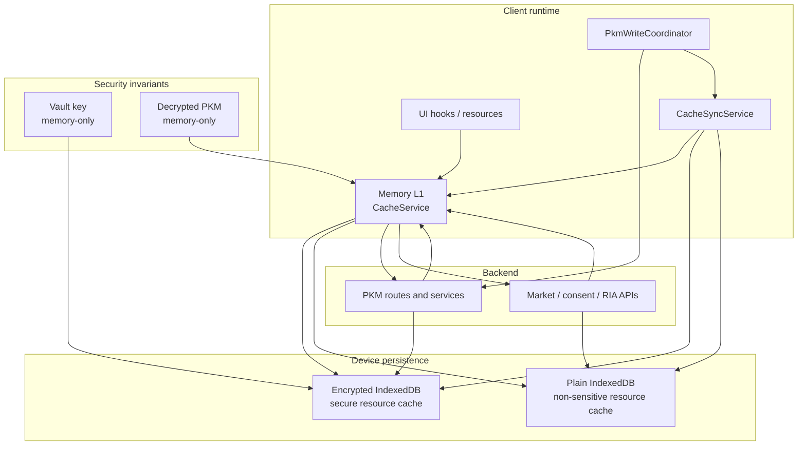

# Cache Coherence Reference

## Visual Map

## Purpose

Hussh frontend cache is split by sensitivity and runtime role:

- decrypted PKM stays **memory-only**
- encrypted PKM-derived snapshots can persist in **encrypted IndexedDB**
- non-sensitive read models can use resource-specific memory/device caches

Every DB-backed mutation must still pass through `CacheSyncService` so views stay coherent without ad-hoc invalidation.

Source files:
- `hushh-webapp/lib/services/cache-service.ts`
- `hushh-webapp/lib/cache/cache-sync-service.ts`
- `hushh-webapp/lib/cache/cache-context.tsx`
- `hushh-webapp/lib/cache/use-stale-resource.ts`
- `hushh-webapp/cache-coherence-screen-manifest.generated.json`
- `hushh-webapp/scripts/architecture/audit-cache-coherence.mjs`
- `hushh-webapp/lib/services/secure-resource-cache-service.ts`
- `hushh-webapp/lib/pkm/pkm-domain-resource.ts`
- `hushh-webapp/lib/services/pkm-write-coordinator.ts`
- `consent-protocol/hushh_mcp/services/market_insights_cache.py`
- `consent-protocol/hushh_mcp/services/market_cache_store.py`

## Key Taxonomy

Fixed user keys:
- PKM metadata cache key for the user
- PKM encrypted blob cache key for the user
- encrypted secure-resource cache entries for PKM-derived resources
- `vault_status_${userId}`
- `vault_check_${userId}`
- `active_consents_${userId}`
- `pending_consents_${userId}`
- `consent_audit_log_${userId}`
- `consent_center_summary_${userId}_${actor}`
- `portfolio_data_${userId}`

Dynamic user keys:
- `domain_data_${userId}_${domain}`
- `domain_blob_${userId}_${domain}`
- `stock_context_${userId}_${ticker}`
- `consent_center_list_${userId}_${actor}_${surface}_${query}_${page}_${limit}`
- `consent_center_preview_${userId}_${actor}_${surface}_${top}` for dedicated preview-only callers that explicitly choose `top=n`; first-party shield inbox flows should prefer the shared `consent_center_list_*_pending_*_1_20` cache entry

Summary metadata write-through fields (when available):
- `attribute_count`
- `item_count`
- `holdings_count` (financial/portfolio-like domains)
- `portfolio_total_value`

Backend Kai market cache tiers (generalized modules):
- L1 memory cache: `market_insights_cache`
- L2 Postgres cache table: `kai_market_cache_entries`
- L3 live provider fetch

Runtime DB data classes:
- `provider_cache` tables are refreshable operational state, not durable user memory.
- `workflow_state` tables can hold active approval or status state, but terminal sensitive drafts/previews should be compacted or redacted by the family retention policy.
- durable personal memory must be written through the encrypted PKM path, not by promoting provider cache rows into long-lived app DB truth.

## Mutation -> Cache Sync Matrix

- PKM store domain: `CacheSyncService.onPkmDomainStored(...)`
- PKM clear domain: `CacheSyncService.onPkmDomainCleared(...)`
- Portfolio upsert/save: `CacheSyncService.onPortfolioUpserted(...)`
- Vault setup/check state changes: `CacheSyncService.onVaultStateChanged(...)`
- Consent approve/deny/revoke: `CacheSyncService.onConsentMutated(...)`
- Analysis history write/delete: `CacheSyncService.onAnalysisHistoryMutated(...)`
- Sign out: `CacheSyncService.onAuthSignedOut(...)`
- Account delete: `CacheSyncService.onAccountDeleted(...)`

## Sign-out And Delete Purge Policy

- Sign-out should purge all user-scoped cache keys through `onAuthSignedOut(userId)`.
- Account delete should call `onAccountDeleted(userId)` before final sign-out/redirect.
- When user id is unavailable, full cache clear is allowed (`onAuthSignedOut(null)`).

## Rules

Do:
- Centralize invalidation/write-through in `CacheSyncService`.
- Write through encrypted blob keys when CRUD payloads already include ciphertext.
- Patch cached PKM metadata in-place when safe summary fields are provided.
- Treat backend `pkm_index` updates as cloud discovery projections. Local memory,
  secure device cache, and encrypted-domain write-through remain first-class
  state for local-first and on-device flows; failed projection sync should
  invalidate or retry the projection lane, not erase local encrypted cache.
- Keep `CacheContext` as a state mirror only.
- Use `invalidateUser(userId)` when purging a full user session.
- Keep domain blob + metadata reconciliation aligned with PKM index semantics.
- Keep consent-manager summary/list caches memory-only.
- Keep the first-party consent inbox on the same memory-only `pending page 1` list cache used by `/consents`; do not introduce a second browser cache lane just for the top-shell preview.
- Keep passive background refresh copy human-readable:
  - `Getting your portfolio data ready`
  - `Refreshing your profile details`
  - `Refreshing your consent list`
  - `Updating market snapshots`
  - `Refreshing advisor workspace summaries`
- Keep BYOK/ZK boundaries explicit:
  - vault key stays memory-only
  - `VAULT_OWNER` stays memory-only
  - decrypted PKM stays memory-only
  - only ciphertext may persist to encrypted IndexedDB
- Treat performance as a cache-coherence contract, not an afterthought:
  - warm cache should reach usable UI without a blocking full-page loader
  - stale safe data should remain visible while refresh runs
  - cold or unsafe states may show loaders, but must emit route-readiness metadata
  - route/cache performance events must use route IDs, resource classes, cache tiers, duration buckets, and result state only
  - never emit raw cache keys, user IDs, workflow IDs, PKM payloads, portfolio values, prompts, or decrypted values in analytics

Don't:
- Add ad-hoc `CacheService.getInstance().invalidate(...)` calls in mutation flows.
- Mix component-level DB mutation and cache operations.
- Reintroduce plaintext browser persistence for PKM-derived user data.

## Performance KPI Contract

Every cacheable route should be able to explain its best available UX path from the generated screen manifest:

1. fresh memory render when the resource is valid
2. secure device stale render for encrypted user data when revision/TTL permits
3. plain device stale render for non-sensitive app resources
4. background refresh after a safe stale render
5. cold loader only when the data is missing, locked, unsafe, or first-use

The standard KPI set is:

- warm-cache time to usable UI
- cold unlock-to-usable time
- stale render rate versus blocking loader rate
- cache hit, stale-hit, miss, and locked/unsafe rate by route and resource class
- refresh duration, retry count, and error rate
- warmup duration and usefulness by resource class
- approximate footprint bucket by cache tier and sensitivity class

Use these internal observability events for the contract:

- `route_readiness_completed`
- `cache_resource_resolved`
- `route_refresh_completed`
- `warmup_completed`

The events are metadata-only. They are for UX and reliability decisions; they are not a reason to retain decrypted PKM longer or broaden warmup.

## Verification

Run:
- `cd hushh-webapp && npm run verify:cache`
- `cd hushh-webapp && npm run audit:cache-coherence`
- `cd hushh-webapp && npm run verify:analytics`
- `./bin/hushh native ios --mode uat`

The `verify:cache` script hard-fails when critical mutation/auth paths bypass `CacheSyncService`.
The `audit:cache-coherence` script hard-fails when the screen cache manifest is stale or when a physical screen is missing route/surface-map coverage.

## Reconciliation Notes

- Domain metadata patches should preserve canonical summary counters (`attribute_count`, `item_count`, `holdings_count`).
- Raw `total_value` is not retained in index summary cache patches; numeric values should map to `portfolio_total_value`.
- If patch inputs are insufficient, invalidate metadata and force a clean re-fetch rather than persisting partial summaries.
- PKM writes are version-aware:
  - `POST /api/pkm/store-domain` remains canonical
  - first-party writes should use `PkmWriteCoordinator`
  - stale domains can trigger resumable client-side PKM upgrade before save
  - bounded optimistic conflict retries rebuild writes from the latest decrypted domain state
- Debate/analysis history writes attach explicit non-sensitive `write_projections[]`:
  - encrypted `financial.analysis_history` stays canonical
  - backend `decision_projection` events stay aligned with the encrypted history after save, refresh, and hard reload
  - first-party readers should treat `projection_mode=replace_all` as canonical for upgraded users
  - current retention stays `3` saved analyses per ticker (newest first)
- Save compatibility policy:
  - first-party financial/profile/portfolio/history writes must go through `PkmWriteCoordinator`
  - stale manifests/domains should resume the client-side PKM upgrade before save when the vault is unlocked
  - if the vault is locked and the domain is stale, the UI should surface an upgrade-required/read-only state instead of attempting a legacy plaintext fallback
