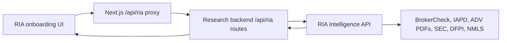

# CRD And Financial Verification API

This is the hussh Research backend contract for CRD scraping and generalized
financial professional verification.

The hussh Research backend keeps this surface intentionally thin. It exposes a
clear app-facing route under `/api/ria/*` and forwards the work to the
standalone hussh RIA Intelligence API, which owns the BrokerCheck, FINRA, IAPD,
PDF, SEC Form ADV, California DFPI, NMLS, and bounded open-web enrichment
pipeline.

## Visual Map



## Why It Lives This Way

- hussh Research gets one backend endpoint to call from web or native surfaces.
- The regulatory scraper stays in the RIA Intelligence service as the source of
  truth.
- BrokerCheck/IAPD scraping logic is not duplicated inside the larger Research
  backend.
- The existing Next.js RIA catch-all proxy already forwards `/api/ria/...` to
  the Python backend, so no separate frontend proxy route is needed.

## Public Backend Routes

Create a CRD scrape job:

```http
POST /api/ria/crd-scrape-jobs
Content-Type: application/json
```

Request:

```json
{
  "crdNumber": "7413463"
}
```

Accepted aliases:

- `crdNumber`
- `crd_number`
- `crd`

Create a generalized financial verification job:

```http
POST /api/ria/financial-verification-jobs
Content-Type: application/json
```

Request:

```json
{
  "subject": {
    "name": "Joseph Kirkland",
    "state": "CA"
  },
  "identifiers": [
    { "type": "crd", "value": "5838118" }
  ],
  "jurisdictions": ["US", "CA"],
  "licenseScopes": ["ria_broker", "ca_dfpi", "nmls"],
  "includeOpenWeb": true
}
```

Supported identifier types include `crd`, `firmCrd`, `secFileNumber`,
`iapdUrl`, `brokerCheckUrl`, `nmlsId`, `caDfpiLicense`, and `name`.

Read job status and report:

```http
GET /api/ria/crd-scrape-jobs/{jobId}
GET /api/ria/financial-verification-jobs/{jobId}
```

These routes mirror the standalone provider contract:

```text
POST /v1/crd-scrape-jobs
GET  /v1/crd-scrape-jobs/{jobId}
POST /v1/financial-verification-jobs
GET  /v1/financial-verification-jobs/{jobId}
```

## Example

```bash
curl -sS -X POST \
  "$BACKEND_URL/api/ria/crd-scrape-jobs" \
  -H "Content-Type: application/json" \
  -d '{"crdNumber":"7413463"}'
```

Then poll the returned job id:

```bash
curl -sS "$BACKEND_URL/api/ria/crd-scrape-jobs/crd_scrape_abc123"
```

Generalized verification:

```bash
curl -sS -X POST \
  "$BACKEND_URL/api/ria/financial-verification-jobs" \
  -H "Content-Type: application/json" \
  -d '{"identifiers":[{"type":"crd","value":"5838118"}],"jurisdictions":["US","CA"],"licenseScopes":["ria_broker","ca_dfpi","nmls"],"includeOpenWeb":true}'
```

## Response Contract

The backend returns the provider payload unchanged. Expected job states:

- `queued`
- `running`
- `completed`
- `partial`
- `failed`

The completed report can include:

- barred status
- CRD number
- full name and aliases
- broker and investment adviser registration status
- current and previous employment
- firm history by date/year
- disclosures
- exams and qualifications
- experience days/years from official payloads
- BrokerCheck and IAPD PDF URLs with text excerpts when available
- source ledger with fetch status and timestamps
- raw BrokerCheck and IAPD structured payloads
- open-web enrichment labeled as `open_web`

The generalized financial verification report additionally normalizes:

- matched identifiers across CRD, firm CRD/IARD, SEC file number, NMLS, DFPI,
  BrokerCheck URL, and IAPD URL
- official registrations and licenses across FINRA, SEC/IAPD, California DFPI,
  and NMLS lanes when identifiers or public records are available
- `barredOrSanctionedStatus` plus `conflicts` when official sources disagree
- SEC Form ADV firm PDFs and excerpts when a firm CRD/IARD is discovered

## Source Rules

- BrokerCheck, FINRA barred list, SEC/IAPD, SEC Form ADV, California DFPI, and
  NMLS are official or regulator-operated evidence lanes.
- Open-web results are enrichment only.
- Blocked search/source pages are recorded as blocked by the provider; they are
  not bypassed.
- If no verified profile/headshot image is available, consumers should display
  no image rather than guessing.

## Runtime Configuration

| Variable | Default | Purpose |
| --- | --- | --- |
| `RIA_INTELLIGENCE_CRD_SCRAPER_BASE_URL` | `https://hushh-ria-intelligence-api-yxfa6ba3aq-uc.a.run.app` | Standalone CRD and financial verification provider base URL. |
| `RIA_INTELLIGENCE_CRD_SCRAPER_TIMEOUT_SECONDS` | `60` | Provider request timeout. |
| `RIA_INTELLIGENCE_CRD_SCRAPER_API_KEY` | unset | Optional bearer token if the provider is later protected. |

If `RIA_INTELLIGENCE_CRD_SCRAPER_BASE_URL` is unset, the backend falls back to
`RIA_INTELLIGENCE_VERIFY_BASE_URL` and then to the current standalone service
URL.

## Implementation Pointers

- Route: `consent-protocol/api/routes/crd_scraper.py`
- Proxy service: `consent-protocol/hushh_mcp/services/crd_scrape_proxy_service.py`
- Backend tests: `consent-protocol/tests/test_crd_scraper_routes.py`
- Standalone provider docs: `LocalProjects/hushh-ria-intelligence-api/docs/CRD_SCRAPING_API.md`
