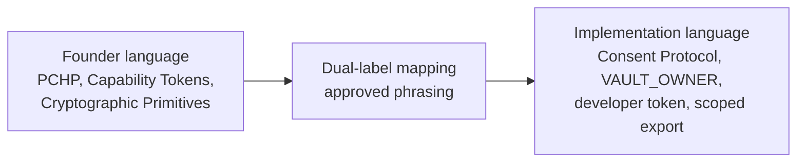

# Founder Language Matrix

Status: canonical terminology contract for founder-language architecture framing and implementation-language mapping across the Hussh platform docs.

## Visual Map



## Purpose

This document keeps the entire docs surface speaking one architecture language.

Use founder terms first when the page is describing platform meaning, trust boundaries, or system intent. Immediately map those terms to the checked-in runtime surfaces when the page needs engineering precision.

This is a documentation contract, not a code rename plan.

## Dual-Label Rule

1. Lead with the founder term when describing architecture.
2. Follow with the implementation label when route, API, package, token, or storage precision matters.
3. Keep current code symbols, endpoint paths, package names, and token names unchanged.
4. Do not present future-state concepts as shipped behavior unless a checked-in runtime surface proves them.

Approved phrasing pattern:

- `PCHP (implemented today through the Consent Protocol developer API + MCP consent/export flow)`
- `Capability Tokens (implemented today as consent tokens, including VAULT_OWNER and scoped tokens)`
- `TrustLink / A2A delegation (current delegated-access implementation surface)`

## Terminology Matrix

| Founder term | Current implementation term(s) | Meaning / boundary | Founder term may lead in | Implementation term must stay primary in | Approved dual-label phrasing |
| --- | --- | --- | --- | --- | --- |
| `PCHP` | Consent request, approval, status, encrypted scoped export, Developer API, MCP | The public approval handshake between an external app and a Hussh user for scoped encrypted access | platform overviews, founder briefs, architecture narratives, developer-lane framing | endpoint docs, setup guides, request/response contracts, package README examples | `PCHP (implemented today through the Consent Protocol developer API + MCP consent/export flow)` |
| `Capability Tokens` | `VAULT_OWNER`, consent token, scoped token, developer token | Tokens that prove granted authority and bound what data or operation is allowed | trust model sections, IAM overviews, founder-facing prose | API tables, auth headers, code snippets, runtime validation docs | `Capability Tokens (implemented today as consent tokens, including VAULT_OWNER and scoped tokens)` |
| `Cryptographic Primitives` | BYOK, wrapped export key, key derivation, ciphertext, vault wrappers, X25519-AES256-GCM | The cryptographic material and local key control that keep Hussh ciphertext-only at rest | security sections, platform architecture, mobile and vault framing | algorithm names, key fields, env vars, plugin APIs, protocol examples | `Cryptographic Primitives (implemented today through BYOK, vault wrappers, wrapped export keys, and local key derivation)` |
| `Separation of Duties` | frontend/backend trust boundary, web proxy vs native plugin split, route/service ownership, future Kai/Nav direction | The division between user-held secrets, app execution, backend policy, and future stronger policy lanes | architecture maps, mobile docs, founder briefs, control-plane framing | file ownership docs, package-local implementation notes, route/runtime ownership tables | `Separation of Duties (implemented today through the frontend/backend trust boundary and the web-proxy/native-plugin split)` |
| `Tamper-Evident History` | consent audit, export revision, verification artifacts, append-only event tables | The reviewable record of consent and export activity | governance docs, trust sections, founder narratives | exact storage tables, audit payload fields, verification commands | `Tamper-Evident History (implemented today through consent audit tables, export revisions, and verification artifacts; Merkle-log style sealing is not yet shipped)` |
| `TrustLink / A2A delegation` | TrustLink, delegated access, relationship share flows, A2A entry points | Delegated authority that inherits scope and never bypasses consent | agent docs, IAM narratives, platform overview docs | plugin APIs, A2A route contracts, delegated access code paths | `TrustLink / A2A delegation (implemented today through delegated access links, relationship grants, and A2A-compatible entry points)` |
| `Consent Protocol` | `consent-protocol`, FastAPI consent routes, token validation middleware, consent scope catalog | The current backend system that realizes Hussh trust, approval, and scoped access behavior | platform docs, repo maps, founder-aware backend docs | backend package docs, code references, route docs, implementation sections | `Consent Protocol (the current backend system that realizes the platform trust model)` |
| `Developer API / MCP` | `/api/v1`, `/mcp/?token=<developer-token>`, `@hushh/mcp` | The public developer-access lane into Hussh | architecture overviews, founder brief sections, external-platform framing | setup guides, host examples, path tables, package commands | `Developer API / MCP (implemented today through /api/v1, the hosted MCP endpoint, and @hushh/mcp)` |
| `Partner CRM / PII handoff` | CRM-native contact/workflow fields, consent receipt ids, scope labels, audit references, narrowed approved payloads | A minimized, explicit, consented handoff to an enterprise system; not a mirror of Hussh PKM, KYC documents, vault data, or broad personal memory | Salesforce/MuleSoft briefs, partner architecture, compliance sections | storage contracts, API payload docs, retention/audit policies | `Partner CRM / PII handoff (allowed only for CRM-native metadata or narrowly approved fields; Hussh PKM and keys remain under the Hussh trust boundary)` |
| `One` | Current Kai-first voice/action runtime, future top personal-agent layer | The approved top relationship layer for greetings, memory, notifications, cross-domain help, and specialist handoffs | vision docs, future roadmap, founder briefs, shell/copy governance | current runtime docs unless explicitly marked as approved direction | `One (approved direction for the top personal-agent layer; the current voice/action runtime is still Kai-first)` |
| `Agent One` | One, current Kai-first runtime, future One relationship layer | Founder-facing name for the user's top personal agent, not a second product ontology | founder story, product narrative, future-roadmap framing | current runtime docs unless explicitly marked as approved direction | `Agent One / One (approved direction for the personal agent the user owns; the current runtime remains Kai-first)` |
| `Kai` | Kai finance surfaces, generated Kai action gateway, portfolio/market/analysis services | The current shipped finance specialist that One will summon for finance workflows | investor/RIA product docs, finance workflow docs, architecture narratives | code paths, route docs, generated contract names, package-local implementation docs | `Kai (implemented today as the finance assistant runtime across portfolio, market, analysis, voice, and search surfaces)` |
| `Nav` | Consent center, vault/privacy/deletion/scope-review surfaces; future Nav-owned `nav.*` actions | The approved privacy and consent guardian that One will summon for trust-sensitive flows | vision docs, future roadmap, consent/privacy founder language | current runtime docs unless the checked-in action or copy surface is actually Nav-owned | `Nav (approved direction for privacy, consent, vault, deletion, and scope-review flows; not a separate current runtime yet)` |
| `BYOA / Bring your own AI` | Provider routing, BYOK, local model execution planning, user-held provider credentials | Directional product language for using the user's chosen models and keys with Hussh-owned memory and consent boundaries | vision docs and future roadmap | current setup guides, supported-provider docs, key-management docs unless implementation exists | `BYOA (future direction for user-chosen AI/model routing; current docs must name the supported provider and key path explicitly)` |
| `hu_ssh / SSH for humans` | Hussh, Consent Protocol, PCHP, scoped consent, audit history | Founder metaphor for the Hussh trust handshake; not a replacement for Human Secure Socket Host | founder briefs, vision docs, trust narratives | exact architecture definitions unless paired with the canonical name | `hu_ssh / SSH for humans (founder metaphor for Human Secure Socket Host: ask, approve, audit through scoped consent)` |
| `Ask. Approve. Audit.` | Consent request, approval/revocation, consent audit, export revision | Public explanation of the consent loop | vision docs, consent/trust overviews, founder briefs | endpoint docs, payload examples, database/audit table references | `Ask / Approve / Audit (implemented today through consent request, approval/revocation, scoped export, and audit rows)` |
| `Your agents. Yours to own.` | One/Kai/Nav ontology, BYOK, consent, PKM, scoped export | Durable product line for user-owned agent relationships | vision docs, community updates, founder briefs | runtime docs that need exact implementation proof | `Your agents. Yours to own. (product thesis; current implementation remains Kai-first until One/Nav runtime ships)` |
| `Personal Operating Layer` | One, Kai, Nav, KYC, generated action gateway, consented specialist handoff | The product model where One owns the relationship and specialists perform bounded craft | vision docs, founder briefs, future roadmap, product narratives | implementation docs unless the runtime surface is checked in | `Personal Operating Layer (north-star model for One plus specialist handoffs; current implementation remains Kai-first)` |
| `World Model` | encrypted PKM, metadata indexes, provenance, user context, workflow state | User-owned structured context that can support memory and reasoning without moving authority away from the user | vision docs, future roadmap, PKM architecture narratives | storage contracts, table docs, runtime API docs without exact fields | `World Model (future-state framing for user-owned context; current implementation truth is encrypted PKM plus governed metadata and workflow state)` |
| `One Lens` | cross-surface One shell, profile context, voice/search/action framing | The user-facing way One interprets connected context through consent and specialist handoff | product narratives, UX planning, future roadmap | current UI implementation docs unless a checked-in route or component proves it | `One Lens (north-star UX framing for consented cross-surface context; do not claim full runtime coverage until shipped)` |
| `LLM Wiki / OpenClaw-style portable brain` | PKM projections, markdown/wiki-style exports, local-first memory, consented context bundles | Useful external pattern for portable personal memory, not a replacement for Hussh's encrypted PKM authority | future roadmap, R&D assessments, interoperability planning | current storage docs unless implemented as a projection from canonical PKM | `LLM Wiki / OpenClaw-style portable brain (interoperability pattern; Hussh canonical memory remains encrypted, consented PKM)` |
| `Signature Vault` | vault, consent audit, approval receipts, document/KYC workflows | Trust-sensitive document or signature workflows that must stay inside vault and consent boundaries | vision docs, future roadmap, founder briefs | route/API docs unless implementation exists | `Signature Vault (north-star trust surface for documents and approvals; implementation must preserve vault, consent, and audit boundaries)` |
| `iBrokerage` | Kai brokerage connectivity, RIA/investor workflows, market and portfolio services | Brokerage-facing product direction below Kai, not a separate platform authority | investor/RIA product narratives, future roadmap | provider/API docs unless a checked brokerage path exists | `iBrokerage (Kai-owned brokerage direction; current implementation truth stays with checked brokerage and market-service contracts)` |
| `One Email KYC` | One/KYC mailbox contract, identity workflow intake, structured PKM writeback | Bounded identity workflow surface under One and KYC, not broad autonomous email control | KYC product docs, future roadmap, architecture narratives | current endpoint/runtime docs unless backed by the checked mailbox and KYC contracts | `One Email KYC (bounded KYC workflow under One/KYC; current implementation truth lives in the One Email KYC architecture contract)` |
| `PCHP brand-side endpoint` | Developer API, MCP, consent request/status/export flow, scoped brand or app access | Future-facing distribution language for brand/app access through the same consent handshake | founder briefs, ecosystem planning, future roadmap | endpoint docs unless the route exists and is named | `PCHP brand-side endpoint (future ecosystem framing; today PCHP maps to the Consent Protocol Developer API and MCP consent/export flow)` |

## Retired Founder Draft Phrases

These phrases appeared in founder source material but are not approved canonical wording:

| Retired phrase | Why it is retired | Approved replacement |
| --- | --- | --- |
| `Hussh is your personal MCP server and AI agent.` | Blurs platform infrastructure with the user's personal agent. | `Hussh is the platform and trust infrastructure. One is the personal agent.` |
| `One has two faces.` | Makes Kai and Nav sound like alternate identities instead of specialists below One. | `One holds the relationship. Kai and Nav are specialists One summons.` |
| `Kai is the One who remembers.` | Moves One-owned relationship memory into the finance specialist. | `One remembers. Kai owns finance memory and finance reasoning.` |

## Scope Notes

Use the founder label as the heading language for:

- repo-level architecture docs
- current-state platform summaries
- founder and board artifacts
- IAM and trust narratives
- mobile and agent architecture overviews

Use the implementation label directly for:

- endpoint and method tables
- environment-variable references
- code examples
- package install/setup guidance
- explicit token, scope, table, and field names

## Non-Goals

This terminology contract does not:

- rename endpoints
- rename packages
- rename tokens or code symbols
- assert a separate One/Nav runtime as currently implemented
- assert Merkle-style sealing, threshold signing, or future PCHP mechanics that are not checked into the repo

## Terminology Audit Checklist

Before merging a terminology-heavy docs change, verify:

1. Founder terms appear in the canonical repo-level docs that define architecture meaning.
2. Implementation labels remain present anywhere a reader must copy a path, token name, package name, or field name exactly.
3. `PCHP` is always mapped back to the current Consent Protocol developer API + MCP consent/export flow.
4. `Capability Tokens` never replace literal runtime labels such as `VAULT_OWNER`, `developer token`, or `consent_token` inside examples.
5. `Tamper-Evident History` never overclaims Merkle-style or hardware-backed sealing.
6. `TrustLink` and `A2A delegation` are described as inherited-scope delegation, not scope escalation.
7. `One` is capitalized when it refers to the top personal agent and is not described as fully shipped until the runtime proves it.
8. `Kai` remains the current finance specialist and is not described as the whole Hussh platform identity.
9. `Nav` is reserved for privacy, consent, vault, deletion, and scope-review meaning; ordinary navigation uses `route.*`, not `nav.*`.
10. `hu_ssh` and `SSH for humans` remain founder metaphors and do not replace the canonical `Human Secure Socket Host` expansion.
11. `Ask. Approve. Audit.` maps back to consent request, approval/revocation, scoped export, and audit rows.
12. BYOA/BYO model claims stay future-state unless the doc names the shipped provider and key-management path.
13. Portable-brain, LLM Wiki, or OpenClaw-style language never replaces encrypted PKM as the canonical memory authority.
14. Signature, brokerage, email, KYC, and brand-side surfaces must name their One/Kai/Nav/KYC owner and the consent/vault boundary before being treated as product-aligned.

Suggested sweep:

```bash
rg -n "PCHP|Capability Tokens|Cryptographic Primitives|Separation of Duties|Tamper-Evident History|TrustLink|A2A delegation|developer token|consent token|VAULT_OWNER|scoped export|Consent Protocol|One|Kai|Nav|KYC|hu_ssh|SSH for humans|Ask\\. Approve\\. Audit|BYOA|Personal Operating Layer|World Model|One Lens|LLM Wiki|OpenClaw|Signature Vault|iBrokerage|One Email KYC" docs consent-protocol/docs hushh-webapp/docs packages/hushh-mcp -S
```

## Related References

- [README.md](./README.md)
- [architecture.md](./architecture.md)
- [api-contracts.md](./api-contracts.md)
- [../iam/architecture.md](../iam/architecture.md)
- [../operations/docs-governance.md](../operations/docs-governance.md)
