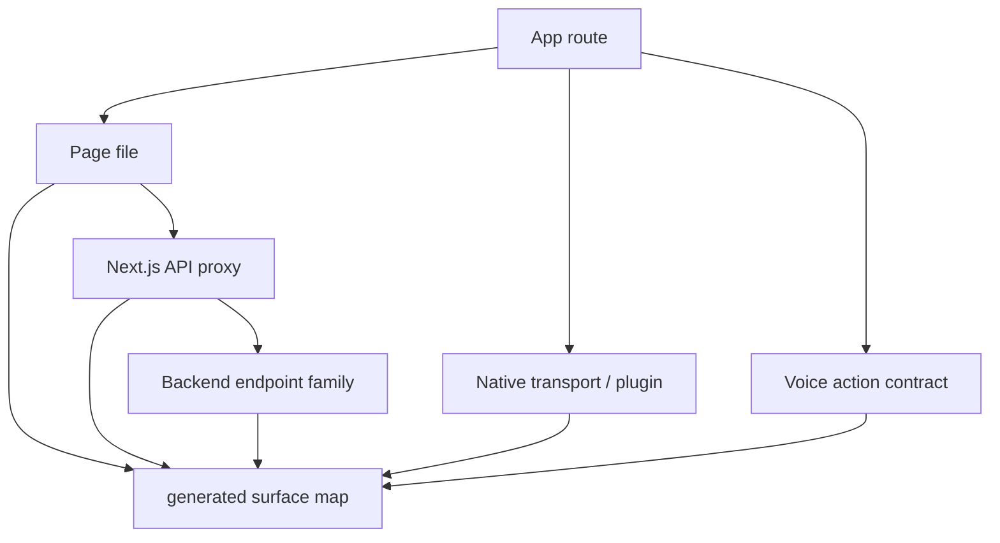

# Frontend Native Surface Map

## Visual Map

The generated surface map is the canonical scaffold for linking each app route to its
page file, native parity marker, shared shell pattern, Next.js proxy family, backend
endpoint family, native transport, plugin dependency, and voice/action contract.

## Source

- Generated contract: `hushh-webapp/frontend-native-surface-map.generated.json`
- Generator: `hushh-webapp/scripts/architecture/generate-surface-map.mjs`
- Check command: `cd hushh-webapp && npm run verify:surface-map`

## Rules

1. Run the check before frontend, native, API, voice/action, or route work.
2. If a screen starts calling a new service method or backend family, update the
   route override in the generator and regenerate the JSON.
3. If a route changes shell/header/back/loader behavior, regenerate the JSON and
   update route/mobile docs when the contract changes intentionally.
4. Native builds do not have a Next.js server. Native transport must be mapped as
   direct backend through `ApiService.apiFetch`, `CapacitorHttp`, or a named
   Capacitor plugin method.
5. Voice/action ids belong in each route's checked-in
   `page.voice-action-contract.json`; the surface map only indexes them.

## Current KYC Contract

`/one/kyc` is the first fully annotated route in this scaffold. It maps:

- `OneKycService` to `/api/one/{path*}` and backend `/one/kyc/*`.
- `AccountService` to `/api/account/{path*}` and backend `/account/*`.
- `KycWorkflowPkmService` to `/api/pkm/{path*}` and backend `/pkm/*`.
- Native transport to direct backend calls through `ApiService.apiFetch`.
- KYC approval to the original Gmail thread, selected workflow scopes, transient
  approved-body transport, and local plaintext cleanup after terminal states.

Future batches should extend the same route override pattern screen by screen
instead of creating parallel docs or ad hoc audit notes.
