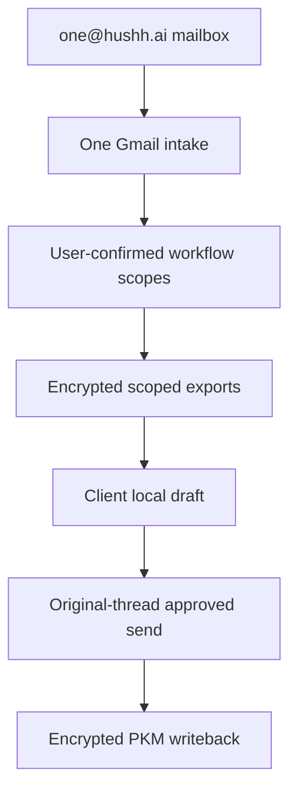

# One Email KYC

## Visual Map

This is the current implementation contract for One-led, approval-gated email
intake through `one@hushh.ai`. The current `/one/kyc` surface owns the KYC
review workflow, but the mailbox helper can recommend any consumer-visible
dynamic `attr.*` scope that already exists in the vault owner's shareable scope
inventory. It is not a free-form email agent and does not own platform consent
policy.

## Current Runtime

- Backend owner: `consent-protocol/hushh_mcp/services/one_email_kyc_service.py`.
- Backend routes: `consent-protocol/api/routes/one/email.py`.
- Frontend route: `hushh-webapp/app/one/kyc/page.tsx`.
- Frontend service: `hushh-webapp/lib/services/one-kyc-service.ts`.
- Client ZK service: `hushh-webapp/lib/services/one-kyc-client-zk-service.ts`.
- Surface map: `hushh-webapp/frontend-native-surface-map.generated.json`.

The backend owns mailbox intake, workflow metadata, consent status, Gmail send,
retention metadata, and PKM writeback receipts. The frontend owns vault unlock,
per-user connector private keys, scoped export decrypt, local deterministic
draft generation, user review, and encrypted PKM writeback. The KYC ADK
manifest owns the approved-reply drafting contract, but strict client-side
zero-knowledge mode executes that contract in the browser so decrypted PKM
plaintext is never sent to a backend drafting agent.

## Invariants

1. `one@hushh.ai` is the Workspace user mailbox for One-led KYC intake.
2. Gmail Pub/Sub intake stores message IDs, thread IDs, sender metadata,
   required-field labels, candidate scopes, hashes, and workflow state.
   If Gmail watch history state is missing or the app user explicitly refreshes
   Email Helper, One performs a bounded recent-mail catch-up scan and reuses the
   same sender-authority and duplicate-protection rules.
3. Raw email bodies, consent tokens, connector private keys, decrypted exports,
   final approved bodies, and draft plaintext are not durable backend state.
4. One detects candidate scopes from text against the resolved vault owner's
   consumer-visible scope inventory. The vault owner must confirm or narrow
   selected scopes in `/one/kyc` before consent requests are created.
   The resolved vault owner is the verified sender only; copied recipients and
   distribution-list members are reply context, not authority.
5. Each selected workflow scope becomes its own consent request under one bundle
   id. Draft generation may use all selected and granted workflow scopes, not
   just identity scope, but must not read every globally available user scope.
   Client drafts must render selected scopes as clear sections and must not
   expose raw PKM structure such as entity ids, manifests, hashes, provenance,
   or parser metadata.
6. If any selected scope is denied or stale, One blocks the external reply.
7. The canonical approved-reply renderer is
   `hushh-webapp/lib/services/one-kyc-client-zk-service.ts`. Route code must
   not create parallel email HTML templates. Portfolio, financial, and other
   dense dynamic-scope drafts must preserve all useful approved values and use
   Gmail-safe horizontal table scrolling instead of overlapping mobile columns.
8. Approved KYC sends must reply in the original Gmail thread and preserve reply
   headers. The backend uses the approved body only transiently for Gmail send.
   The send contract requires plain text and may include sanitized HTML for
   Gmail multipart/alternative rendering; the plain-text part remains the
   fallback and hash anchor.
9. Local decrypted exports and local drafts are cleared after approve/writeback
   success, reject, or refresh into a non-ready state.
10. Durable KYC memory is an encrypted PKM writeback artifact plus workflow
   metadata and hashes, not raw mailbox content.
11. The Email Helper list uses stale-while-refresh semantics: cached visible
    requests remain visible while One checks recent mail, refreshes workflow
    status, and merges newer rows into the paginated list.

## Workflow States

KYC workflow states are:

- `needs_client_connector`
- `needs_scope`
- `needs_documents`
- `drafting`
- `waiting_on_user`
- `waiting_on_counterparty`
- `completed`
- `blocked`

## Runtime Endpoints

Use [API contracts](./api-contracts.md#one-email-kyc) for the endpoint table.
The primary frontend/native mapper entry is
[Frontend Native Surface Map](./frontend-native-surface-map.md).

## Environment Contract

Required hosted runtime keys are documented in
[Env and Secrets](../operations/env-and-secrets.md) and
`consent-protocol/docs/reference/env-vars.md`.

Important operational boundaries:

- `FIREBASE_ADMIN_CREDENTIALS_JSON` is the canonical backend service-account secret.
- `ONE_EMAIL_ADDRESS` defaults to `one@hushh.ai`.
- `ONE_EMAIL_PUBSUB_TOPIC` configures Gmail watch delivery.
- `ONE_EMAIL_KYC_STRICT_CLIENT_ZK_ENABLED` must remain true for strict-ZK KYC.
- `ONE_EMAIL_KYC_DEFAULT_SCOPE` must remain allowlisted. Current approved value:
  `attr.identity.*`.
- Backend connector public, key-id, and private-key env vars are not part of
  strict client-side ZK mode.

## Production Gates

Production/public One mailbox automation remains gated until all of these are
true:

1. Delegated Gmail readonly and send work for the production mailbox.
2. Pub/Sub push auth and maintenance-token watch renewal are verified.
3. Production has exactly one active watch ownership model for `one@hushh.ai`,
   or an explicitly tested label/topic/fanout strategy.
4. A broker-style UAT smoke proves vault unlock, connector registration, scoped
   consent, local decrypt/draft, same-thread approved send, encrypted PKM
   writeback, and retention purge.
5. KYC cannot read or write outside selected workflow consent scopes.
6. Server-side draft plaintext remains null/redacted in strict mode.
7. `/one/kyc` passes web and native parity gates for the current route inventory.
