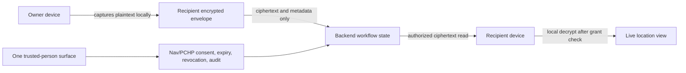

# One Location Agent

Status: v1 implementation contract
Owner: One + IAM/consent governance
Last updated: 2026-05-21

## Visual Map



## Current Truth

Merged KAI location APIs are a prototype/current-risk surface. They include a
public shared resolver and server-readable latest coordinate rows. They are not
the One Location Agent architecture and should not receive more product entry
points.

The production direction is One-owned, authenticated, recipient-scoped, and
ciphertext-only for live coordinates.

## Plaintext Boundary

Plain coordinates are allowed only on:

- the owner's device while capturing foreground location
- the approved recipient's device after local decryption

Plain coordinates are forbidden in:

- backend database rows
- backend API responses
- logs and analytics
- notification payloads
- consent/audit metadata
- public URLs and share links
- support tooling and server fallback buffers

## Ciphertext Envelope

The web/native client creates one envelope per grant update:

```json
{
  "algorithm": "ECDH-P256-AES256-GCM",
  "recipientKeyId": "recipient-key-id",
  "ciphertext": "base64url-aes-gcm-ciphertext",
  "iv": "base64url-96-bit-iv",
  "senderEphemeralPublicKeyJwk": {},
  "capturedAt": "2026-05-20T00:00:00.000Z",
  "sourcePlatform": "web|ios|android|native",
  "metadata": { "payload": "coordinate_envelope", "plaintext": false }
}
```

The backend stores the envelope and grant metadata only. It does not parse,
reverse geocode, map, notify, or inspect latitude/longitude.

## Key Contract

- Recipients register an active ECDH P-256 public JWK.
- Recipient private keys remain in client-side device storage.
- Owners encrypt with an ephemeral ECDH P-256 key and AES-GCM 256.
- Grant rows are bound to `owner_user_id`, `recipient_user_id`, and
  `recipient_key_id`.
- If recipient key material is unavailable or rotated away from the grant key,
  the owner must create a fresh grant.

## Authorization Contract

All live-location grant, envelope, approval, revocation, and state routes
require a VAULT_OWNER bearer token. Scope-2 public invite routes are the only
public exceptions, and they are request-only. They may resolve safe owner/link
metadata and accept visitor name/phone/message, but they never return
coordinates, ciphertext, grants, map embeds, or share authority.

- `actor_identity_cache.phone_verified = true` is eligibility only.
- Each recipient needs a separate active grant.
- Expiry and revocation block reads before ciphertext is returned.
- Referrals create access requests only; they never forward access.
- Public invite submissions create access requests only when the visitor maps
  to a verified Hussh user with active recipient key material; otherwise they
  remain metadata-only intent for follow-up.
- Consent/audit records are metadata-only.

Capability scopes:

- `cap.location.live.share`
- `cap.location.live.view`
- `cap.location.live.request`
- `cap.location.live.revoke`
- `cap.location.live.refer_request`

## Agent And Tool Contract

`hushh_mcp.agents.location` is the One Location Agent surface. The manifest
declares callable ADK tools for recipient listing, grant creation, encrypted
envelope publishing, ciphertext viewing, revocation, access requests, request
resolution, and referrals. Tools validate their capability scope per invocation
and delegate persistence to `OneLocationAgentService`.

The agent refuses public bearer links that reveal location, plaintext server
coordinates, and referrals or public submissions that grant access without owner
approval.

## Public Request Links

Scope-2 public sharing is a request-link workflow, not a public live-location
viewer.

1. The authenticated owner creates a duration-bounded public request link from
   `/one/location`.
2. The backend returns the raw token once and stores only its hash.
3. The public page `/one/location/request/{token}` asks the visitor for name, phone,
   and optional message.
4. The public resolve response exposes only a safe owner label, status,
   duration, and expiry. By default the safe label is "a trusted person".
5. The public page submits metadata only. It never displays a map or location.
6. If the phone maps to a verified/keyed Hussh user, One creates a normal
   pending access request for owner approval.
7. If the phone does not have usable Hussh identity/key material, the submission
   stays pending identity/key setup.
8. Owner approval still creates a fresh recipient-scoped grant and the owner
   device still encrypts the coordinate envelope for that recipient.

Public invite tables store token hashes, status, expiry, visitor display name,
phone hash/last4, matched user id when available, and request linkage. They must
not store raw phone numbers, raw invite tokens, coordinates, addresses, map
previews, or movement/freshness trails. Public submissions are bounded per token,
throttled per phone/fingerprint hash, and never return request internals, grants,
ciphertext, or location payloads to the anonymous caller.

## Notification Contract

Location notifications are best-effort and metadata-only. Payloads may include
safe ids, actor ids, action type, expiry/countdown metadata, and `/one/location`
navigation. They must not include coordinates, addresses, map previews,
freshness trails, ciphertext, token values, or debug terminology.

## Native Contract

v1 is foreground-only.

- iOS uses `NSLocationWhenInUseUsageDescription` and the `HushhLocation`
  Capacitor plugin.
- Android uses fine/coarse location permissions and the `HushhLocation`
  Capacitor plugin.
- No iOS background location mode is added.
- No Android background location permission is added.

Denied, unavailable, approximate, and foreground-only states must be visible in
the web control surface.

## Migration From KAI Prototype

1. Keep existing KAI location tables/routes as transitional prototype history.
2. Do not mount public KAI location routes as product traffic.
3. Stop adding UX entry points to bearer-token share links.
4. Store new live-location updates only in `one_location_envelopes`.
5. Migrate or purge any future plaintext `kai_location_latest` rows before
   launch readiness.

## Test Bar

The implementation must prove:

- verified directory excludes self and unverified users
- backend never returns plaintext coordinates
- encrypted envelopes are recipient-bound
- non-recipient reads fail
- expired/revoked grants block reads
- referrals create requests but no access
- notification and audit metadata contain no coordinates
- public request links store token hashes only and never reveal location
- web, iOS, and Android have foreground permission parity
- A/B/C/D flow is covered at service, authenticated API route, and browser
  crypto levels
