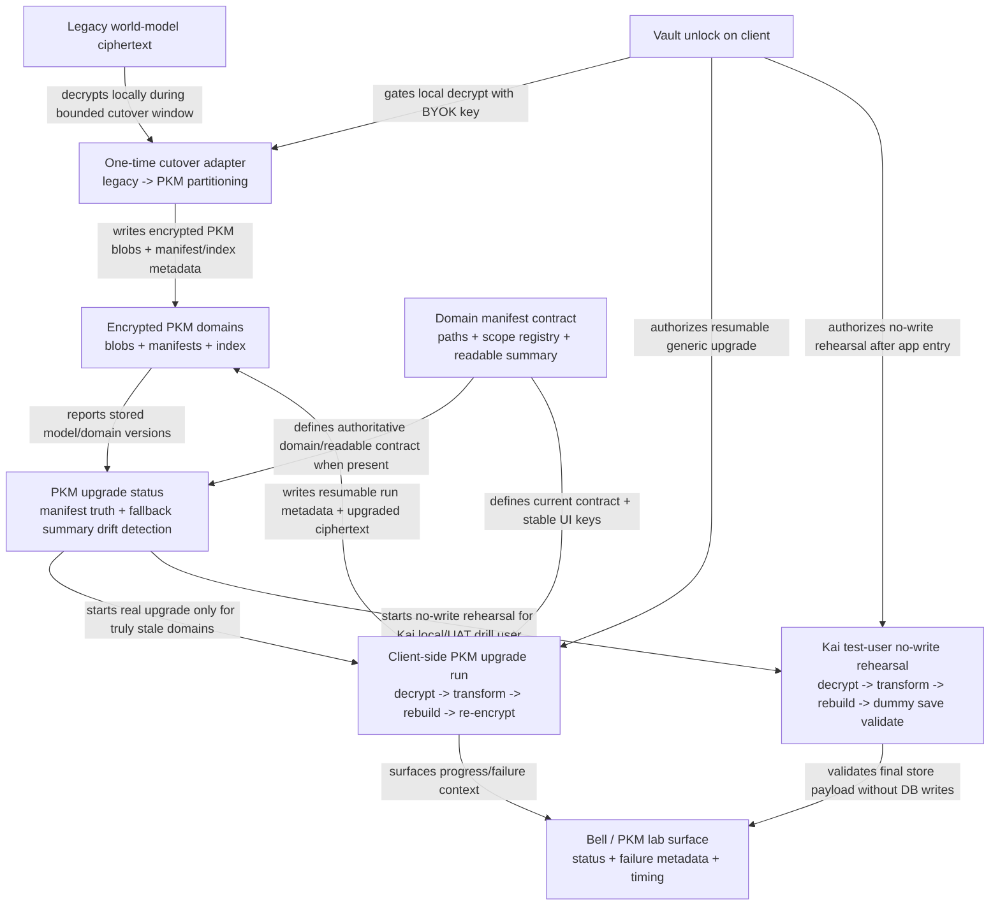

# PKM Cutover Runbook


## Visual Map



This is the bounded runbook for cutting Kai from legacy encrypted storage to the Personal Knowledge Model (PKM).

## Preconditions

- PKM schema is applied in the target environment.
- Backend serves `/api/pkm/*`.
- Frontend uses the PKM service path.
- Agent Lab works with an authenticated user and unlocked vault.
- Kai financial regression smoke is green.

## Local/UAT drill user

- `REVIEWER_UID=UWHGeUyfUAbmEl5xwIPoWJ7Cyft2`
- passphrase is stored only in ignored local/UAT env files and secret storage
- never commit the real passphrase into tracked examples or production env

## Migration drill

1. Unlock the test user's vault with the passphrase wrapper.
2. Read the legacy encrypted payload.
3. Decrypt locally.
4. Repartition each top-level domain into PKM segments.
5. Write:
   - `pkm_blobs`
   - `pkm_manifests`
   - `pkm_manifest_paths`
   - `pkm_scope_registry`
   - `pkm_index`
   - `pkm_events`
   - `pkm_migration_state`
6. Verify Kai financial behavior still matches pre-cutover behavior.
7. Verify consent export still works for `pkm.read` and `attr.financial.*`.

## Production cutover rules

- Do not attempt server-side repartition of BYOK ciphertext.
- Keep the migration adapter time-boxed.
- Delete legacy adapters and tables only after the unlock migration window closes.
- Treat production separately from UAT because runtime posture is different.

## Important boundary: cutover vs generic upgrades

Legacy cutover and ongoing PKM evolution are different:

- `pkm_migration_state` is only for the bounded legacy-to-PKM repartition window.
- Ongoing PKM schema/readability evolution uses resumable `pkm_upgrade_runs` + `pkm_upgrade_steps`.
- Generic PKM upgrades still happen client-side after unlock:
  1. detect stale model, semantic contract, domain, readable, or capability metadata
  2. decrypt one encrypted domain locally
  3. transform it through the generic dynamic PKM capability pipeline
  4. rebuild manifests, scope registry, readable metadata, consumer visibility, and semantic counts
  5. preserve the section visibility posture as a protocol field: `private`, `consent_required`, or `default_available`
  6. re-encrypt and store with optimistic concurrency
- If the app is interrupted, resume is allowed only after local vault re-auth. There is no silent server-side decrypt or key recovery.

## Compatibility gate

Production rollout is blocked unless all supported stored-version paths are green:

1. legacy world-model cutover source -> PKM
2. prior PKM model versions -> current `CURRENT_PKM_MODEL_VERSION`
3. prior semantic PKM contracts -> current `CURRENT_PKM_CONTRACT_VERSION`
4. prior domain-contract versions -> current dynamic domain contract
5. prior readable-summary/projection versions -> current readable projection

The minimum blocking proof set is:

1. backend manifest route compatibility tests
2. frontend PKM upgrade orchestrator compatibility tests
3. runtime migration audit proving unlock-triggered background upgrade does not break profile/privacy or PKM lab

Manifest fetch failures must be treated as P0:

1. `404` means no manifest yet and can still be a supported compatibility path
2. malformed/legacy manifest rows must normalize into the current response contract
3. true backend failures must surface structured route/domain/stage detail to the bell and PKM lab

## Manifest truth rule

When a domain manifest exists, it is the authoritative source for:

- `domain_contract_version`
- `pkm_contract_version`
- `readable_summary_version`
- `readable_projection_version`
- `upgraded_at`

Index summary versions remain useful as a fallback when no manifest exists, but stale summary data must not force a false rerun of the PKM upgrade.

## Kai no-write rehearsal rule

For the Kai drill user in local/UAT:

1. enable `NEXT_PUBLIC_PKM_UPGRADE_REHEARSAL=true`
2. sign in and unlock normally
3. let the app start the PKM cycle automatically from app entry
4. the rehearsal runs the real client-side decrypt/transform/rebuild path
5. the final payload is validated through a dummy save route and is never written to the real PKM tables

This is the safe way to measure end-to-end upgrade timing and frontend rendering behavior without mutating the live user record.

The required automated companion for this drill is:

1. [scripts/ci/pkm-upgrade-gate.sh](../../../scripts/ci/pkm-upgrade-gate.sh)
2. it runs the PKM upgrade contract/orchestration suites by default
3. when `PKM_UPGRADE_RUNTIME_AUDIT_BASE_URL` is present, it also runs the live investor onboarding, PKM migration, and RIA onboarding browser audits against that runtime

## Reviewer-backed active PKM shape audit

Protocol upgrades must be tested against the env-wired reviewer account, not a synthetic user that happens to pass unit tests.

Use the active shape audit before changing a PKM contract version or presentation projection:

```bash
cd consent-protocol
python3 scripts/audit_active_pkm_shape_readonly.py --env-file .env
```

If the local maintainer overlay does not contain the reviewer secrets, resolve them directly from Secret Manager without writing them to `.env`:

```bash
python3 scripts/audit_active_pkm_shape_readonly.py --env-file .env --gcp-secret-project hushh-pda-uat
```

Rules:

1. the script resolves `REVIEWER_UID` and `REVIEWER_VAULT_PASSPHRASE` from maintainer-only env by default
2. when `--gcp-secret-project` is provided, missing reviewer secrets are read from Secret Manager into process memory only
3. it decrypts active `pkm_blobs` locally in memory and never writes to PKM tables
4. it emits only structural metadata, redacted paths, counts, and presentation painpoints
5. it must not print plaintext values, entity ids, emails, hashes, or raw user facts
6. if the reviewer fixture lacks the domain needed for a change, reseed or repair the same reviewer fixture instead of testing a different UID

Pair the shape audit with the structure-agent chain eval:

```bash
cd consent-protocol
python3 scripts/eval_pkm_structure_agent.py --phase fresh_chain_60 --env-file .env
```

The eval uses `REVIEWER_UID` as its first shadow user when present. This keeps daily prompt-chain checks aligned to the real reviewer-shaped domain/scope surface while still avoiding plaintext PKM in model prompts.

## Default-available projection rehearsal

When changing the third visibility posture, test it as the env-wired reviewer vault owner:

1. unlock locally with the reviewer passphrase overlay
2. choose one low-risk consumer-visible section
3. publish only the safe client-generated projection
4. verify developer discovery marks it `visibility_posture=default_available` and `default_projection_ready=true`
5. read it through `/api/v1/default-available-export`
6. confirm an audit event is recorded
7. reset to `consent_required` unless the test is intentionally persistent

Do not use raw PKM blobs, `pkm.read`, workflow artifacts, hashes, provenance, or internal manifest paths as a default-available payload.

## Wrapper selection rule

Migration tooling must never choose "latest wrapper wins".

Correct behavior:

- choose the explicit wrapper id when provided
- otherwise choose the actual unlock method
- when using a passphrase drill, choose the `passphrase` wrapper
