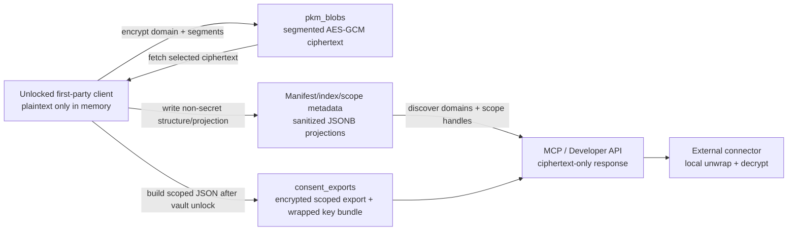

# ADR: PKM Storage and JSONB Boundaries

## Visual Context

Canonical visual owner: [Architecture Index](README.md). Use that map for the top-down system view. The detailed PKM table, read/write, cache, and PKM-to-MCP encrypted export diagrams live in [Personal Knowledge Model](../../../consent-protocol/docs/reference/personal-knowledge-model.md#visual-map).

## Status

Accepted.

## Decision

The current PKM runtime stores Personal Knowledge Model payloads as segmented encrypted blobs, not as JSONB objects with plaintext keys and encrypted leaf values.

## Why

- Zero-knowledge is a real architecture boundary, not a marketing claim.
- Plaintext keys leak semantic memory structure.
- Encrypted leaf JSONB still does not enable useful deep encrypted querying.
- Nested object and array updates become harder and noisier.
- Write amplification gets worse as PKM grows across domains.

## What JSONB is still for

- `pkm_index.summary_projection`
- `pkm_manifests.structure_decision`
- `pkm_scope_registry.summary_projection`
- sanctioned counters and flags
- append-only event metadata

## Indexing strategy

- B-tree on `pkm_blobs(user_id, domain, segment_id)`
- B-tree on `pkm_scope_registry(user_id, domain, scope_handle)`
- B-tree on `pkm_scope_registry(user_id, domain, segment_id)`
- B-tree on `pkm_events(user_id, domain, created_at desc)`
- GIN only on small sanctioned JSONB metadata where justified

## Consequences

- Fetch performance improves by reading only the encrypted segments needed for the active UI scope.
- Exact raw JSON paths stay private to first-party authenticated tooling.
- Public scope discovery must use handles and coarse metadata, not path leakage.
- Financial can remain protected while the broader PKM architecture expands across many domains.
