# Hussh Kai Index

## Visual Map

```mermaid
flowchart TD
  root["Kai Index"]
  n1["Kai Accuracy Contract"]
  root --> n1
  n13["Kai Architecture Specification v1"]
  root --> n13
  n12["Kai Action Gateway vNext"]
  root --> n12
  n14["Kai Voice Action Coverage Audit"]
  root --> n14
  n10["Kai Voice Runtime Architecture"]
  root --> n10
  n11["Kai Voice Migration Audit"]
  root --> n11
  n2["Kai Brokerage Connectivity Architecture"]
  root --> n2
  n3["Kai Change Impact Matrix"]
  root --> n3
  n4["Kai Interconnection Map"]
  root --> n4
  n5["Kai Rate Limit Playbook"]
  root --> n5
  n6["Kai Route Audit Matrix"]
  root --> n6
  n7["Kai Runtime Smoke Checklist"]
  root --> n7
  n8["Kai V6 Execution Plan"]
  root --> n8
  n9["Mobile Kai Parity Map"]
  root --> n9
```

Kai-specific architecture, runtime, rollout, and audit references live here.

Within the seven-layer platform architecture, Kai spans Layer 5 through Layer 7: intelligence, experience, and channel delivery.

Kai is not the product-surface owner for all of One. Keep this directory focused on the current finance specialist runtime: portfolio, market intelligence, brokerage, RIA, voice/search/actionability, finance safety, and decision receipts. Planning for One as the broader product surface lives in [../../future/one-product-surface-evolution-plan.md](../../future/one-product-surface-evolution-plan.md); current-state Kai claims must stay tied to checked routes, generated contracts, tests, and provider behavior.

Kai docs use founder language as part of the whole-platform vocabulary:

- `Kai` is the primary user-facing intelligence surface for the platform, not a separate platform from the repo
- `Separation of Duties` maps to the current frontend/backend trust boundary and the web-proxy/native-plugin split
- `Capability Tokens` map to `VAULT_OWNER`, consent tokens, and scoped tokens used by Kai surfaces

Canonical mapping: [../architecture/founder-language-matrix.md](../architecture/founder-language-matrix.md)
Brand and compatibility rule: [../operations/brand-and-compatibility-contract.md](../operations/brand-and-compatibility-contract.md)

## References

- Canonical current-state references:
- [kai-architecture-specification-v1.md](./kai-architecture-specification-v1.md): single current-state Kai architecture narrative across product surfaces, trust boundaries, voice/actionability, brokerage connectivity, and verification.
- [kai-interconnection-map.md](./kai-interconnection-map.md): dependency map and upstream boundaries.
- [kai-action-gateway-vnext.md](./kai-action-gateway-vnext.md): canonical capability-authoring and generated gateway contract for voice, search, UI actionables, and planner grounding.
- [kai-voice-action-coverage-audit.md](./kai-voice-action-coverage-audit.md): current audit of what Kai voice can actually trigger and where screen/button/action coverage is incomplete.
- [kai-change-impact-matrix.md](./kai-change-impact-matrix.md): blast-radius guide for Kai changes.
- [kai-voice-runtime-architecture.md](./kai-voice-runtime-architecture.md): canonical current runtime architecture for Kai voice, including English-only STT/realtime/TTS policy, planner, compose, execution, settlement, and how the generated action gateway is consumed at runtime.
- [kai-brokerage-connectivity-architecture.md](./kai-brokerage-connectivity-architecture.md): brokerage and import architecture.
- [kai-accuracy-contract.md](./kai-accuracy-contract.md): accuracy and output expectations.
- [kai-route-audit-matrix.md](./kai-route-audit-matrix.md): route-level audit map.
- [kai-runtime-smoke-checklist.md](./kai-runtime-smoke-checklist.md): runtime smoke checklist.
- [kai-rate-limit-playbook.md](./kai-rate-limit-playbook.md): rate-limit handling.
- [mobile-kai-parity-map.md](./mobile-kai-parity-map.md): mobile parity map.

- Historical or plan references:
- [kai-voice-assistant-architecture.md](./kai-voice-assistant-architecture.md): original migration/audit spec for the Kai voice redesign.
- [kai-v6-execution-plan.md](./kai-v6-execution-plan.md): execution-plan artifact, not the source of truth for current runtime behavior.
