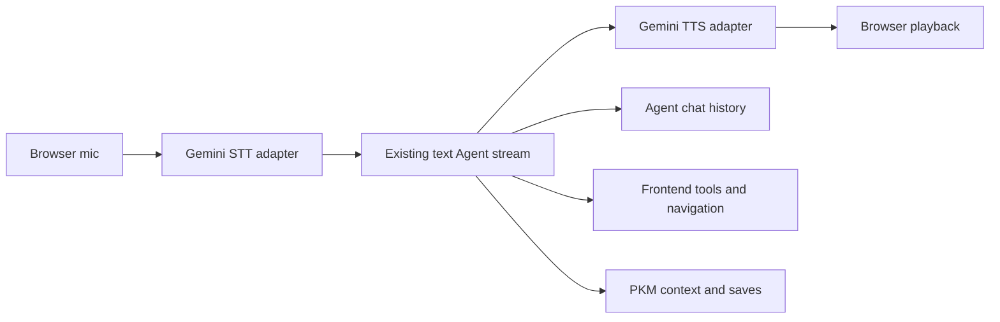

# Agent Chained Voice Architecture

This document describes the Agent popup voice path. It is separate from the
existing Kai OpenAI realtime voice runtime.

## Visual Context

Canonical visual owner: [Kai Index](README.md). Use that map for the top-down Kai system view; this page is the narrower Agent voice transport detail beneath it.



## Current Chain

Agent voice uses a chained transport architecture:

```text
browser microphone
  -> Gemini STT route
  -> existing text Agent stream
  -> Gemini TTS route
  -> browser audio playback
```

The typed Agent remains the only Agent brain. Voice transcripts call the same
Agent turn runner as typed messages, so conversation history, PKM context,
PKM save behavior, frontend tool execution, navigation actions, Markdown
rendering, debug events, and durable messages stay aligned.

## Why Not Gemini Live As The Brain

Gemini Live is useful for direct realtime speech sessions, but Agent must reuse
the existing text Agent contract so future on-device STT/TTS can replace the
transport layer without rewriting the Agent planner, tool events, memory, or
chat persistence. The chain keeps these boundaries clean:

- STT converts transient audio into text.
- The existing Agent stream decides, reasons, calls tools, and saves durable chat.
- TTS speaks assistant text after Markdown is cleaned into speech-safe text.

## Privacy Boundary

Raw microphone audio is transient. It is uploaded only to the backend
`/api/kai/agent/voice/stt` adapter for transcription and is not persisted.

Generated TTS audio is also transient. `/api/kai/agent/voice/tts` returns audio
bytes with `Cache-Control: no-store`; the frontend plays the blob and releases
the object URL.

Voice messages persist only as normal Agent chat messages:

- good user transcripts are saved as user messages
- assistant responses are saved through the existing Agent stream
- failed or uncertain transcripts are reviewed before they enter chat history

## App-Wide Behavior

The Agent popup owns the voice session state, while the global floating voice
indicator reflects the current state across the app:

- Listening
- Muted
- Transcribing
- Thinking
- Speaking
- Error/retry

The popup may be minimized or route navigation may happen during a voice session.
The voice client remains mounted after the popup has opened, so route changes do
not intentionally tear down the microphone stream. Logout, vault lock/expiry, or
the voice kill switch stops the session.

## Settings And Flags

The default Gemini TTS voice is `Sulafat`. Users can choose a per-device voice
from Profile preferences:

- Charon
- Sulafat
- Kore
- Puck

The current storage is local persisted UI state in
`hushh.agent.voice.settings.v1`. It is intentionally small and can later move to
backend profile settings without changing the Agent voice chain.

Kill switch:

- Backend: `AGENT_GEMINI_VOICE_ENABLED=false` disables Agent STT and TTS routes.
- Frontend: `NEXT_PUBLIC_AGENT_GEMINI_VOICE_ENABLED=false` hides the Agent mic.

Both flags default to enabled when unset.

## OpenAI Realtime Runtime

The existing OpenAI realtime voice path remains untouched. Its routes, session
creation, telemetry, and rollout guards continue to live under the Kai voice
runtime. Agent Gemini voice only adds `/agent/voice/stt` and `/agent/voice/tts`
as transport adapters for the Agent popup.
