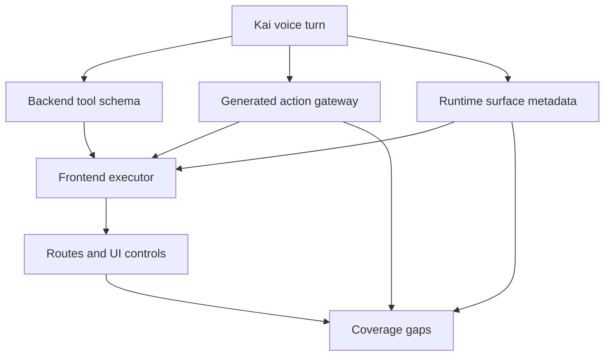

# Kai Voice Action Coverage Audit

Status: current coverage audit.
Snapshot date: 2026-04-27.

## Visual Map

## Verdict

The current voice mapper still does not map every UI screen and every button across the whole app.

It now maps the expanded voice/search action plane: 19 local action-contract surfaces, 73 generated actions, and a smaller set of backend/frontend executable tools. RIA coverage is now first-class for workspace entry, onboarding, clients, picks, client workspace tabs, account/request fallbacks, compatibility routes, and marketplace RIA profile. Some non-RIA controls still publish voice metadata or `data-voice-control-id` values that do not exist in the generated gateway, and several app routes still have no local action contract or explicit voice-ignore contract.

Treat the current mapper as capability coverage, not full UI coverage.

## Sources Checked

- Local action contracts: `hushh-webapp/**/*.voice-action-contract.json`
- Generated gateway: [kai-action-gateway.vnext.json](../../../contracts/kai/kai-action-gateway.vnext.json)
- Generated compatibility manifest: [voice-action-manifest.v1.json](../../../contracts/kai/voice-action-manifest.v1.json)
- Backend planner and tool validator: [voice_intent_service.py](../../../consent-protocol/hushh_mcp/services/voice_intent_service.py)
- Frontend grounding and execution:
  - [voice-grounding.ts](../../../hushh-webapp/lib/voice/voice-grounding.ts)
  - [voice-response-executor.ts](../../../hushh-webapp/lib/voice/voice-response-executor.ts)
  - [voice-action-dispatcher.ts](../../../hushh-webapp/lib/voice/voice-action-dispatcher.ts)
  - [command-executor.ts](../../../hushh-webapp/lib/kai/command-executor.ts)
- Screen and runtime metadata:
  - [screen-context-builder.ts](../../../hushh-webapp/lib/voice/screen-context-builder.ts)
  - [voice-surface-metadata.ts](../../../hushh-webapp/lib/voice/voice-surface-metadata.ts)
  - [route-screen-derivation.ts](../../../hushh-webapp/lib/voice/route-screen-derivation.ts)
- Route constants: [routes.ts](../../../hushh-webapp/lib/navigation/routes.ts)

## Effective Voice Trigger Surface

### Backend Tool Schema

The backend LLM tool schema can directly return only these tool names:

| Tool | What it can trigger | Notes |
| --- | --- | --- |
| `execute_kai_command` | Existing Kai command executor | Command must be one of `analyze`, `optimize`, `import`, `consent`, `profile`, `history`, `dashboard`, `home`. |
| `navigate_back` | Existing app back handler | Maps to `route.back`. |
| `resume_active_analysis` | Resume active debate/analysis run | Requires vault token and an active run. |
| `cancel_active_analysis` | Cancel active debate/analysis run | Requires confirmation, vault token, and an active run. |
| `clarify` | Ask a clarification question | No app mutation; frontend shows an informational prompt. |

Backend canonical action mapping:

| Command/tool | Canonical action id |
| --- | --- |
| `home` | `route.kai_home` |
| `dashboard` | `route.kai_dashboard` |
| `history` | `route.analysis_history` |
| `import` | `route.kai_import` |
| `consent` | `route.consents` |
| `profile` | `route.profile` |
| `optimize` | `route.kai_optimize` |
| `analyze` | `analysis.start` |
| `resume_active_analysis` | `analysis.resume_active` |
| `cancel_active_analysis` | `analysis.cancel_active` |

### Frontend dispatcher tools

The frontend dispatcher supports the backend tools above plus `switch_persona`.

`switch_persona` is not exposed in the backend OpenAI tool schema. It can still be generated by frontend grounding from an authored gateway workflow, currently for `route.ria_home`, where the workflow asks for RIA persona confirmation before routing to `/ria`.

### Kai command executor

`execute_kai_command` reaches [command-executor.ts](../../../hushh-webapp/lib/kai/command-executor.ts). Current effective commands:

| Command | Effective behavior |
| --- | --- |
| `analyze` | Requires `symbol`; clears any stale live intent and routes to `/kai/analysis?ticker=...` so the comparison preview is confirmed before a debate starts. Blocks if another analysis is active. |
| `optimize` | Routes to `/kai/optimize`; if no portfolio exists, routes to `/kai/import` and blocks execution. |
| `import` | Routes to `/kai/import`. |
| `history` | Routes to `/kai/analysis` with history/tab params. |
| `dashboard` | Routes to `/kai/portfolio`. |
| `home` | Routes to `/kai`. |
| `consent` | Routes to `/consents`. |
| `profile` | Routes to `/profile`. |

## Generated Gateway Snapshot

Generated gateway coverage:

- 19 source contracts
- 73 generated actions
- 43 wired actions
- 29 unwired actions
- 1 dead legacy action
- execution policy split: 44 `allow_direct`, 25 `manual_only`, 4 `confirm_required`

Action inventory:

| Action id | Status / target | Effective voice behavior |
| --- | --- | --- |
| `route.kai_analysis` | wired route `/kai/analysis` | Can navigate to analysis. |
| `route.analysis_history` | wired Kai command `history` | Can open analysis history. |
| `analysis.start` | wired Kai command `analyze` | Can start stock analysis when a symbol is present and analysis is idle. |
| `analysis.resume_active` | wired voice tool `resume_active_analysis` | Can resume an active analysis run when vault and run state are valid. |
| `analysis.cancel_active` | wired voice tool `cancel_active_analysis` | Manual/confirmation-gated cancellation of active analysis. |
| `analysis.open_transcript_tab_legacy` | dead | Contract says transcript tab no longer exists in the analysis page. |
| `route.profile` | wired Kai command `profile` | Can open `/profile`. |
| `route.profile_gmail_panel` | wired route `/profile?panel=gmail` | Can open the Gmail profile panel. |
| `route.profile_support_panel` | wired route `/profile?tab=account&panel=support` | Can open support panel. |
| `route.profile_security_panel` | wired route `/profile?tab=privacy&panel=security` | Can open security panel. |
| `route.profile_pkm_agent_lab` | wired route `/profile/pkm-agent-lab` | Can open PKM Agent Lab. |
| `profile.support.submit_message` | unwired | Local ProfilePage handler only; no global voice/action adapter. |
| `profile.marketplace_visibility.toggle` | unwired | Local ProfilePage switch only; manual-only. |
| `profile.sign_out` | unwired | Local ProfilePage handler only; manual-only. |
| `profile.delete_account` | unwired | Local guarded dialog flow only; manual-only. |
| `profile.pkm.preview_capture` | unwired | Local PKM Agent Lab state only. |
| `profile.pkm.save_capture` | unwired | Local PKM Agent Lab save only; manual-only. |
| `route.profile_receipts` | wired route `/profile/receipts` | Can open receipts memory page. |
| `profile.gmail.connect` | unwired | Local Gmail connect handler only; confirmation required. |
| `profile.gmail.sync_now` | unwired | Local receipts/Profile handlers only; confirmation required. |
| `profile.receipts_memory.preview` | unwired | Local receipts page handler only. |
| `profile.receipts_memory.save` | unwired | Local receipts page save only; manual-only. |
| `profile.gmail.disconnect` | unwired | No global voice/action adapter; manual-only. |
| `route.ria_home` | wired route `/ria` plus workflow | Can ask to switch to RIA persona, then route to `/ria`. |
| `route.ria_onboarding` | wired route `/ria/onboarding` | Can navigate to RIA setup. |
| `route.ria_clients` | wired route `/ria/clients` | Can navigate to the RIA client roster. |
| `route.ria_picks` | wired route `/ria/picks` | Can navigate to the RIA picks surface. |
| `ria.picks.open_source_kai`, `ria.picks.open_source_my` | wired route-state switches | Can switch visible picks source via route query. |
| `ria.picks.open_category_top_picks`, `ria.picks.open_category_avoid`, `ria.picks.open_category_screening` | wired route-state switches | Can switch visible picks category via route query. |
| `ria.picks.save_package` and picks edit/import/copy/discard actions | unwired | Manual-only because they mutate advisor package or file state. |
| `route.ria_client_workspace` and workspace tab actions | wired dynamic routes | Can navigate within the selected client workspace when `[userId]` exists in the current route. |
| `ria.client_workspace.request_access` | unwired | Confirmation-required; must remain user-triggered because it creates a client consent request. |
| `ria.client_workspace.disconnect_relationship` | unwired | Manual-only relationship mutation. |
| `marketplace.ria.request_advisory` | unwired | Manual-only investor-to-RIA consent request creation. |
| `route.consents` | wired Kai command `consent` | Can open consent center. |
| `route.back` | wired voice tool `navigate_back` | Can call the app back handler. |
| `route.kai_dashboard` | wired Kai command `dashboard` | Can open `/kai/portfolio`. |
| `route.kai_import` | wired Kai command `import` | Can open `/kai/import`. |
| `route.kai_investments` | wired route `/kai/investments` | Can navigate to investments. |
| `route.kai_optimize` | wired route `/kai/optimize` | Can navigate to optimize; backend command path can also execute `optimize`. |
| `route.kai_home` | wired Kai command `home` | Can open `/kai`. |

## Coverage Gaps

### 1. UI routes exceed action-contract coverage

The app currently has 39 `page.tsx`/`page.ts` routes under `hushh-webapp/app`, while the generated action gateway covers 19 contracted surfaces.

Examples without matching action-contract coverage or explicit voice-ignore contracts:

- `/kai/onboarding`
- `/kai/funding-trade`
- `/kai/dashboard`
- `/kai/dashboard/analysis`
- `/kai/plaid/oauth/return`
- `/kai/alpaca/oauth/return`
- marketplace routes
- login/register/logout routes

Some of these may intentionally be non-voice surfaces, but the repo does not currently encode that as a first-class ignore contract.

### 2. Route-screen derivation knows screens the gateway does not cover

[route-screen-derivation.ts](../../../hushh-webapp/lib/voice/route-screen-derivation.ts) derives screens such as:

- `kai_funding_trade`
- fallback `kai`
- fallback `profile`
- fallback `app`

Those screens are not all represented as generated gateway surfaces/actions. RIA route derivation is now represented for the main RIA surfaces and dynamic client detail routes.

### 3. Published screen ids drift from contract screen ids

Contract screen ids include `kai_analysis`, `profile_account`, `profile_gmail_panel`, `profile_support_panel`, and `profile_security_panel`.

Runtime publishers currently emit different ids in some places:

- Analysis page publishes `kai_analysis_workspace` or `kai_analysis_history`, while the contract expects `kai_analysis`.
- Profile page publishes `profile_home` or dynamic ids like `profile_gmail`, `profile_support`, `profile_security`, and `profile_my-data`, while contracts/route derivation expect ids such as `profile_account`, `profile_gmail_panel`, `profile_support_panel`, and `profile_security_panel`.
- Kai flow publishes state ids such as `kai_portfolio_bootstrap`, `kai_portfolio_import`, `kai_portfolio_import_progress`, `kai_portfolio_import_complete`, `kai_portfolio_review`, `kai_portfolio_dashboard`, and `kai_portfolio_analysis`; only some of these have contract coverage.

This can cause settlement to rely on route changes or timeouts even when navigation itself succeeds.

### 4. Runtime-published action ids are not all canonical gateway ids

The screen context builder accepts action ids from runtime surface metadata. Several published ids do not exist in the generated gateway:

- Analysis: `kai.analysis.back_to_history`, `kai.analysis.cancel`, `kai.analysis.tab.debate`, `kai.analysis.tab.summary`, `kai.analysis.tab.detailed`, `kai.analysis.open_active`, `kai.analysis.retry_save`
- Portfolio dashboard: `kai.portfolio.share_pdf`, `kai.portfolio.optimize`, `route.kai_investments`, `kai.portfolio.connect_plaid`, `kai.portfolio.import_statement`, `kai.portfolio.delete_imported_data`, `kai.portfolio.refresh_plaid`
- Kai market: `kai.market.refresh`, `kai.market.switch_pick_source`, `route.kai_dashboard`
- Profile: `route.profile_my_data`, `route.profile_access`, `route.profile_account`, `route.profile_gmail`, `route.profile_support`
- Consent center: `consents.search`, `consents.review`, `consents.approve`, `consents.deny`, `consents.revoke`
- PKM Agent Lab: `profile.pkm.resume_upgrade`

These ids can appear in structured screen context, but they are not shared action authority ids.

### 5. DOM voice control ids are not all in the generated gateway

The generated gateway currently declares control ids across the contracted Kai, profile, consent, and RIA surfaces. RIA declarations now include route tabs, onboarding buttons, picks source/category controls, client roster rows, workspace tabs, account/request fallbacks, access-manager controls, and marketplace RIA profile controls.

Observed DOM voice controls that are not currently declared by the generated gateway:

- `add_holding`
- `analysis_retry_save`
- `connect_plaid`
- `consent_approve`
- `consent_deny`
- `consent_open_request`
- `consent_revoke`
- `consent_search`
- `delete_imported_data`
- `load_older_receipts`
- `refresh_plaid`
- `save_holdings_changes`
- `share_portfolio_pdf`

`sync_gmail_receipts` is declared in the contract and appears dynamically in the receipts page when Gmail is connected.

### 6. RIA publishes live surface metadata for mapped surfaces

RIA pages and detail components now publish `usePublishVoiceSurfaceMetadata(...)` for the mapped screens, including `ria_home`, `ria_onboarding`, `ria_clients`, `ria_picks`, `ria_client_workspace`, `ria_client_account_detail`, `ria_client_request_detail`, and `marketplace_ria_profile`.

The remaining RIA limitation is deliberate: actions that need a clicked row id, file picker state, account selection, selected scopes, or consent-request payload remain manual-only or confirmation-required unless those inputs are already safely present in route/context state.

### 7. Existing verification does not prove full UI coverage

`npm run verify:voice-gateway` verifies generation/schema consistency. The focused voice tests verify registry, manifest, grounding, and screen-context behavior.

They do not currently fail when:

- a route lacks a local action contract
- a published `screenId` is not in the gateway/route derivation vocabulary
- a published `actionId` is not in the generated gateway
- a `data-voice-control-id` has no gateway action
- a surface is intentionally non-voice but lacks an ignore reason

## Recommended Next Fixes

1. Decide the contract rule: either every route/button must be voice-addressable, or every non-voice route/button must have an explicit ignore reason.
2. Add a coverage verifier that compares:
   - app routes
   - route-screen derivation ids
   - local action contracts
   - runtime `screenId` publishers
   - runtime `actionId` publishers
   - DOM `data-voice-control-id` values
3. Normalize screen ids across contracts, route derivation, command execution, and surface publishers.
4. Replace runtime-only action ids with canonical gateway ids, or add matching local action contracts.
5. For unwired actions, either implement a global action adapter or mark them as manual-only explainable actions with no executable claim.
6. Add explicit voice-ignore contracts for login/OAuth/marketplace/admin surfaces if they should remain outside Kai voice coverage.

## Bottom Line

The voice agent can execute a real but bounded set of functions today: the backend tool schema, the frontend `switch_persona` workflow path, route navigation steps, RIA route-state navigation, dynamic RIA client workspace tab routing when the current client id is known, and the 8 Kai commands. It still does not map every UI screen and every button across the whole app into the generated action gateway.
