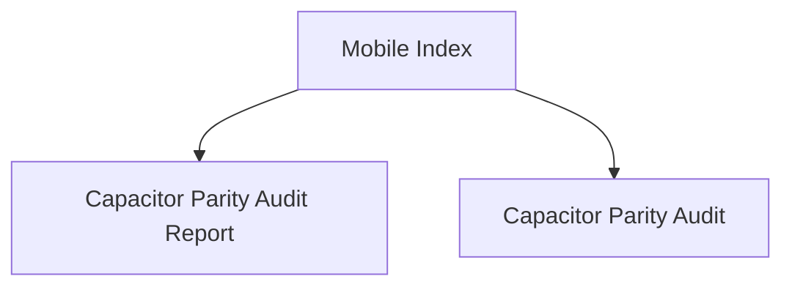

# Hussh Mobile Index

## Visual Map

Use this index for Capacitor parity and release-readiness checks.

These docs describe the mobile side of the platform's `Separation of Duties`: one shared product contract, different transport boundaries, and release gating that proves parity rather than assuming it.

Within the seven-layer platform architecture, mobile is the main Layer 6 and Layer 7 delivery surface.

## References

- [capacitor-parity-audit.md](./capacitor-parity-audit.md): parity contract and audit gate.
- [capacitor-parity-audit-report.md](./capacitor-parity-audit-report.md): latest release-ready audit findings.
- [../architecture/frontend-native-surface-map.md](../architecture/frontend-native-surface-map.md): route to API/native/plugin/voice mapper scaffold.
