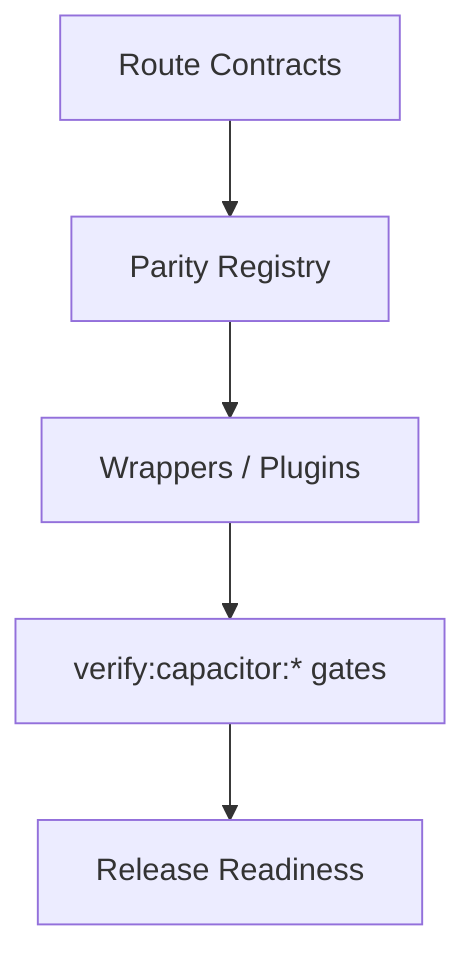

# Capacitor Parity Audit


## Visual Map



This is the release-gate contract for calling iOS/Android parity complete.

Founder-language note: this audit is one of the concrete proofs behind the platform's `Separation of Duties` claim. It shows that changing the transport boundary from Next.js proxy to native plugin does not change the visible product contract.

## Source Of Truth

- Canonical app routes: `hushh-webapp/lib/navigation/routes.ts`
- Route governance reference: `docs/reference/architecture/route-contracts.md`
- Frontend/native surface map: `hushh-webapp/frontend-native-surface-map.generated.json`
- Native route inventory: `hushh-webapp/native-route-inventory.json`
- Native route evidence:
  - `hushh-webapp/native-ios-parity-report.json`
  - `hushh-webapp/native-android-parity-report.json`
- Mobile parity reference: `docs/reference/mobile/capacitor-parity-audit.md`
- Docs/runtime verification: `bash scripts/ci/docs-parity-check.sh`
- Full CI lane: `bash scripts/ci/orchestrate.sh all`

## Required Local Command

```bash
cd hushh-webapp && npm run verify:capacitor:audit
```

The native audit must pass as one lane, not as a hand-waved collection of partial checks. The broader repo CI lane remains:

```bash
bash scripts/ci/orchestrate.sh all
```

## Route Classification Policy

Every visible page in the canonical app route contract must be classified in the parity docs as one of:

- native-supported and required
- intentionally web-only and explicitly exempt

Current policy keeps the full visible app surface in scope, including:

- product routes
- `/developers`
- public/auth content routes
- visible labs routes

Current inventory policy:

- 36 routes are native-required and must pass on iOS and Android.
- 3 routes are explicit web-only exclusions: `/developers`, `/labs/profile-appearance`, `/profile/pkm-agent-lab`.
- New parity exceptions are not accepted unless this document and the route inventory change in the same PR.

## Browser API Policy

Route-facing code must not directly own browser-only APIs when a shared wrapper should exist.
Internal route changes must use Next.js routing (`router.push` / `router.replace`) or the shared internal navigation event handled by `app/providers.tsx`; direct `window.location` mutation is reserved for wrapper-owned external navigation because it can discard the in-memory BYOK vault key.
Before changing a route that calls a service or plugin, run
`cd hushh-webapp && npm run verify:surface-map` and update the generated map
when the route's Next.js proxy, backend endpoint family, native transport, or
voice/action contract changes.

Current shared wrappers:

- clipboard: `hushh-webapp/lib/utils/clipboard.ts`
- navigation mutations / external open: `hushh-webapp/lib/utils/browser-navigation.ts`
- local/session storage access: `hushh-webapp/lib/utils/session-storage.ts`
- download/export: `hushh-webapp/lib/utils/native-download.ts`
- foreground location: `hushh-webapp/lib/capacitor/index.ts` via
  `HushhLocation`

Direct usage is allowed only in:

- the wrapper files above
- explicitly exempt web-only plugin implementations
- documented accepted exceptions in the mobile docs

## Accepted Exceptions

Current accepted parity exceptions are:

- None.

Cloud-backed vault preference flows are the canonical cross-platform behavior, and Android passkey PRF is part of the parity contract rather than an exception. If a new exception is ever needed, document it in the mobile docs in the same change.

## Native Project Sanity

Parity is not complete until both projects still load structurally:

- iOS: `xcodebuild -list -project ios/App/App.xcodeproj`
- Android: `./gradlew tasks --all`

Parity is also not complete until the native reports are fresh against the current inventory:

- `cd hushh-webapp && npm run ios:test`
- `cd hushh-webapp && npm run android:test`
- `cd hushh-webapp && npm run verify:capacitor:reports`

`verify:capacitor:reports` fails when either platform audits fewer native-required routes than the current inventory, or when an `ok: true` result lacks `ready=1`, `found=1`, the expected marker, route match, auth match, or allowed data state.

## Authentication Provider Parity

Native parity for authenticated flows now includes the verified phone mandate after login.

- `FirebaseAuthentication.providers` must include `"phone"` alongside the existing provider list.
- `/register-phone` is a contract route even though it bypasses the standard shell.
- Kai voice surfaces require native microphone permission metadata:
  `NSMicrophoneUsageDescription` on iOS and `android.permission.RECORD_AUDIO` on Android.
- One Location Agent requires foreground-only location parity:
  `NSLocationWhenInUseUsageDescription` on iOS,
  `android.permission.ACCESS_FINE_LOCATION` / `ACCESS_COARSE_LOCATION` on
  Android, and the `HushhLocation` plugin on web, iOS, and Android.
- One Location Agent v1 must not add iOS background location mode or Android
  background location permission.
- `/kai/funding-trade` is part of the native route inventory because voice/action parity can
  land users on the funding trade surface.
- `/one/location` is part of the native route inventory because live location is
  a platform permission surface, not a web-only route.
- Web, iOS, and Android must all produce the same product truth: a signed-in user without
  `FirebaseAuth.currentUser.phoneNumber` cannot continue past the mandate.
- Android still requires a documented OTP smoke on device or UAT because the repo does not
  currently ship a dedicated Android OTP automation harness.

## Release Standard

Treat docs/runtime drift as a blocker. A route, native contract, or browser-sensitive flow is not parity-ready if the docs and audit registry do not describe it correctly.

Native plugin drift is also a blocker. `cd hushh-webapp && npm run verify:capacitor:plugins` compares TypeScript `registerPlugin` contracts with iOS `CAPBridgedPlugin` metadata and Android `@CapacitorPlugin` / `@PluginMethod` declarations.
