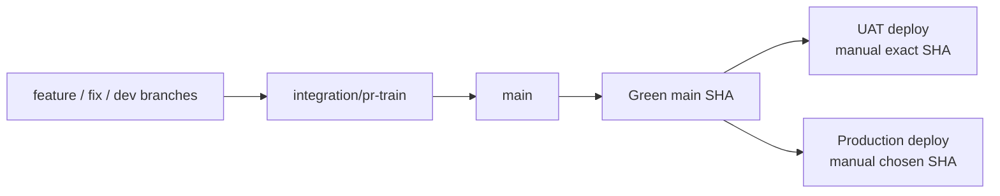

# Branch Governance

## Visual Map

This repo now runs on a dedicated PR-train branch, a protected promotion branch, and SHA-based environment deployment:

| Lane | Purpose | Default policy |
|---|---|---|
| `integration/pr-train` | Normal PR intake and async train landing | Effective landing base for every normal feature/fix/docs PR |
| `main` | Promotion branch for deployable history | Only `integration/pr-train` may open normal promotion PRs into `main` |
| UAT | Hosted validation environment | Manual deploy of an exact green `main` SHA |
| Production | Live user traffic | Manual deploy of an approved green `main` SHA |

## Working Rules

1. Start all maintainer/developer branches from the current `integration/pr-train` unless an isolated `main` hotfix is explicitly required.
2. Contributor PRs may still be opened to `main` for a familiar GitHub intake experience; maintainers or automation retarget normal intake to `integration/pr-train` before review, approval, queue, merge, maintainer patch, or harvest.
3. Merge all normal feature/fix/docs work into `integration/pr-train`.
4. Promote `integration/pr-train` into `main` through a PR after the train is green and ancestry-clean.
5. Do not merge direct feature, contributor, or agent PRs into `main`; CI blocks them unless the head branch is `integration/pr-train`.
6. Continue follow-up fixes on the active development branch by default; do not create extra temporary branches for routine polish, validation follow-up, or same-lane fixes.
7. Create a new branch only when isolation is materially required, such as a post-merge hotfix from `main`, a deploy blocker that must land independently, or unrelated in-flight changes on the current branch.
8. After an isolated hotfix lands, return local work to the normal development branch or `integration/pr-train` and delete the temporary branch after rollout validation.
9. Do not use `deploy_uat` or `deploy` as release branches; they are retired from the deployment path.
10. UAT deploys only from a successful `Main Post-Merge Smoke` run on `main` and uses an explicitly chosen exact green commit SHA.
11. Production deploys only from a manually chosen SHA that is reachable from `origin/main` and already green in CI.
12. Do not open release PRs into environment branches; the deployment source of truth is `main`.

## Codex Branch Preservation Gate

Coding agents must run this gate before CI, deploy, PR, hotfix, or validation work:

1. Inspect and preserve the current developer branch before edits, branch switches, merges, or deploy operations.
2. Keep incremental fixes on the preserved developer branch when the current worktree can safely carry them.
3. Do not create temporary branches for routine follow-up work, UAT validation fixes, PR polish, or local hardening.
4. Use a temporary branch only when branch isolation is explicitly requested, an isolated `main` hotfix is required, or unrelated in-flight work makes the preserved branch unsafe for the fix.
5. If a temporary branch is used, delete it locally and remotely after merge and rollout validation when safe, then switch back to the preserved developer branch.
6. If a normal fix lands on `integration/pr-train`, merge or rebase the landed train commits into the preserved developer branch before handoff.
7. If an emergency hotfix lands on `main`, merge or rebase the landed `origin/main` commits into `integration/pr-train` and the preserved developer branch before handoff.
8. Do not end a task detached, on `main`, or on a temporary branch unless the user explicitly requested that final state or a concrete conflict blocks restoration.

## Branch Types and Retention

| Branch type | Naming pattern | Retention |
|---|---|---|
| Developer branch | `feature/*`, `feat/*`, `agent_*`, developer-owned names | Keep while active |
| PR train branch | `integration/pr-train` | Durable protected intake branch |
| Hotfix branch | `fix/*` | Delete after merge to `main`, sync back to `integration/pr-train`, and successful UAT validation |
| Deployment artifact | exact green `main` SHA | Keep in Git history and deployment logs |
| Local backup branch | `backup/*`, `publishable/*` | Audit unique commits, salvage if needed, then delete |

Before deleting a local backup branch, classify its unique commits as:

1. already represented in `main`
2. obsolete and safe to drop
3. still valuable and worth promoting onto a fresh salvage branch from current `integration/pr-train`

## Deployment Lanes

### UAT

1. UAT deploys only through a manual workflow dispatch with an explicit green `main` SHA.
2. The workflow checks out that exact chosen green `main` SHA.
3. Manual dispatch is limited to the maintainer cohort in `config/ci-governance.json` (`uat.manual_dispatch_users`): `kushaltrivedi5`, `RGlodAkshat`, `ankitkumarsingh1702`, `azfx`, and `Jhumma-hushh`. This list is held equal to the merge cohort (`main.review_bypass_users`) by design — anyone trusted to land code on `main` may validate it in the UAT sandbox — and `scripts/ci/verify-deployment-environment-governance.py` fails if the two drift apart.
4. Workflow preflight fails if the requested SHA is not reachable from `origin/main`.
5. Workflow preflight also fails if the SHA does not already have a successful `Main Post-Merge Smoke Gate`.
6. The canonical GitHub deployment environment for this lane is `uat`.
7. Cloud Run traffic changes must be made only by the GitHub UAT workflow service account. Human `gcloud run deploy` or `gcloud run services update-traffic` against UAT is deploy-authority drift, even for maintainers.
8. Every UAT backend/frontend revision must carry `HUSHH_DEPLOY_ENV`, `HUSHH_DEPLOY_SOURCE`, `HUSHH_DEPLOY_SHA`, and `HUSHH_DEPLOY_RUN_ID` from the workflow. UAT release classification treats missing or mismatched provenance as `deploy_authority_drift` and rolls back the affected service.
9. Project IAM should remove direct human Cloud Run deploy/update permissions for UAT; humans dispatch the governed workflow, not the runtime service.

### Production

1. Production does not auto-deploy from branch pushes.
2. Production deploys only through a manual workflow dispatch with an explicit green `main` SHA.
3. The workflow validates that the SHA is reachable from `origin/main`.
4. The workflow also validates that `Main Post-Merge Smoke Gate` succeeded for that SHA before deployment starts.
5. Only `kushaltrivedi5` may dispatch the production workflow after the SHA preflight passes.
6. The canonical GitHub deployment environment for this lane is `production`.

## Protected Surfaces & Trust Model

The repository protects a set of high-blast-radius surfaces — the files that
decide who can merge, who can deploy, and what the pipeline does — behind
**three independent, defense-in-depth layers**. No single mistaken approval can
land a change to these surfaces.

### Protected surfaces

These paths are owned by the maintainer team in `.github/CODEOWNERS` and are
listed in `config/ci-governance.json` under `main.protected_pipeline_paths`:

- `.github/workflows/`
- `.github/actions/`
- `scripts/ci/`
- `deploy/`
- `config/ci-governance.json`
- `.github/CODEOWNERS`

### The three enforcement layers

1. **CODEOWNERS (GitHub-native, blocks merge).** Ownership is mapped to the
   `@hushh-labs/allowed-maintainers-to-approve` team, not a single user, so it
   auto-tracks membership and removes the single-owner bottleneck. For this to
   *block* (not merely request review), `main` and `integration/pr-train` must
   have **"Require review from Code Owners"** enabled, and the team must keep at
   least write/maintain repo access or GitHub silently ignores team entries.
2. **CI maintainer-actor guard (fails closed).**
   `scripts/ci/verify-protected-pipeline-edits.py` runs in the required
   `CI Status Gate` and fails the PR if a non-maintainer touches a protected
   surface. It requires `GH_TOKEN` in the governance job to resolve the PR's
   changed files; if it cannot resolve them it **fails closed** (blocks), never
   open. A `--self-test` runs in CI so the guard can never silently regress.
3. **Branch-protection approval.** The standard 1 independent approval plus
   approval-of-most-recent-push still applies underneath the two layers above.

### Concentric privilege rings

Privilege is deliberately nested. Each inner ring is a strict subset of the one
outside it, and the boundaries are enforced, not informal:

| Ring | Who | Authority | Source of truth |
|---|---|---|---|
| Merge cohort | `allowed-maintainers-to-approve` team (5) | bypass review + queue, edit pipeline | `main.review_bypass_users` / `merge_queue_bypass_users` / `protected_pipeline_edit_users` |
| UAT deploy cohort | same 5 | dispatch UAT deploy of a green `main` SHA | `uat.manual_dispatch_users` (held == merge cohort) |
| Production deploy cohort | `kushaltrivedi5` only | dispatch production deploy | `production.manual_dispatch_users` |

Invariants enforced in CI by `verify-deployment-environment-governance.py`:

- **UAT == merge cohort.** Anyone trusted to land code on `main` may validate it
  in the UAT sandbox — no more, no less. The two lists are held equal and any
  independent drift fails the check.
- **Production == owner only.** `production.manual_dispatch_users` must be exactly
  `["kushaltrivedi5"]`; any widening fails the check.

### Rule: deploy-actor lists are governance, not routine config

Changes to `manual_dispatch_users` (UAT or production) and to the maintainer
cohort lists are protected-surface edits: they require maintainer-team code-owner
review, pass the CI guard, and should be authored/merged by the owner. Widening
who can deploy is never a routine, self-mergeable change.

## Hotfix Playbook

1. Preserve the active developer branch before switching away.
2. Create the hotfix branch from the latest `main` only when an isolated hotfix is materially required.
3. Merge the hotfix into `main`.
4. Immediately sync the landed hotfix back into `integration/pr-train` so the train branch does not drift behind the promotion branch.
5. If hosted validation is required, manually deploy that same green `main` SHA to UAT.
6. Delete the hotfix branch locally and remotely after merge and rollout validation when safe.
7. Switch back to the preserved developer branch and merge or rebase the landed train/main commits into it.
8. If another blocker appears after that rollout, create a new hotfix branch from the updated `main` only when the same isolation criteria still applies.
9. Do not reuse an already-merged hotfix branch for a second fix.

## GitHub Admin Checklist

### `integration/pr-train`

1. Require pull requests before merge.
2. Require the `CI Status Gate` status check.
3. Require strict/up-to-date checks.
4. Require conversation resolution before merge.
5. Enable merge queue for `integration/pr-train`.
6. Block force-pushes.
7. Block branch deletion.
8. Require at least 1 independent PR approval and approval of the most recent push.
9. Use this branch as the only normal PR landing branch.

### `main`

1. Require pull requests before merge.
2. Require the `CI Status Gate` status check.
3. Require strict/up-to-date checks.
4. Require conversation resolution before merge.
5. Enable merge queue for `main`.
6. Block force-pushes.
7. Block branch deletion.
8. Require at least 1 independent PR approval on `main`; CI status plus merge queue remain required merge gates.
9. Use review bypass plus the dedicated `Allowed Maintainers to Approve` team for the sanctioned maintainer bypass cohort only; do not rely on overlapping push restrictions.
10. Keep ordinary development off `main`; only promote from `integration/pr-train` except explicit emergency hotfixes.

Current operating note:

- `enforce_admins` should stay enabled
- DCO is enforced in CI, not via a separate GitHub branch-protection primitive
- verify the live setting with `../../../scripts/ci/verify-main-branch-protection.sh`
- `integration/pr-train` and `main` both require 1 independent approval; the external community goes through PR + CI + review + queue on `integration/pr-train`
- admin ownership does not count as an independent PR approval
- require approval of the most recent push is enabled, so stale approvals cannot carry newly pushed code
- a PR author cannot self-approve through GitHub; sanctioned maintainer "self approval" means explicit branch-protection bypass, not a counted GitHub review
- the current live branch protection review-bypass allowlist is `kushaltrivedi5`, `RGlodAkshat`, `ankitkumarsingh1702`, `azfx`, and `Jhumma-hushh`
- the current live merge-queue bypass team is `Allowed Maintainers to Approve`, containing those same 5 users only
- the sanctioned review-bypass cohort is intentional policy and should not be reported as governance drift when it matches `config/ci-governance.json`
- if an admin needs to proceed on a green PR, verify whether the live ruleset allows queue entry; do not assume approval is implicitly satisfied
- bypass actors may waive review through branch protection and bypass queue through the dedicated owner team path
- direct pushes to `main` are not the default bypass model; the preferred path is a green `integration/pr-train` promotion PR plus bypass merge when justified
- CI should still gate the landing decision; bypass is for review policy, not for skipping validation

### Retired release branches

1. `deploy_uat` and `deploy` are no longer part of the deployment control plane.
2. They should not carry required checks or workflow expectations for new rollouts.
3. Leave them inert or archive/remove them only after the team confirms no external automation still points at them.

## Production Deployment Environment

The production workflow uses one active GitHub environment name:

| Environment | Intended use |
|---|---|
| `production` | Owner-only production deploy lane for `kushaltrivedi5` |

The UAT workflow uses one active GitHub environment name:

| Environment | Intended use |
|---|---|
| `uat` | Maintainer-dispatched hosted validation lane for exact green `main` SHAs |

Operational rules:

1. Only `kushaltrivedi5` may dispatch the production workflow.
2. Other developers may still merge to `main` through PR flow, but production dispatch remains owner-only.
3. `production` should not require reviewers and should not allow admin bypass.
4. Verify the live setup with `../../../scripts/ci/verify-production-environment-governance.sh`.
5. Verify both deploy lanes together with `../../../scripts/ci/verify-deployment-environment-governance.py`.
