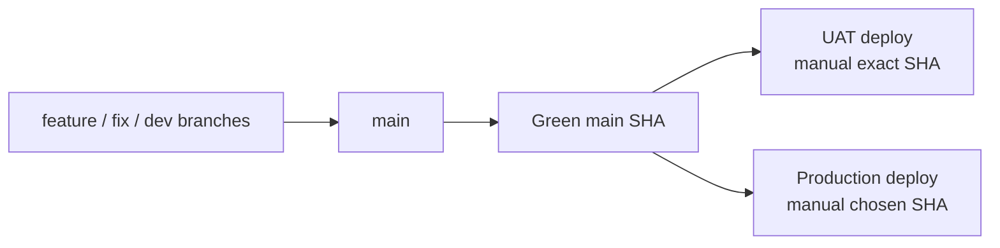

# Branch Governance

## Visual Map

This repo now runs on one integration branch plus SHA-based environment deployment:

| Lane | Purpose | Default policy |
|---|---|---|
| `main` | Team integration branch | Every feature PR targets `main` |
| UAT | Hosted validation environment | Manual deploy of an exact green `main` SHA |
| Production | Live user traffic | Manual deploy of an approved green `main` SHA |

## Working Rules

1. Start all development branches from `main`.
2. Merge all feature/fix/docs work back into `main`.
3. Continue follow-up fixes on the active development branch by default; do not create extra temporary branches for routine polish, validation follow-up, or same-lane fixes.
4. Create a new branch only when isolation is materially required, such as a post-merge hotfix from `main`, a deploy blocker that must land independently, or unrelated in-flight changes on the current branch.
5. After an isolated hotfix lands, return local work to the normal development branch or `main` and delete the temporary branch after rollout validation.
6. Do not use `deploy_uat` or `deploy` as release branches; they are retired from the deployment path.
7. UAT deploys only from a successful `Main Post-Merge Smoke` run on `main` and uses an explicitly chosen exact green commit SHA.
8. Production deploys only from a manually chosen SHA that is reachable from `origin/main` and already green in CI.
9. Do not open release PRs into environment branches; the deployment source of truth is `main`.

## Codex Branch Preservation Gate

Coding agents must run this gate before CI, deploy, PR, hotfix, or validation work:

1. Inspect and preserve the current developer branch before edits, branch switches, merges, or deploy operations.
2. Keep incremental fixes on the preserved developer branch when the current worktree can safely carry them.
3. Do not create temporary branches for routine follow-up work, UAT validation fixes, PR polish, or local hardening.
4. Use a temporary branch only when branch isolation is explicitly requested, an isolated `main` hotfix is required, or unrelated in-flight work makes the preserved branch unsafe for the fix.
5. If a temporary branch is used, delete it locally and remotely after merge and rollout validation when safe, then switch back to the preserved developer branch.
6. If a fix lands on `main`, merge or rebase the landed `origin/main` commits into the preserved developer branch before handoff.
7. Do not end a task detached, on `main`, or on a temporary branch unless the user explicitly requested that final state or a concrete conflict blocks restoration.

## Branch Types and Retention

| Branch type | Naming pattern | Retention |
|---|---|---|
| Developer branch | `feature/*`, `feat/*`, `agent_*`, developer-owned names | Keep while active |
| Hotfix branch | `fix/*` | Delete after merge to `main` and successful UAT validation |
| Deployment artifact | exact green `main` SHA | Keep in Git history and deployment logs |
| Local backup branch | `backup/*`, `publishable/*` | Audit unique commits, salvage if needed, then delete |

Before deleting a local backup branch, classify its unique commits as:

1. already represented in `main`
2. obsolete and safe to drop
3. still valuable and worth promoting onto a fresh salvage branch from current `main`

## Deployment Lanes

### UAT

1. UAT deploys only through a manual workflow dispatch with an explicit green `main` SHA.
2. The workflow checks out that exact chosen green `main` SHA.
3. Manual dispatch is limited to `kushaltrivedi5`, `RGlodAkshat`, and `ankitkumarsingh1702`.
4. Workflow preflight fails if the requested SHA is not reachable from `origin/main`.
5. Workflow preflight also fails if the SHA does not already have a successful `Main Post-Merge Smoke Gate`.
6. The canonical GitHub deployment environment for this lane is `uat`.
7. Cloud Run traffic changes must be made only by the GitHub UAT workflow service account. Human `gcloud run deploy` or `gcloud run services update-traffic` against UAT is deploy-authority drift, even for maintainers.
8. Every UAT backend/frontend revision must carry `HUSHH_DEPLOY_ENV`, `HUSHH_DEPLOY_SOURCE`, `HUSHH_DEPLOY_SHA`, and `HUSHH_DEPLOY_RUN_ID` from the workflow. UAT release classification treats missing or mismatched provenance as `deploy_authority_drift` and rolls back the affected service.
9. Project IAM should remove direct human Cloud Run deploy/update permissions for UAT; humans dispatch the governed workflow, not the runtime service.

### Production

1. Production does not auto-deploy from branch pushes.
2. Production deploys only through a manual workflow dispatch with an explicit green `main` SHA.
3. The workflow validates that the SHA is reachable from `origin/main`.
4. The workflow also validates that `Main Post-Merge Smoke Gate` succeeded for that SHA before deployment starts.
5. Only `kushaltrivedi5` may dispatch the production workflow after the SHA preflight passes.
6. The canonical GitHub deployment environment for this lane is `production`.

## Hotfix Playbook

1. Preserve the active developer branch before switching away.
2. Create the hotfix branch from the latest `main` only when an isolated hotfix is materially required.
3. Merge the hotfix into `main`.
4. If hosted validation is required, manually deploy that same green `main` SHA to UAT.
5. Delete the hotfix branch locally and remotely after merge and rollout validation when safe.
6. Switch back to the preserved developer branch and merge or rebase the landed `origin/main` commits into it.
7. If another blocker appears after that rollout, create a new hotfix branch from the updated `main` only when the same isolation criteria still applies.
8. Do not reuse an already-merged hotfix branch for a second fix.

## GitHub Admin Checklist

### `main`

1. Require pull requests before merge.
2. Require the `CI Status Gate` status check.
3. Require strict/up-to-date checks.
4. Require conversation resolution before merge.
5. Enable merge queue for `main`.
6. Block force-pushes.
7. Block branch deletion.
8. Require at least 1 independent PR approval on `main`; CI status plus merge queue remain required merge gates.
9. Use review bypass plus the dedicated `Allowed Maintainers to Approve` team for the sanctioned maintainer bypass cohort only; do not rely on overlapping push restrictions.
10. Keep ordinary development off `main`; use PRs from developer branches.

Current operating note:

- `enforce_admins` should stay enabled
- DCO is enforced in CI, not via a separate GitHub branch-protection primitive
- verify the live setting with `../../../scripts/ci/verify-main-branch-protection.sh`
- `main` requires 1 independent approval; the external community goes through PR + CI + review + queue
- admin ownership does not count as an independent PR approval
- require approval of the most recent push is enabled, so stale approvals cannot carry newly pushed code
- a PR author cannot self-approve through GitHub; sanctioned maintainer "self approval" means explicit branch-protection bypass, not a counted GitHub review
- the current live `main` branch protection review-bypass allowlist is `kushaltrivedi5`, `RGlodAkshat`, and `ankitkumarsingh1702`
- the current live merge-queue bypass team is `Allowed Maintainers to Approve`, containing those same 3 users only
- the sanctioned review-bypass cohort is intentional policy and should not be reported as governance drift when it matches `config/ci-governance.json`
- if an admin needs to proceed on a green PR, verify whether the live ruleset allows queue entry; do not assume approval is implicitly satisfied
- bypass actors may waive review through branch protection and bypass queue through the dedicated owner team path
- direct pushes to `main` are not the default bypass model; the preferred path is a green PR plus bypass merge
- CI should still gate the landing decision; bypass is for review policy, not for skipping validation

### Retired release branches

1. `deploy_uat` and `deploy` are no longer part of the deployment control plane.
2. They should not carry required checks or workflow expectations for new rollouts.
3. Leave them inert or archive/remove them only after the team confirms no external automation still points at them.

## Production Deployment Environment

The production workflow uses one active GitHub environment name:

| Environment | Intended use |
|---|---|
| `production` | Owner-only production deploy lane for `kushaltrivedi5` |

The UAT workflow uses one active GitHub environment name:

| Environment | Intended use |
|---|---|
| `uat` | Maintainer-dispatched hosted validation lane for exact green `main` SHAs |

Operational rules:

1. Only `kushaltrivedi5` may dispatch the production workflow.
2. Other developers may still merge to `main` through PR flow, but production dispatch remains owner-only.
3. `production` should not require reviewers and should not allow admin bypass.
4. Verify the live setup with `../../../scripts/ci/verify-production-environment-governance.sh`.
5. Verify both deploy lanes together with `../../../scripts/ci/verify-deployment-environment-governance.py`.
