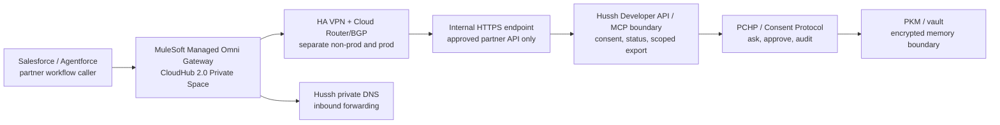

# MuleSoft Managed Omni Gateway Private Space Handoff

Status: execution handoff. This document records the approved network posture, live GCP foundation, live MuleSoft Private Space verification, and remaining VPN/private-endpoint steps for MuleSoft Managed Omni Gateway, formerly Flex Gateway.

## Visual Map



## Current Truth

Hussh UAT and production currently run in GCP `us-central1`:

| Environment | GCP project | Current runtime | Current network truth |
| --- | --- | --- | --- |
| Non-Prod / UAT | `hushh-pda-uat` | Cloud Run `consent-protocol`, `hushh-webapp` | MuleSoft Ohio partner VPC, HA VPN gateway shell, Cloud Router, and private DNS inbound forwarding are live; VPN tunnels and private HTTPS endpoint are not live yet |
| Prod | `hushh-pda` | Cloud Run `consent-protocol`, `hushh-webapp` | MuleSoft Ohio partner VPC, HA VPN gateway shell, Cloud Router, and private DNS inbound forwarding are live; VPN tunnels and private HTTPS endpoint are not live yet |

Salesforce, MuleSoft, Agentforce, and Omni Gateway remain partner integration lanes. They can route, normalize, observe non-sensitive metadata, and enforce gateway policy. They must not become Hussh's consent engine, vault boundary, PKM store, memory store, or audit authority.

## MuleSoft Intake Answers

| MuleSoft request | Hussh answer |
| --- | --- |
| Private Space region | `US East (Ohio)` for Non-Prod and Prod private connectivity paths, aligned to GCP `us-east5`. |
| Non-Prod Private Space CIDR | `10.81.0.0/22` |
| Prod Private Space CIDR | `10.91.0.0/22` |
| CIDR guardrails | The CIDRs must not overlap GCP auto-mode `10.128.0.0/9`, Hussh custom VPC ranges, MuleSoft's disallowed ranges, or reserved VPN/on-prem ranges. |
| Internal DNS server IPs | Pending until Hussh provisions Cloud DNS inbound forwarding. Do not provide public `run.app`, public `hushh.ai`, or metadata resolver IPs as internal DNS. |
| Internal DNS domains | `np.hushh-gateway.private` and `prod.hushh-gateway.private`, subject to MuleSoft accepting `.private` as a permitted non-public suffix. |
| VPN | Separate Non-Prod and Prod HA VPN connections with Cloud Router/BGP. Hussh side ASNs: `64520` for Non-Prod, `64521` for Prod. MuleSoft can use its default private ASN unless it conflicts. |

## Hussh Network Defaults

The dedicated partner VPCs should be custom-mode VPCs. Do not reuse the current auto-mode `default` VPC.

| Environment | Project | Region | Partner VPC | Service subnet | Proxy-only subnet | MuleSoft CIDRs | Hussh ASN |
| --- | --- | --- | --- | --- | --- | --- | --- |
| Non-Prod | `hushh-pda-uat` | `us-east5` | `hushh-mulesoft-np-ohio-vpc` | `10.88.0.0/24` | `10.88.1.0/24` | `10.81.0.0/22` | `64520` |
| Prod | `hushh-pda` | `us-east5` | `hushh-mulesoft-prod-ohio-v2-vpc` | `10.98.0.0/24` | `10.98.1.0/24` | `10.91.0.0/22` | `64521` |

`10.82.0.0/22` and `10.92.0.0/22` are not active targets for the current single Private Space per environment. They are reserved only if MuleSoft explicitly provisions an additional Private Space later.

## Live Non-Prod Foundation

Status as of 2026-06-01: the Non-Prod foundation is live in `hushh-pda-uat`.

| Resource | Live value |
| --- | --- |
| VPC | `hushh-mulesoft-np-ohio-vpc` |
| Service subnet | `hushh-mulesoft-np-services-us-east5`, `10.88.0.0/24`, Private Google Access enabled |
| Proxy-only subnet | `hushh-mulesoft-np-proxy-us-east5`, `10.88.1.0/24` |
| Cloud Router | `hushh-mulesoft-np-router-us-east5`, ASN `64520` |
| HA VPN gateway | `hushh-mulesoft-np-ha-vpn-us-east5` |
| Hussh VPN interface 0 public IP | `34.157.35.157` |
| Hussh VPN interface 1 public IP | `34.157.163.69` |
| Private DNS zone | `hushh-mulesoft-np-ohio-private`, `np.hushh-gateway.private.` |
| Cloud DNS inbound policy | `hushh-mulesoft-np-ohio-inbound-dns` |
| Cloud DNS inbound resolver IP | `10.88.0.2` |

## Live Prod Foundation

Status as of 2026-06-01: the Prod foundation is live in `hushh-pda`.

| Resource | Live value |
| --- | --- |
| VPC | `hushh-mulesoft-prod-ohio-v2-vpc` |
| Service subnet | `hushh-mulesoft-prod-services-v2-us-east5`, `10.98.0.0/24`, Private Google Access enabled |
| Proxy-only subnet | `hushh-mulesoft-prod-proxy-v2-us-east5`, `10.98.1.0/24` |
| Cloud Router | `hushh-mulesoft-prod-router-v2-us-east5`, ASN `64521` |
| HA VPN gateway | `hushh-mulesoft-prod-ha-vpn-v2-us-east5` |
| Hussh VPN interface 0 public IP | `34.157.32.171` |
| Hussh VPN interface 1 public IP | `34.157.160.164` |
| Private DNS zone | `hushh-mulesoft-prod-v2-private`, `prod.hushh-gateway.private.` |
| Cloud DNS inbound policy | `hushh-mulesoft-prod-v2-inbound-dns` |
| Cloud DNS inbound resolver IP | `10.98.0.2` |

No MuleSoft VPN tunnels, partner firewall allow rules, internal HTTPS endpoint, or private Cloud Run backend binding exists yet in either environment. Those steps require MuleSoft peer values and the approved private endpoint/certificate design.

## Live MuleSoft Verification

Status as of 2026-06-01 from the MuleSoft CloudHub 2.0 Private Space API:

| Environment | Private Space | Region | Status | Version | Live MuleSoft CIDR | DNS resolver | Domain | Blocking note |
| --- | --- | --- | --- | --- | --- | --- | --- | --- |
| Non-Prod | `hussh-ps-non-prod-east1` | `us-east-2` | `Active` | `2.0.491-may26-hop1` | `10.81.0.0/22` | `10.88.0.2` | `np.hushh-gateway.private` | Matches target |
| Prod | `hussh-ps-prod-east1` | `us-east-2` | `Active` | `2.0.491-may26-hop1` | `10.82.0.0/22` | `10.98.0.2` | `prod.hushh-gateway.private` | Does not match target `10.91.0.0/22` |

The existing Prod Private Space has `muleAppDeploymentCount=0`, so the clean correction path is to replace/recreate the Prod Private Space before establishing VPN tunnels. Do not configure GCP Prod VPN tunnels against the current `10.82.0.0/22` Prod space.

## Implementation Sequence

1. Run the read-only inventory:

   ```bash
   bash deploy/mulesoft/gcp_private_space_inventory.sh
   ```

2. Review that the proposed MuleSoft and Hussh VPC ranges do not overlap any current subnet, route, peering, VPN, Cloud SQL private network, or reserved partner range.
3. Provision Non-Prod first with the guarded repo script in `ACTION=plan` mode, then `ACTION=apply` after review.
4. Provision Cloud DNS private zone and inbound forwarding, then give MuleSoft the generated inbound resolver IPs and approved private domains.
5. Configure HA VPN tunnels only after MuleSoft provides peer public IPs, remote ASN, tunnel inside IPs, and tunnel secret handling.
6. Expose only the approved partner API surface through a private internal HTTPS endpoint. Keep existing public Cloud Run ingress unchanged until current public paths are proven independent from the partner path.
7. Promote the same pattern to Prod only after Non-Prod DNS, routing, auth, consent audit, and negative access tests pass.

## Security Boundary

MuleSoft may receive and log non-sensitive operational metadata:

- tenant or org identifier
- app identifier
- actor identifier
- workflow name
- requested scope label
- request ID, response class, and latency

MuleSoft must not store or receive by default:

- vault keys
- broad PKM or durable One memory
- decrypted PKM payloads
- full KYC packages
- full email archives
- reusable credentials or consent tokens outside the approved connector boundary

The Hussh runtime remains the authority for consent validation, expiry, revocation, audit, and encrypted scoped export.

## Acceptance Criteria

Non-Prod must pass before Prod:

1. MuleSoft Private Space resolves the private Hussh FQDN through Hussh DNS inbound forwarding.
2. MuleSoft can reach only the approved private HTTPS health/API endpoint over VPN.
3. MuleSoft cannot reach Cloud SQL, broad VPC ranges, vault internals, SSH, RDP, or unrelated services.
4. Hussh audit records show the actor, app, scope, decision, expiry, and response class for partner requests.
5. Gateway logs contain only non-sensitive metadata.
6. BGP route exchange is scoped to the approved CIDRs, with no default route advertisement.
7. VPN failover is tested before production promotion.

## References

- [MuleSoft Private Space setup information](https://docs.mulesoft.com/cloudhub-2/ps-gather-setup-info)
- [MuleSoft Private Space creation](https://docs.mulesoft.com/cloudhub-2/ps-create-configure)
- [MuleSoft Omni Gateway overview](https://docs.mulesoft.com/gateway/latest/)
- [Salesforce and MuleSoft partner brief](../../future/hussh-one-infra/salesforce-mulesoft-brief.md)
- [Salesforce HLL architecture](../../future/hussh-one-infra/salesforce-hll-architecture.md)
- [Hussh Architecture View Catalog](../../reference/architecture/architecture-view-catalog.md)
