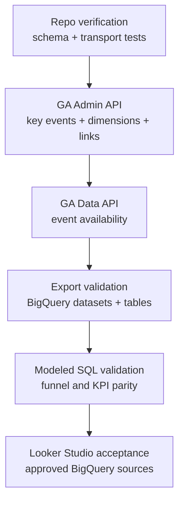

# Analytics Verification Contract

## Visual Context

Canonical visual owner: [Observability Architecture Map](../operations/observability-architecture-map.md). Use that map for topology and plane boundaries; this page is the proof contract that decides whether Kai analytics is trustworthy.

## Purpose

Kai analytics is considered working only when the repo, runtime, GA4, BigQuery, and Looker Studio data-source contracts all agree.

This document defines the proof ladder and the failure conditions.

## Proof Ladder



No downstream surface is trusted if the previous rung fails.

## 1. Repo Verification

Required commands:

```bash
cd hushh-webapp
npm run verify:analytics
npm run audit:analytics-sandbox
npm run smoke:analytics:uat
cd ..
./bin/hushh docs verify
```

What this proves:

1. the allowed event schema and privacy guardrails still hold
2. the growth helper emits the expected contract
3. every first-party `app/**/page.tsx` route resolves to a stable non-`unknown` `route_id`
4. native Firebase adapter still exists and is wired
5. web transport pushes `dataLayer` for GTM compatibility and sends direct GA4 `gtag` events to the configured measurement ID
6. docs and the implementation references remain aligned
7. sandbox audit emits a local report for representative investor and RIA journeys without affecting GA4 numbers
8. UAT smoke proves a real deployed UAT browser journey and direct GA4 collect handoff when maintainer-only smoke credentials are available
9. cache and route performance events remain bounded metadata-only signals for UX KPIs, not user-data telemetry

Repo verification fails if:

1. `verify:analytics` fails
2. `audit:analytics-sandbox` fails or does not emit a report
3. any current first-party app route maps to `route_id = unknown`
4. UAT smoke credentials are unavailable for a deployed validation gate, or the smoke journey cannot produce the required live events
5. docs verification fails
6. the event schema drifts from the declared contract
7. route/cache performance events accept raw user IDs, emails, PKM payloads, workflow IDs, cache keys, prompts, or decrypted values

Cache performance KPI note:

- `route_readiness_completed`, `cache_resource_resolved`, `route_refresh_completed`, and `warmup_completed` are system-health events used to measure warm-cache UX and loader friction.
- UAT validates event shape, transport, and route IDs only.
- Production is the source for real KPI conclusions such as warm-cache time to usable UI, stale render rate, blocking loader rate, refresh error rate, and warmup usefulness.
- These metrics must not justify broader decrypted PKM retention; the vault and PKM memory-only boundary remains higher priority than performance.

Sandbox audit note:

- `audit:analytics-sandbox` is the pre-release proof rung for local transport correctness
- it exercises representative web flows, captures `dataLayer` and direct `gtag` handoff latency, writes a report to `tmp/`, and never sends events to GA4
- use it when the build is not deployed yet or when testing must not pollute reporting

Governed command bundle after deployed UAT validation:

```bash
cd hushh-webapp
npm run verify:analytics:governed
```

This command intentionally fails unless repo schema tests, sandbox transport audit, GA Admin API inspection, GA Data API event availability, BigQuery export/materialization, and docs verification pass.

UAT smoke note:

- `npm run smoke:analytics:uat` uses Playwright against the deployed UAT origin and the existing reviewer test fixture via maintainer-only `REVIEWER_UID` / `REVIEWER_VAULT_PASSPHRASE`.
- `UAT_SMOKE_*` and `KAI_TEST_*` are accepted only as one-release migration aliases.
- it must not fabricate analytics events; it only observes events produced by the app during a real browser journey
- it must not create Firebase users, reviewer users, app environments, or one-off analytics fixtures
- after the cold `/login` boot, it must use Next client navigation for protected routes so the in-memory vault key stays inside the mounted React provider tree
- it verifies UAT web measurement ID `G-H1KGXGZTCF`, rejects production measurement ID leakage, and requires `growth_funnel_step_completed`, `portfolio_viewed`, `recommendation_viewed`, and `investor_activation_completed`
- if prerequisite credentials or seeded portfolio/recommendation data are missing, the smoke fails clearly and the gate remains blocked; repair or reseed the same reviewer test fixture instead of creating another user

## 2. GA Admin API Validation

Use the maintained inspection helper:

```bash
python3 .codex/skills/analytics-observability-governance/scripts/inspect_analytics_surface.py validate
```

Required checks:

1. production property `526603671` has key events:
   - `investor_activation_completed`
   - `ria_activation_completed`
2. UAT property `533362555` has the same key events
3. both properties have event-scoped custom dimensions:
   - `journey`
   - `step`
   - `entry_surface`
   - `auth_method`
   - `portfolio_source`
   - `workspace_source`
   - `env`
   - `platform`
   - `event_category`
   - `app_version`
4. both properties have web, iOS, and Android streams present
5. exact stream IDs and web measurement IDs match the governed topology:
   - prod web stream `13695004816` uses `G-2PCECPSKCR`
   - UAT web stream `14383500973` uses `G-H1KGXGZTCF`
   - prod native streams are `13695001361` and `13694989021`
   - UAT native streams are `14383415557` and `14383555179`
6. required custom dimensions have `scope = EVENT`
7. both properties have BigQuery links present
8. production export excludes `HushhVoice` stream `13702689760`

If a required custom dimension is missing and the service account has edit access, the helper can create missing event-scoped dimensions:

```bash
python3 .codex/skills/analytics-observability-governance/scripts/inspect_analytics_surface.py ensure-custom-dimensions
```

## 3. GA Data API Event Availability

Use the health command:

```bash
python3 .codex/skills/analytics-observability-governance/scripts/inspect_analytics_surface.py health
```

This checks recent GA reporting availability for:

- `growth_funnel_step_completed`
- `investor_activation_completed`
- `ria_activation_completed`
- `market_insights_loaded`
- `portfolio_viewed`
- `recommendation_viewed`

For UAT, a fresh web validation journey must produce at least:

- `growth_funnel_step_completed`
- `portfolio_viewed` when usable portfolio state renders
- `recommendation_viewed` after a final recommendation is visible
- `investor_activation_completed`

If activation rows are absent after a completed UAT web journey, classify the issue as instrumentation failure until proven otherwise. Do not treat a flat conversion tile as a Looker Studio configuration problem first.

## 4. Web Runtime Validation

Use GA DebugView plus browser inspection.

Required checks:

1. page HTML resolves the expected measurement ID for the environment:
   - prod: `G-2PCECPSKCR`
   - uat: `G-H1KGXGZTCF`
2. browser network shows GA traffic for real app actions
3. DebugView shows:
   - `growth_funnel_step_completed`
   - `investor_activation_completed`
   - `ria_activation_completed`
4. event params are present and bounded:
   - `journey`
   - `step`
   - `entry_surface`
   - `auth_method`
   - `portfolio_source`
   - `workspace_source`
   - `env`
   - `platform`
   - `event_category`
   - `app_version`

Identity separation checks:

1. the same UAT session must land in UAT DebugView, not prod DebugView
2. if UAT traffic appears in production DebugView, sink selection is wrong

## 5. Native Validation

Use Firebase / GA DebugView on real or dev devices.

Current release note:

1. There are currently no separate iOS or Android UAT app-store builds.
2. UAT native streams exist in GA4 for topology readiness.
3. Current store-distributed iOS and Android builds are production analytics surfaces.
4. Native UAT validation requires a future TestFlight/internal-track build or a documented dev-device debug build.
5. Until then, UAT KPI validation is web-first and production native analytics must be monitored separately.

Required checks once UAT native builds exist:

1. iOS and Android both emit growth events into the expected environment property
2. UAT native app IDs map to UAT property `533362555`
3. prod native app IDs map to prod property `526603671`
4. the same canonical growth events appear as on web

Device-debug reminder from Google:

- debug-mode events are excluded from overall Analytics data and from the daily BigQuery export
- use them for validation, not for KPI counting

Reference:

- https://firebase.google.com/docs/analytics/debugview

## 6. Export Validation

GA Admin API proof:

1. production property `526603671` has a BigQuery link
2. UAT property `533362555` has a BigQuery link
3. production export streams include only the three Kai prod streams and exclude `HushhVoice`
4. UAT export streams include the three UAT streams

Project-side proof:

1. production must materialize `analytics_526603671`
2. UAT must materialize `analytics_533362555`
3. event tables must appear:
   - `events_intraday_YYYYMMDD`
   - `events_YYYYMMDD`

Verification commands:

```bash
bq ls -a --project_id hushh-pda
bq ls -a --project_id hushh-pda-uat
bq query --use_legacy_sql=false "SELECT table_name FROM \`hushh-pda.analytics_526603671.INFORMATION_SCHEMA.TABLES\` ORDER BY table_name DESC LIMIT 20"
bq query --use_legacy_sql=false "SELECT table_name FROM \`hushh-pda-uat.analytics_533362555.INFORMATION_SCHEMA.TABLES\` ORDER BY table_name DESC LIMIT 20"
```

Export validation fails if:

1. the GA link exists but the dataset does not materialize
2. the dataset exists but event tables do not
3. the production export includes stream `13702689760`

## 7. Modeled KPI Validation

The dashboard is only valid when modeled SQL agrees with the event contract.

Canonical query surface:

- [ga4_growth_dashboard_queries.sql](../../../consent-protocol/scripts/observability/ga4_growth_dashboard_queries.sql)

Required modeled surfaces:

1. investor funnel
2. RIA funnel
3. activation conversion rate
4. attribution quality using `collected_traffic_source`, then `session_traffic_source_last_click`, then `traffic_source`
5. platform mix
6. feature engagement
7. missing-param and instrumentation health
8. data freshness

Reporting rules:

1. production dashboards read only from `analytics_526603671`
2. UAT queries read only from `analytics_533362555`
3. UAT is validation-only and must not back business KPIs
4. `HushhVoice` stream `13702689760` must be excluded from Kai growth models
5. Looker Studio must connect to modeled BigQuery results, not raw GA4 UI cards

## 8. Looker Studio Acceptance

Required dashboard tiles:

1. conversion rate
2. funnel progression
3. activation trend
4. attribution quality
5. platform mix
6. feature engagement
7. missing event/param health
8. data freshness

A zero conversion rate is accepted as real only when:

1. activation events are configured as GA4 key events
2. activation emitters are verified in repo and runtime
3. BigQuery export contains current data
4. modeled SQL shows zero activations after a completed test journey
5. UAT validation traffic does not leak into production

## 9. Anomaly Checks

| Check | Expected outcome | Failure meaning |
| --- | --- | --- |
| key events non-zero in prod | `investor_activation_completed` and `ria_activation_completed` appear for real usage | conversion setup or live instrumentation is broken |
| funnel monotonicity | entered >= auth >= downstream steps | step loss, route drift, or event-order drift |
| `(direct)/(not set)` share | not dominant for tagged campaigns | attribution capture is incomplete |
| platform mix | reflects real web / iOS / Android traffic | stream mapping or one platform transport is broken |
| missing-param health | low or explainable | emitter coverage regressed |
| missing `env` / `app_version` | zero or explainable | payload contract drift |
| missing `event_category` | zero | event-family governance drift |
| UAT leakage into prod | absent | measurement ID or app stream configuration is wrong |

## 10. Done Criteria

Kai growth analytics is only considered production-grade when all of these are true:

1. repo verification passes
2. DebugView confirms the canonical events and params
3. production and UAT land in separate properties
4. GA Data API shows current event availability after a fresh UAT web journey
5. BigQuery export datasets and tables materialize
6. production modeled queries run against production export only
7. the growth dashboard is fed from modeled BigQuery results rather than raw GA cards
8. Looker Studio tiles include KPI and instrumentation-health views

Production dashboard confidence is blocked until `analytics_526603671` is visible with current event tables or the production export materialization issue is explicitly remediated.
