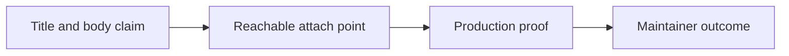

# PR Contributor Readiness Contract

## Visual Map

This page defines what maintainers expect before a pull request is considered
review-ready. It exists to make reviews predictable for contributors and to keep
the backlog moving without repeated clarification rounds.

## Before You Open The PR

Do this first:

1. Sync with current `main` and confirm GitHub says the branch can be merged.
2. Enable maintainer edits, or explain why the fork/branch cannot allow them.
3. Search for the existing implementation and related open PRs so the change
   improves a canonical surface instead of duplicating it.
4. Name the reachable production attach point: app route, backend route,
   package export, generated contract, documented devex entrypoint, or
   canonical production-code test surface.
5. Run the smallest production-code proof and paste the exact command.
6. For UI-visible behavior, provide the browser route, Playwright spec/command,
   screenshot, or video proof.
7. For sensitive surfaces, state the trust boundary, error path, rollback or
   safe-failure behavior, and privacy impact.
8. For stacked work, link the predecessor PR and explain what lands first.

## Review-Ready Standard

A PR is review-ready when it proves all of the following:

1. The title, body, changed files, and tests describe the same contract.
2. The change attaches to a current app route, backend route, package export,
   generated contract, documented devex entrypoint, or canonical test surface.
3. New helpers, components, services, exports, or agents are reachable from that
   attach point.
4. Tests import production code or exercise the real route/caller. Tests that
   define their own mock implementation do not prove product behavior.
5. Sensitive surfaces name the trust boundary: auth, consent, vault, PKM,
   finance, voice/action, KYC, schema, deploy, CI, or public ingress.
6. The PR body lists the smallest verification commands actually run.
7. Stacked PRs link the predecessor and explain what lands first.
8. Required checks, DCO, and mergeability are current on the submitted head.

If a section is not applicable, say why. A checked empty template is not enough.

## Common Blockers

Maintainers will block or request changes for these patterns even when CI is
green:

- The PR claims one outcome while the diff changes a different subsystem.
- The PR adds a new helper, component, service, export, or agent that only its
  own tests use.
- Backend/API/schema changes do not include caller, proxy, contract, docs, or
  runtime proof.
- The change overlaps an existing capability without explaining why the current
  implementation is being changed instead of duplicated.
- Tests prove mocks or copied logic instead of production behavior.
- A broad branch contains unrelated fixes, stacked work, generated files, or
  product decisions that should be split.
- A PR adds a new top-level folder, setup path, workflow, config, ignore rule,
  generated artifact, or helper script without wiring it into the existing
  `./bin/hushh`, docs, CI, or runtime contract.
- Consent, vault, PKM, finance, voice/action, KYC, or deploy behavior changes
  without explicit trust-boundary and rollback proof.
- Required checks are failing, missing, stale, or the branch cannot be merged
  cleanly into the current base.

| Pattern | What maintainers need to see |
| --- | --- |
| Claim/diff mismatch | Rewrite the title/body or narrow the diff so both describe one contract. |
| Helper only used by tests | Wire it to a real caller/export or mark the PR as test/devex-only. |
| Mock-only proof | Add a focused test that imports production code or hits the real route/caller. |
| Root/config/generated noise | Name the existing workflow, command, or runtime path that owns the change. |
| Sensitive boundary change | Prove auth/consent/error-path behavior and rollback or safe-failure behavior. |

## Maintainer Outcomes

Maintainers use this order:

1. `merge_now`: the contributor PR is green, current, reachable, and safe as-is.
2. `maintainer_patch_then_merge`: the contributor PR is the right vehicle and a
   bounded maintainer patch can safely finish it without changing product intent.
3. `maintainer_harvest`: the exact branch should not land, but a useful slice
   can land through a maintainer branch with public source attribution.
4. `request_changes`: the accepted value, attach point, proof, or trust boundary
   cannot be named without contributor work.

Harvest is not an approval of the original PR. The source PR stays open with a
clear path, or is closed as superseded only after the maintainer landing commit
reaches `main`. If contributor code, tests, or implementation shape are
materially reused, the landing commit must include a valid `Co-authored-by:`
trailer when the contributor identity is available.

Native GitHub contribution credit comes from either merging the contributor PR
or landing a maintainer commit on `main` with a valid `Co-authored-by:` trailer.
Public acknowledgement alone does not update GitHub's contributor graph.
Co-author trailers are for materially reused code, tests, or implementation
shape; ideas or direction receive public acknowledgement, not GitHub co-author
credit.

## What To Put In The PR

Use concrete evidence, not broad intent:

- Route or caller touched: `hushh-webapp/app/...`, `app/api/...`,
  `consent-protocol/api/routes/...`, package export, generated contract, or
  docs/devex entrypoint.
- Contract changed: request/response shape, schema, cache key, consent scope,
  auth mode, event, generated type, UI route, or runtime behavior.
- Tests run: exact commands and whether they passed locally.
- Base/head status: whether the branch is current with `main`, mergeable, and
  DCO-signed.
- UI proof: screenshot, video, or browser route checked when behavior is visible.
- Sensitive proof: auth/consent/error-path test, rollback path, and no secret or
  private data exposure.
- Top-level/devex/generated changes: the existing workflow they attach to and
  the command that regenerated generated files.
- Stack proof: predecessor PR link and what this PR depends on.

## Fastest Path To Merge

Keep PRs small, current, and attached to one contract. If a fix needs both
backend and frontend work, either include both sides with proof or split into a
clearly linked stack. If the real value is a test-only hardening PR, state that
explicitly and make the test import the production surface it protects.

After maintainers request changes, push a new commit or explain the material
state change in the PR. Unchanged PRs with a current maintainer record stay
parked until new evidence is available.
