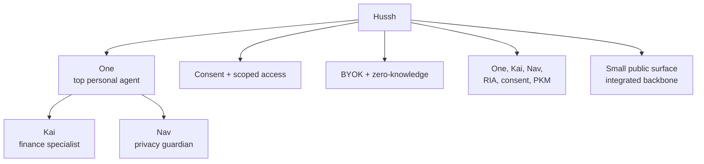

# Hussh Vision

> Build personal AI on consent, scoped access, BYOK, and zero-knowledge boundaries.

## Visual Map

## The Core Idea

Hussh is not trying to make privacy feel cute. It is trying to make trust explicit.

Hussh exists because personal information has been everywhere except with the person it describes. Companies collect fragments of identity, trade them, feed them to systems the user never chose, and often notify the person only after the damage is already done.

The founder origin is direct: Hussh started after the founder's identity was stolen and his family was harmed before anyone told him. That is not a marketing anecdote. It is the moral contract behind the platform: never again should a human discover that their identity, access, or private context moved without them.

The product thesis is:

- the user owns the key boundary
- the server stores ciphertext
- access is granted through scoped consent
- agents work for the person whose data they touch

The durable product line is:

> **Your agents. Yours to own.**

Where the shorthand helps, the trust model can be read as:

- **Secure**
- **Scoped**
- **Handled by the user**

The founder metaphor is:

> **hu_ssh: SSH for humans. Ask. Approve. Audit.**

`Human Secure Socket Host` remains the canonical architecture meaning of Hussh. `hu_ssh` is the founder-facing way to explain the same trust model: every meaningful connection should ask for a named scope, receive explicit approval, and leave an auditable receipt.

## What Hussh Is

Hussh is a platform for personal agents and agent-assisted workflows where:

- identity says who is acting
- the vault defines the encrypted data boundary
- consent tokens define the allowed scope
- apps and agents execute only within that scope

## Agent Ontology

The canonical product ontology is:

| Name | Role | Current-state boundary |
| --- | --- | --- |
| **Hussh** | Platform, trust model, infrastructure | Owns consent, scoped access, BYOK, zero-knowledge, PKM, developer access, and audit boundaries. Hussh has values, not a character voice. |
| **One** | Top-level personal agent and relationship layer | Approved north-star layer for shell greetings, memory, notifications, cross-domain help, and specialist handoff framing. Current runtime is still Kai-first until the One/Nav migration lands. |
| **Kai** | Finance specialist summoned by One | Current shipped investor/RIA finance assistant, voice/search/action gateway, portfolio analysis, market intelligence, and receipts-backed decisions. |
| **Nav** | Privacy and consent guardian summoned by One | Approved direction for consent, scope review, vault, deletion, privacy, and trust-friction copy. Nav is not yet a separate runtime. |

See [agent-ontology.md](./agent-ontology.md) for the maintained role, tone, copy, and handoff contract.

## One Product Model

One is the personal agent the user owns. Its durable product model is four motions:

| Motion | Meaning | Current-state boundary |
| --- | --- | --- |
| **Listens** | One reads only what the user explicitly connects through scoped, revocable grants. | Current surfaces already enforce auth, vault, consent, route, and persona guards, but the runtime identity is still Kai-first. |
| **Remembers** | One becomes the relationship layer for context, preferences, decisions, trusted people, and previously answered questions. | Current PKM is Kai-first; One-owned memory is approved direction until the migration lands. |
| **Decides** | One reasons over the user's information and summons specialists for domain work. | Finance decisions remain Kai-owned in the current runtime. |
| **Acts** | One helps execute bounded actions inside consent, route, vault, and workspace guards. | Strong claims about private receipts for every action stay future-state until verified by implementation. |

The shorthand is simple: One holds the relationship, Kai holds finance craft, and Nav holds privacy and consent craft.

## Why This Matters

| Old model | Hussh model |
| --- | --- |
| implied platform access | explicit scoped access |
| server-readable user state | ciphertext-only storage |
| privacy policy as contract | consent token as contract |
| convenience over auditability | auditability built into the access path |

## Product Direction

Near-term product direction stays the same:

- One as the user-facing relationship layer
- Kai for investor workflows
- Nav for privacy, consent, vault, deletion, and scope-review workflows
- consent center and scoped sharing
- RIA and collaboration surfaces
- multi-domain PKM growth on top of the same trust boundary

What changes is the clarity of the story:

- **consent first**
- **scope first**
- **BYOK**
- **zero-knowledge**

## Scaling Model

The public product north star is that Hussh should scale as personal AI infrastructure, not as a pile of disconnected agents, dashboards, or standalone feature roots.

The scaling model is:

- **Personal Operating Layer:** One is the relationship layer the user owns. Specialists such as Kai, Nav, and KYC remain below One and do domain work only inside their boundaries.
- **Trust Handshake:** PCHP is the consent and scoped-access handshake for humans, agents, apps, developers, and future brand-side endpoints. It does not replace the current Consent Protocol implementation; it explains the public trust model around it.
- **User-Owned Memory:** PKM and World Model work must preserve encrypted user-side authority. LLM Wiki and OpenClaw-style ideas are useful only when they behave as portable, consented memory projections rather than platform-owned knowledge stores.
- **BYOA And On-Device Direction:** BYOK, BYOA, MLX/on-device execution, and App Intents are architecture constraints. They should move more capability toward user-held keys, user-chosen compute, and local/private execution where the platform can support it safely.
- **Reachable Product Surfaces:** Signature, KYC, brokerage, email, voice, and search surfaces are valuable only when they make a real One/Kai/Nav/PCHP workflow more useful without bypassing consent, vault, identity, route, workspace, or audit boundaries.

This is a direction contract, not implementation proof. Current runtime docs, generated contracts, tests, schemas, and CI still decide what is shipped today.

## Planning Boundary

`docs/vision/` is for durable north stars only:

- product thesis
- trust invariants
- enduring assistant philosophy

Speculative workflow architecture, R&D options, and future-roadmap concepts belong in [../future/README.md](../future/README.md), not in `docs/vision/`.

## Monorepo Philosophy

The platform may need a large integrated backbone, but the contributor experience should feel smaller:

- public commands should be minimal
- docs should be modular
- scripts should be self-contained
- the happy path should not require knowing the whole repo

This is the “eukaryotic backbone, bacterial modules” rule for the repo:

- integrated where the platform needs deep coordination
- small, reusable, copy-pasteable pieces everywhere else

## Public Naming Rule

Use **Hussh** in public docs and product copy.

Legacy `Hushh` identifiers that remain in code, env keys, bundle IDs, or service names are compatibility details, not the public brand. The canonical rule lives in [../reference/operations/brand-and-compatibility-contract.md](../reference/operations/brand-and-compatibility-contract.md).
