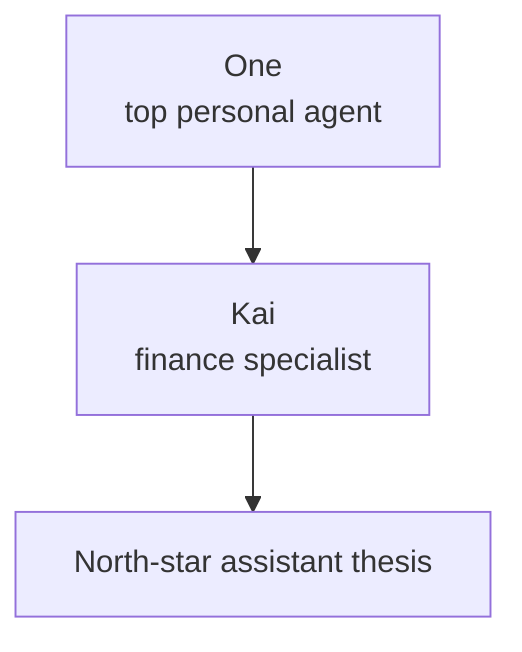

# Kai — Finance Specialist Under One

> **Decide like a committee, carry it in your pocket.**


## Visual Map



Kai is the finance specialist that One summons for portfolio, market, investment debate, RIA, and decision-receipt work. Kai is not the platform-level identity for Hussh and does not own consent, vault, deletion, or privacy-policy authority.

Forward-looking Kai roadmap and R&D planning now belong under [../../future/kai/README.md](../../future/kai/README.md). `docs/vision/kai/` stays north-star oriented; speculative execution-model docs should not start here.

Current implementation note:

- This vision document is not the source of truth for the shipped Kai runtime.
- For the live Kai voice/runtime architecture, use [../../reference/kai/kai-voice-runtime-architecture.md](../../reference/kai/kai-voice-runtime-architecture.md).
- For on-device AI status, use [../../reference/ai/on-device-future-plan/README.md](../../reference/ai/on-device-future-plan/README.md); cloud remains the current primary runtime path.

---

<p align="center">
  
  
  
</p>

---

## ⚠️ Important Legal Notice

> [!CAUTION] > **Agent Kai is an EDUCATIONAL TOOL, NOT a registered investment adviser.**

### Entity Structure

This repository describes product behavior and technical architecture only.
Specific operating-entity, fund, registration, and legal details are maintained outside this public technical documentation set.

### Educational Tool Disclaimer

Kai is provided as an **educational and informational tool**. It is not represented in this repository as an investment adviser, broker-dealer, or fiduciary service.

**The information provided by Kai:**

- Is for informational and educational purposes only
- Does NOT constitute investment advice, recommendations, or offers to buy/sell securities
- Should NOT be relied upon for making investment decisions
- Is NOT a solicitation for any investment product

### Regulatory Status

| Aspect               | Status                                  |
| -------------------- | --------------------------------------- |
| **Kai**              | Educational tool, NOT investment advice |
| **Operating Entity** | Not specified in this repository        |

No operating-entity registration claim should be inferred from this repository.

> **Always consult a licensed financial professional before making investment decisions.**

---

## 🎯 Executive Summary

**Kai** is the Hussh finance specialist under One. On finance questions, Kai can analyze, debate, and deliver a **Buy/Hold/Reduce decision with receipts**: sources, math, dissent, and risk-persona fit.

This is a faithful consumer translation of the **AlphaAgents framework**:

- Specialized agent roles
- Group-chat orchestration
- Round-robin debate
- Risk personas
- Complete observability

Current implementation note: the checked-in runtime is cloud-primary. On-device and hybrid execution remain future-state planning unless a linked current-state reference proves otherwise.

---

## 🧠 The Hussh Philosophy (Why Kai Exists)

### What Hussh IS

**Hussh is the platform. One is the personal agent. Kai is the finance specialist.**

The agent layer:

- Acts **on your behalf**
- Is **bound by consent**
- Treats your data as **your private capital**
- Optimizes outcomes across **your life**, not just tasks

### The Kai Promise

Kai embodies the finance part of this philosophy:

| Traditional Finance AI    | Agent Kai                      |
| ------------------------- | ------------------------------ |
| Black-box recommendations | Decision receipts with sources |
| Trust the algorithm       | Trust the debate               |
| One-size-fits-all         | Risk-persona aligned           |
| No explanation            | Complete audit trail           |
| Serves the institution    | **Serves only you**            |
| Requires cloud            | **Can graduate toward on-device execution where supported** |

---

## 📱 On-Device AI & Hybrid Mode Direction

Kai's long-term direction supports two modes depending on user preference and device capabilities. Current implementation remains cloud-primary unless a linked current-state reference proves a specific on-device path.

### Mode 1: Future Target — Fully On-Device (Privacy-First)

```
┌─────────────────────────────────────────────────────────────────────┐
│                    FULLY ON-DEVICE MODE                              │
├─────────────────────────────────────────────────────────────────────┤
│                                                                      │
│   User Query: "Should I buy Apple stock?"                           │
│                          │                                           │
│                          ▼                                           │
│   ┌────────────────────────────────────────────────────────────┐    │
│   │              LOCAL LLM (MLX / Gemma)                        │    │
│   │                                                             │    │
│   │   ┌─────────────┐  ┌─────────────┐  ┌─────────────┐        │    │
│   │   │ Fundamental │  │  Sentiment  │  │  Valuation  │        │    │
│   │   │   Agent     │  │    Agent    │  │    Agent    │        │    │
│   │   │ (cached     │  │ (cached     │  │ (local      │        │    │
│   │   │  filings)   │  │  news)      │  │  math)      │        │    │
│   │   └─────────────┘  └─────────────┘  └─────────────┘        │    │
│   │                          │                                  │    │
│   │                          ▼                                  │    │
│   │              ┌─────────────────────┐                       │    │
│   │              │   Debate Engine     │                       │    │
│   │              └─────────────────────┘                       │    │
│   │                          │                                  │    │
│   │                          ▼                                  │    │
│   │              ┌─────────────────────┐                       │    │
│   │              │   Decision Card     │                       │    │
│   │              └─────────────────────┘                       │    │
│   └────────────────────────────────────────────────────────────┘    │
│                                                                      │
│   ✅ Data: Uses cached/local data only                              │
│   ✅ Privacy: NO data leaves device                                 │
│   ✅ Offline: Works without internet                                │
│   ⚠️ Limitation: Data may not be real-time                         │
│                                                                      │
└─────────────────────────────────────────────────────────────────────┘
```

**When to use**: Maximum privacy, offline scenarios, general analysis.

### Mode 2: Future Target — Hybrid (Full Featured)

```
┌─────────────────────────────────────────────────────────────────────┐
│                    HYBRID MODE (Per-Request Consent)                 │
├─────────────────────────────────────────────────────────────────────┤
│                                                                      │
│   User Query: "Should I buy Apple stock?"                           │
│                          │                                           │
│                          ▼                                           │
│   ┌────────────────────────────────────────────────────────────┐    │
│   │              LOCAL LLM (MLX / Gemma)                        │    │
│   │   (Reasoning, debate orchestration, decision synthesis)    │    │
│   └────────────────────────────────────────────────────────────┘    │
│                          │                                           │
│                          ▼                                           │
│   ┌────────────────────────────────────────────────────────────┐    │
│   │   🔐 CONSENT PROMPT (per external source)                   │    │
│   │                                                             │    │
│   │   "Kai wants to fetch live data for AAPL:                   │    │
│   │    ✓ SEC filings (Fundamental Agent)                        │    │
│   │    ✓ Recent news (Sentiment Agent)                          │    │
│   │    ✓ Current price (Valuation Agent)                        │    │
│   │                                                             │    │
│   │   [Deny]                    [Approve with FaceID 👆]"       │    │
│   └────────────────────────────────────────────────────────────┘    │
│                          │                                           │
│                          ▼                                           │
│   ┌────────────────────────────────────────────────────────────┐    │
│   │                    EXTERNAL DATA FETCH                      │    │
│   │                                                             │    │
│   │   ┌─────────────┐  ┌─────────────┐  ┌─────────────┐        │    │
│   │   │   SEC API   │  │   News API  │  │  Market API │        │    │
│   │   │  (10-K/10-Q)│  │  (Reuters,  │  │  (prices,   │        │    │
│   │   │             │  │   etc.)     │  │   volume)   │        │    │
│   │   └─────────────┘  └─────────────┘  └─────────────┘        │    │
│   └────────────────────────────────────────────────────────────┘    │
│                          │                                           │
│                          ▼                                           │
│   ┌────────────────────────────────────────────────────────────┐    │
│   │   Decision Card (with live data citations)                  │    │
│   └────────────────────────────────────────────────────────────┘    │
│                                                                      │
│   ✅ Data: Real-time from consented sources                        │
│   ✅ Analysis: Most accurate and current                           │
│   ⚠️ Requires: Internet connection + user consent per source       │
│                                                                      │
└─────────────────────────────────────────────────────────────────────┘
```

**When to use**: Maximum accuracy, real-time analysis, before making decisions.

---

## 👥 The Three Specialist Agents

Kai deploys three specialized agents, each with dedicated tools, mirroring how human investment committees function:

### 🔍 Fundamental Agent

**Purpose**: Analyzes 10-K/10-Q filings and financial reports using specialized RAG retrieval.

**Focus Areas**:

- Business fundamentals
- Financial health
- Long-term viability
- Competitive positioning

**Tools**: SEC filing retrieval, financial statement analysis, ratio calculators

**Data Sources**:

- On-device: Cached SEC filings, historical financials
- Hybrid: Live SEC EDGAR API (with consent)

---

### 📰 Sentiment Agent

**Purpose**: Processes news, earnings calls, and market sentiment through reflection summarization.

**Focus Areas**:

- Market momentum
- Short-term catalysts
- News sentiment analysis
- Earnings call interpretation

**Tools**: News aggregation, sentiment scoring, earnings transcript analysis

**Data Sources**:

- On-device: Cached news, offline sentiment models
- Hybrid: Live news APIs (with consent)

---

### 🧮 Valuation Agent

**Purpose**: Performs quantitative analysis using deterministic math calculators.

**Focus Areas**:

- P/E ratios and multiples
- Returns analysis
- Volatility measurement
- Relative valuation

**Tools**: Financial calculators, peer comparison engines, risk metrics

**Data Sources**:

- On-device: Historical prices, cached peer data
- Hybrid: Live market data APIs (with consent)

---

## 💬 The Debate Process

> _"Debate is the key to quality."_
>
> _Every agent speaks at least twice. Consensus is required. No single agent may decide alone._

```
┌──────────────────────────────────────────────────────────────────────────┐
│                        THE DEBATE PROCESS                                 │
├──────────────────────────────────────────────────────────────────────────┤
│                                                                           │
│   ┌─────────────────┐                                                    │
│   │ 🔍 INITIAL      │  Each agent performs specialized analysis          │
│   │    ANALYSIS     │  using dedicated tools                             │
│   └────────┬────────┘                                                    │
│            │                                                              │
│            ▼                                                              │
│   ┌─────────────────┐                                                    │
│   │ 💬 ROUND-ROBIN  │  Agents challenge each other's findings            │
│   │    DEBATE       │  in structured rounds                              │
│   └────────┬────────┘                                                    │
│            │                                                              │
│            ▼                                                              │
│   ┌─────────────────┐                                                    │
│   │ ⚖️ CONSENSUS    │  Differing perspectives are reconciled,           │
│   │    BUILDING     │  residual dissent captured                         │
│   └────────┬────────┘                                                    │
│            │                                                              │
│            ▼                                                              │
│   ┌─────────────────┐                                                    │
│   │ ✅ DECISION     │  Final Buy/Hold/Reduce recommendation              │
│   │    FORMULATION  │  with confidence level                             │
│   └─────────────────┘                                                    │
│                                                                           │
└──────────────────────────────────────────────────────────────────────────┘
```

### What the Debate Achieves

- **Reduces individual agent biases**
- **Surfaces contradictory evidence**
- **Captures uncertainty and dissent**
- **Creates a comprehensive audit trail**
- **Improves decision quality**

### Real-Time Streaming Visualization

Kai provides a **live streaming interface** that shows the debate as it happens:

```
┌──────────────────────────────────────────────────────────────────────────┐
│ Analyzing NVDA                                                           │
│                                                                          │
│ [Round 1]  [Round 2]  [Decision Card]   ← Tabs always visible           │
├──────────────────────────────────────────────────────────────────────────┤
│                                                                          │
│ 🧠 Kai is thinking...                                                    │
│ "Analyzing SEC filings for NVDA..."                                      │
│                                                                          │
│ ┌─────────────────┐  ┌─────────────────┐  ┌─────────────────┐           │
│ │  🔍 Fundamental │  │  📰 Sentiment   │  │  🧮 Valuation   │           │
│ │                 │  │                 │  │                 │           │
│ │ "Based on the   │  │ "Market         │  │ "P/E of 45x     │           │
│ │  10-K filing,   │  │  sentiment is   │  │  appears rich   │           │
│ │  revenue grew   │  │  bullish due    │  │  vs peers..."   │           │
│ │  114% YoY..."   │  │  to AI demand"  │  │                 │           │
│ │           ▋     │  │           ▋     │  │           ▋     │           │
│ └─────────────────┘  └─────────────────┘  └─────────────────┘           │
│                                                                          │
│ ← Live streaming tokens from Gemini 3 Flash                              │
└──────────────────────────────────────────────────────────────────────────┘
```

**Key Features:**

- **Persistent tabs**: Round 1, Round 2, and Decision Card tabs remain visible throughout
- **Live token streaming**: Watch each agent's reasoning unfold in real-time
- **Embedded KPI report**: Decision Card tab includes full analysis (Executive Summary, Bull/Bear Cases, Business Moat)
- **Powered by Gemini 3 Flash**: Fast, streaming responses with advanced reasoning

**Technical Implementation:**

- Backend uses `generate_content(stream=True)` for real-time SSE events
- Frontend handles `agent_token` events to display streaming text
- `asyncio.sleep(0)` after each yield ensures event loop processes SSE in real-time

---

## 📋 The Decision Card

The culmination of the debate process is a comprehensive **Decision Card** that includes:

| Element                     | Description                             |
| --------------------------- | --------------------------------------- |
| **Headline Recommendation** | Buy/Hold/Reduce + confidence level      |
| **Specialist Insights**     | Summary from each agent                 |
| **Debate Digest**           | Key discussion points and disagreements |
| **Sources & Math**          | Evidence with citations                 |
| **Reliability Badge**       | Trustworthiness indicator               |
| **Risk-Persona Alignment**  | How well it fits _your_ profile         |
| **Legal Disclaimer**        | Required regulatory notice              |

### Required Disclaimer on Every Decision Card

```
┌──────────────────────────────────────────────────────────────────────────┐
│  ⚠️ IMPORTANT DISCLOSURE                                                 │
│                                                                           │
│  This analysis is provided for EDUCATIONAL PURPOSES ONLY.                │
│                                                                           │
│  • This is NOT investment advice                                         │
│  • Kai operators are not represented here as registered advisers         │
│  • This is not a solicitation for any investment product                 │
│  • Past performance does not guarantee future results                    │
│  • You may lose money; there is no assurance of profit                  │
│  • Always consult a licensed financial advisor before investing         │
│                                                                           │
│  By using Kai, you acknowledge that you understand these limitations.   │
│                                                                           │
└──────────────────────────────────────────────────────────────────────────┘
```

---

## 🎭 Risk Personas

Kai personalizes recommendations based on user risk profiles:

| Persona          | Description                   | Kai Behavior                                            |
| ---------------- | ----------------------------- | ------------------------------------------------------- |
| **Conservative** | Capital preservation priority | Emphasizes downside risks, higher confidence thresholds |
| **Balanced**     | Growth with protection        | Balanced agent weighting                                |
| **Aggressive**   | Growth-seeking                | Weighs momentum and opportunity higher                  |

---

## 🔐 Consent Integration with Hussh Protocol

Agent Kai operates under the Hussh Consent Protocol:

### User Onboarding Experience

The mock below is a vision target for consent and mode clarity. The current checked-in runtime remains cloud-primary unless a linked current-state reference proves a specific on-device path.

```
┌─────────────────────────────────────────────────────────────────────┐
│                    KAI ONBOARDING FLOW                               │
├─────────────────────────────────────────────────────────────────────┤
│                                                                      │
│  1. WELCOME + LEGAL ACKNOWLEDGMENT                                   │
│     ┌─────────────────────────────────────────────────────────┐     │
│     │  👋 Meet Kai                                             │     │
│     │                                                          │     │
│     │  Your personal investment committee.                    │     │
│     │  Three specialists. One decision. Your receipts.        │     │
│     │                                                          │     │
│     │  ⚠️ IMPORTANT: Kai provides educational analysis,       │     │
│     │  NOT investment advice. By continuing, you acknowledge: │     │
│     │                                                          │     │
│     │  ☑ I understand this is not investment advice           │     │
│     │  ☑ I will consult professionals before investing        │     │
│     │  ☑ I understand I may lose money                        │     │
│     │                                                          │     │
│     │  [I Understand - Get Started]                            │     │
│     └─────────────────────────────────────────────────────────┘     │
│                                    │                                 │
│                                    ▼                                 │
│  2. PROCESSING MODE SELECTION                                        │
│     ┌─────────────────────────────────────────────────────────┐     │
│     │  How should Kai process your requests?                  │     │
│     │                                                          │     │
│     │  ● On-Device Only (Maximum Privacy)                     │     │
│     │    Analysis runs entirely on your iPhone.               │     │
│     │    No analysis data leaves your device in this mode.    │     │
│     │    Uses cached/historical data.                         │     │
│     │                                                          │     │
│     │  ○ Hybrid Mode (Best Accuracy)                          │     │
│     │    Reasoning on-device, live data with your consent.    │     │
│     │    You approve each external data source.               │     │
│     │                                                          │     │
│     │  [Continue]                                              │     │
│     └─────────────────────────────────────────────────────────┘     │
│                                    │                                 │
│                                    ▼                                 │
│  3. RISK PROFILE SETUP                                              │
│     ┌─────────────────────────────────────────────────────────┐     │
│     │  How do you approach investing?                         │     │
│     │                                                          │     │
│     │  ○ Conservative - I prioritize protecting what I have   │     │
│     │  ○ Balanced - I want growth with protection             │     │
│     │  ● Aggressive - I'm focused on growth opportunities     │     │
│     │                                                          │     │
│     │  [Continue]                                              │     │
│     └─────────────────────────────────────────────────────────┘     │
│                                    │                                 │
│                                    ▼                                 │
│  4. CONSENT GRANT                                                   │
│     ┌─────────────────────────────────────────────────────────┐     │
│     │  🔐 Data Access                                          │     │
│     │                                                          │     │
│     │  Kai needs your permission to:                          │     │
│     │                                                          │     │
│     │  ✓ Analyze stocks you request                           │     │
│     │  ✓ Remember your risk profile                           │     │
│     │  ✓ Store decision history on your device                │     │
│     │                                                          │     │
│     │  ⚠️ Kai will NEVER:                                     │     │
│     │  • Execute trades without explicit consent              │     │
│     │  • Share your data with third parties                   │     │
│     │  • Make decisions without showing you why               │     │
│     │                                                          │     │
│     │  [Approve with FaceID 👆]              [Deny]           │     │
│     └─────────────────────────────────────────────────────────┘     │
│                                    │                                 │
│                                    ▼                                 │
│  5. READY TO ANALYZE                                                │
│     ┌─────────────────────────────────────────────────────────┐     │
│     │  ✅ You're all set!                                      │     │
│     │                                                          │     │
│     │  Ask Kai about any stock or ETF:                        │     │
│     │  "Should I buy Apple?"                                   │     │
│     │                                                          │     │
│     │  [Start Analyzing]                                       │     │
│     └─────────────────────────────────────────────────────────┘     │
│                                                                      │
└─────────────────────────────────────────────────────────────────────┘
```

### Consent Scopes for Kai

```python
class KaiConsentScope:
    # Read operations
    VAULT_READ_PORTFOLIO = "vault.read.portfolio"
    VAULT_READ_RISK_PROFILE = "vault.read.risk_profile"
    VAULT_READ_DECISION_HISTORY = "vault.read.decision_history"

    # Agent operations
    AGENT_ANALYZE_STOCK = "agent.kai.analyze_stock"
    AGENT_DEBATE_SESSION = "agent.kai.debate_session"

    # External data (Hybrid Mode - per-request consent)
    EXTERNAL_SEC_FILINGS = "external.sec.filings"
    EXTERNAL_NEWS_API = "external.news.api"
    EXTERNAL_MARKET_DATA = "external.market.data"

    # Write operations (elevated consent)
    VAULT_WRITE_DECISION = "vault.write.decision"
    VAULT_WRITE_RISK_PROFILE = "vault.write.risk_profile"
```

---

## ⚖️ Regulatory Compliance (USA)

### Entity Structure

This repository intentionally does not publish operating-entity, fund, registration, or legal-status claims. Kai documentation should stay focused on product behavior, educational boundaries, consent, and technical architecture.

### SEC Considerations

| Aspect                             | Kai's Position                                      |
| ---------------------------------- | --------------------------------------------------- |
| **Investment Adviser Act of 1940** | Kai is NOT a registered investment adviser          |
| **Fiduciary Duty**                 | Kai does NOT manage portfolios or execute trades    |
| **Suitability**                    | Risk personas are user-selected, not Kai-determined |
| **Disclosure**                     | Every decision card includes required disclaimers   |
| **Audit Trail**                    | Complete debate history available for review        |
| **Not a Solicitation**             | Kai does NOT solicit for any investment product |

### FINRA Compliance Alignment

| FINRA Best Practice        | Kai Implementation                                  |
| -------------------------- | --------------------------------------------------- |
| **Algorithm Transparency** | Full debate process visible to user                 |
| **Conflict of Interest**   | Kai has no commercial relationships with securities |
| **Rebalancing Disclosure** | Kai does NOT execute or recommend rebalancing       |
| **Training**               | Clear user education during onboarding              |

### CCPA/CPRA Privacy Compliance

| Requirement           | Implementation                               |
| --------------------- | -------------------------------------------- |
| **Right to Know**     | User can view all stored data in vault       |
| **Right to Delete**   | One-tap deletion of all decision history     |
| **Data Minimization** | Future on-device mode collects no external data |
| **Transparency**      | Every data access requires user consent      |
| **ADMT Disclosure**   | Kai explains its reasoning (not a black box) |

---

## 🎯 Goals and Non-Goals

### ✅ Goals

| Goal                          | Description                                             |
| ----------------------------- | ------------------------------------------------------- |
| **Explainable Decisions**     | Visible agent debate and risk-persona alignment         |
| **Trust by Design**           | Citations, decision receipts, and reliability badges     |
| **Privacy by Default**        | Consent-scoped reads, ciphertext storage, and on-device paths where shipped |
| **Unit Economics**            | ≤ $0.01/day average model/compute cost per DAU at scale |
| **Frictionless Distribution** | Native iOS app, PWA, and App Clip                       |
| **Regulatory Clarity**        | Clear disclaimers, no investment advice claims          |

### 🚫 Non-Goals (V1)

| Non-Goal                          | Rationale                           |
| --------------------------------- | ----------------------------------- |
| **Portfolio Optimization Engine** | Focus on individual decisions first |
| **Trade Execution In-App**        | Read-only broker connections only   |
| **Derivatives Recommendations**   | Too complex for retail launch       |
| **Replace Human Advisors**        | Augment, don't replace              |
| **Investment Advice**             | Educational tool only               |

---

## 👤 Target Users

### Everyday Investor

> _Wants trustworthy "why" behind recommendations, not just price targets._

- Values transparency and explanations
- Doesn't need deep financial expertise
- Uses iPhone as primary device
- Makes 1-10 investment decisions per month

### Advisor / RIA (Pro)

> _Needs explainable research, compliance-friendly artifacts, and repeatable process._

- Values ability to show clients reasoning
- Needs audit trail for compliance
- Manages multiple client portfolios
- Appreciates time-saving research

### Advanced Retail (Pro)

> _Wants signals with guardrails; accepts delayed execution via broker._

- Values depth of analysis
- Customizes risk parameters
- Self-directed but wants informed guidance
- Comfortable with technology

---

## ⚡ Why Now?

### Proven Performance

The AlphaAgents paper shows multi-agent debate improves decision quality and mitigates hallucinations. In risk-neutral tests, the multi-agent portfolio outperformed single-agent baselines.

### Risk Management

Even in risk-averse mode, the multi-agent approach reduced drawdowns vs. single agents, demonstrating robust performance across risk profiles.

### Explainable AI Demand

Consumers and advisors want explainable AI—decisions with a reasoning trail, not just a rating or black-box recommendation.

### On-Device AI Maturity

MLX (iOS) and Gemma (Android) now enable powerful LLM inference directly on mobile devices, making privacy-first analysis possible.

---

## 🏗️ Target Technical Architecture

The diagrams below describe the Kai vision target. Treat on-device inference, offline decision review, and fully local processing lanes as future-state unless a current implementation reference explicitly proves the shipped surface.

```
┌──────────────────────────────────────────────────────────────────────────┐
│                         AGENT KAI ARCHITECTURE                            │
├──────────────────────────────────────────────────────────────────────────┤
│                                                                           │
│   ┌──────────────────────────────────────────────────────────────────┐   │
│   │                    CLIENT LAYER (iOS App)                         │   │
│   │  • Native Swift UI with Kai persona                              │   │
│   │  • Biometric authentication (FaceID/TouchID)                     │   │
│   │  • On-device decision artifact storage                           │   │
│   │  • Offline decision review                                        │   │
│   └──────────────────────────────────────────────────────────────────┘   │
│                                    │                                      │
│   ┌──────────────────────────────────────────────────────────────────┐   │
│   │                    ON-DEVICE AI LAYER                             │   │
│   │  • MLX (iOS) / Gemma (Android) for local inference               │   │
│   │  • 4-bit quantized models for efficiency                         │   │
│   │  • Unified Memory Model for fast processing                      │   │
│   └──────────────────────────────────────────────────────────────────┘   │
│                                    │                                      │
│                        ┌───────────▼───────────┐                         │
│                        │   Hussh Consent       │                         │
│                        │   Protocol Layer      │                         │
│                        └───────────┬───────────┘                         │
│                                    │                                      │
│   ┌───────────────────────────────────────────────────────────────────┐  │
│   │                      KAI ORCHESTRATOR                              │  │
│   │                                                                    │  │
│   │  ┌─────────────┐  ┌─────────────┐  ┌─────────────┐               │  │
│   │  │ Fundamental │  │  Sentiment  │  │  Valuation  │               │  │
│   │  │   Agent     │  │    Agent    │  │    Agent    │               │  │
│   │  │  (10-K RAG) │  │ (News/Call) │  │   (Math)    │               │  │
│   │  └─────────────┘  └─────────────┘  └─────────────┘               │  │
│   │           │              │               │                        │  │
│   │           └──────────────┼───────────────┘                        │  │
│   │                          ▼                                        │  │
│   │              ┌─────────────────────┐                              │  │
│   │              │   Debate Engine     │                              │  │
│   │              │   (Round-Robin)     │                              │  │
│   │              └──────────┬──────────┘                              │  │
│   │                         ▼                                         │  │
│   │              ┌─────────────────────┐                              │  │
│   │              │  Decision Card      │                              │  │
│   │              │  Generator          │                              │  │
│   │              └─────────────────────┘                              │  │
│   │                                                                    │  │
│   └───────────────────────────────────────────────────────────────────┘  │
│                                    │                                      │
│   ┌───────────────────────────────────────────────────────────────────┐  │
│   │                DATA SOURCES (Mode-Dependent)                       │  │
│   │                                                                    │  │
│   │  ON-DEVICE:                                                        │  │
│   │  ┌──────────┐  ┌──────────┐  ┌──────────┐                        │  │
│   │  │  Cached  │  │  Cached  │  │  User    │                        │  │
│   │  │  Filings │  │  News    │  │  Vault   │                        │  │
│   │  └──────────┘  └──────────┘  └──────────┘                        │  │
│   │                                                                    │  │
│   │  HYBRID (with consent):                                            │  │
│   │  ┌──────────┐  ┌──────────┐  ┌──────────┐                        │  │
│   │  │  SEC     │  │  News    │  │  Market  │                        │  │
│   │  │  API     │  │  APIs    │  │  Data    │                        │  │
│   │  └──────────┘  └──────────┘  └──────────┘                        │  │
│   │                                                                    │  │
│   └───────────────────────────────────────────────────────────────────┘  │
│                                                                           │
└──────────────────────────────────────────────────────────────────────────┘
```

---

## 📱 Distribution Strategy

| Channel            | Description                           | Priority    |
| ------------------ | ------------------------------------- | ----------- |
| **Native iOS App** | Full experience with all features     | Primary     |
| **PWA**            | Web-based access, reduced features    | Secondary   |
| **App Clip**       | Instant analysis without full install | Acquisition |

---

## 📊 Success Metrics

### User Trust Metrics

| Metric                        | Target  | Description                          |
| ----------------------------- | ------- | ------------------------------------ |
| **Explanation Clarity Score** | > 4.5/5 | User rating of decision explanations |
| **Debate Engagement**         | > 60%   | Users who expand to read full debate |
| **Decision Save Rate**        | > 40%   | Users who save decisions for later   |

### Business Metrics

| Metric             | Target      | Description                        |
| ------------------ | ----------- | ---------------------------------- |
| **DAU**            | 10K+        | Daily active users within 6 months |
| **Cost per DAU**   | ≤ $0.01/day | Model/compute cost efficiency      |
| **Pro Conversion** | > 5%        | Free to paid conversion            |

---

## 🎯 The North Star

> _"Your data, your business. Your committee, on-demand."_

Kai is successful when users trust it more than a single analyst — not to replace human judgment, but to augment it with:

- **Durable memory** (decision receipts and governed history)
- **Tireless analysis** (three agents, always available)
- **Explainable intelligence** (receipts for every decision)
- **Consent-first access** (you control everything)
- **Privacy by default** (consent-scoped, ciphertext-first, and on-device where shipped)

---

_Agent Kai -- The committee you would hire if your portfolio were your business._

---

## Appendix A: Adaptive Attention Marketplace

> Beyond v0 -- The full vision of Kai as an attention concierge.

**Core Idea**: Your attention is your most valuable asset. Instead of you being sold to advertisers, agents must bid for your attention and prove value.

### Attention Bids

- **Alpha Bids**: Insight-driven, high-conviction alerts (e.g., "AAPL earnings beat consensus by 12% -- your position is up $3,400")
- **Aloha Bids**: Low-urgency, convenience suggestions (e.g., "Your watched stock TSLA has a new analyst upgrade")

### Trust Score System

Every agent earns a trust score based on:
- Past recommendation accuracy
- User engagement with previous alerts
- Data quality and sourcing transparency

Higher trust = higher priority in notification queue. Low-trust agents get throttled.

### Life Domains

The attention marketplace extends beyond finance to all data domains:
- Financial alerts (Kai)
- Health reminders (Health Agent)
- Dining suggestions (Food Agent)
- Professional updates (Career Agent)

Each domain has its own consent policy and attention budget controlled by the user.

---

## Appendix B: Investor Onboarding Vision

> Extracted from founder conversations on the Kai investor onboarding concept.

**Core Insight**: The power is not that it uses AI. The power is that it removes friction from one of the most archaic, time-wasting rituals in finance while increasing trust.

### What Kai Does

1. **Collapses weeks of investor friction into minutes** -- KYC/AML, accreditation, wire instructions
2. **Learns investor preferences through conversation** -- risk tolerance, sector interests, allocation targets
3. **Provides fiduciary-grade transparency** -- every recommendation comes with sources, math, and dissent
4. **Preserves consent at every step** -- no data is shared without explicit approval

### The 7-Second Opening

> "Hi, I'm Kai. I help investors like you make faster, smarter decisions with full transparency. Your data stays yours -- I just make it work harder for you. Ready?"

### Long-Term Vision

Kai becomes the trust layer between investors and fund managers. The consent protocol ensures that even when Kai facilitates introductions or data sharing between parties, the investor maintains full control over what is shared and when.

### North Star

> _"An agent should work for the person whose life it touches."_

Kai is successful when investors trust it more than a single analyst -- not to replace human judgment, but to augment it with durable receipts, tireless analysis, and explainable intelligence.
